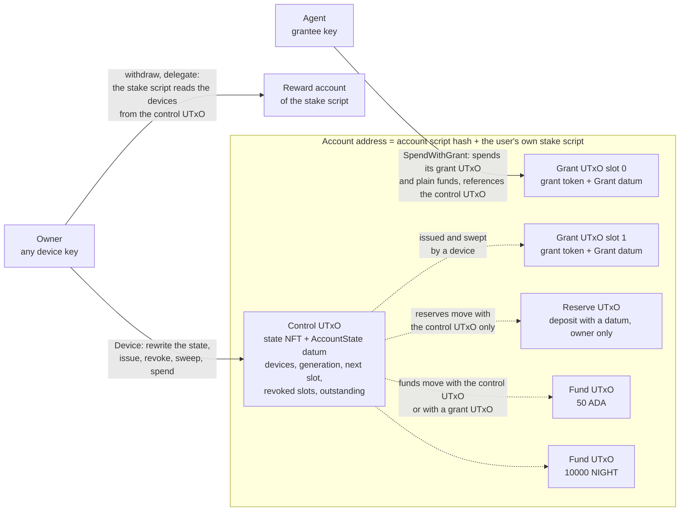
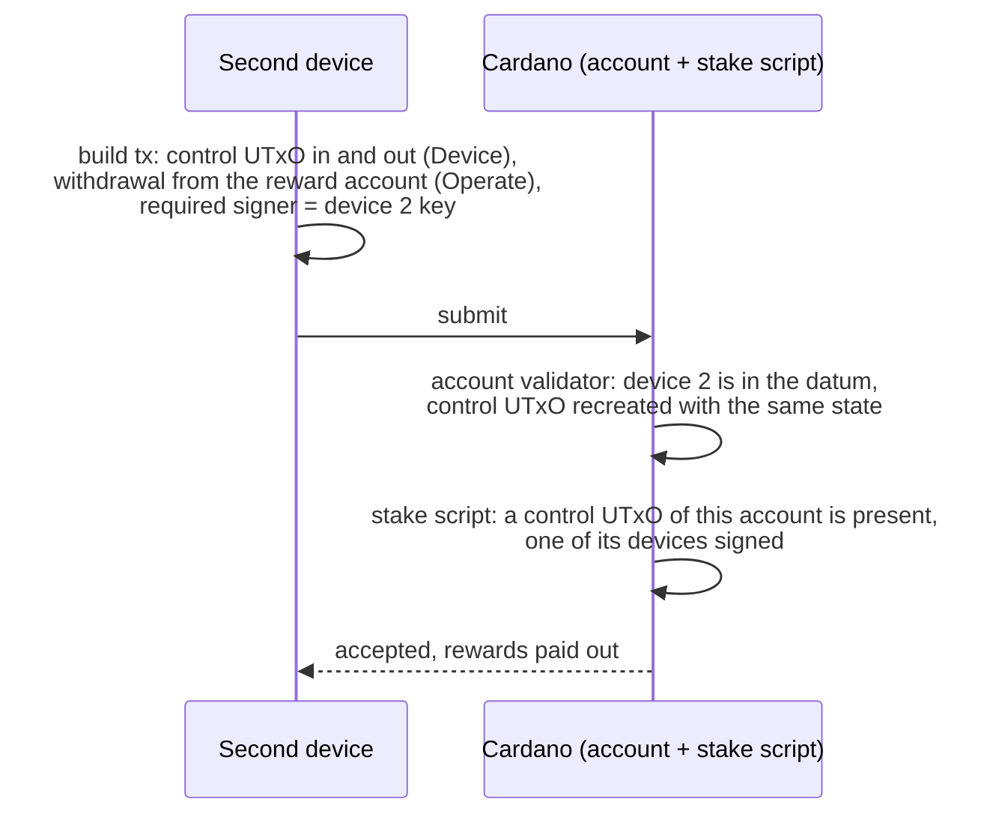
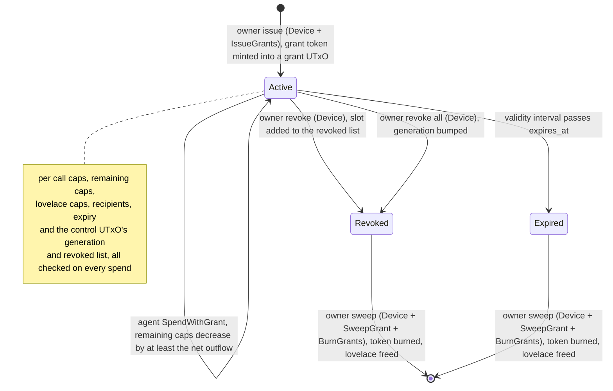
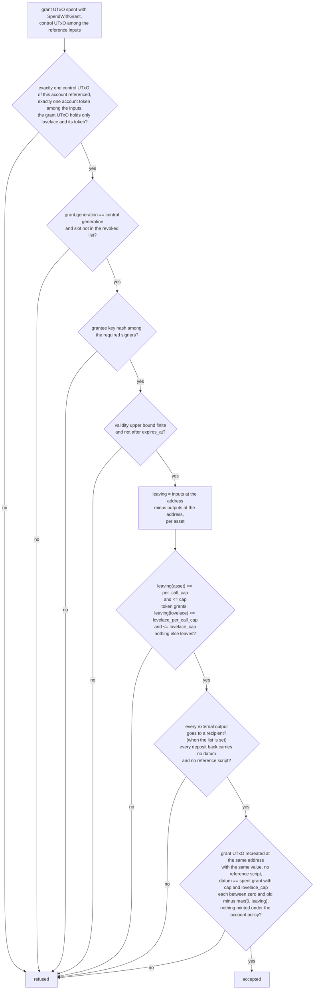
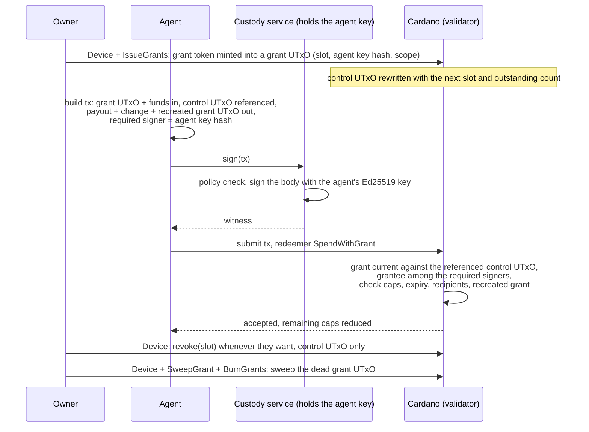

# Cardano Account Custody Contract

Cardano account custody contract in Aiken: a stable per-user address with owner keys and on-chain bounded, revocable agent grants (cap, expiry, destinations).

This is the Cardano counterpart of the Midnight Passport Account Custody
Contract (ACC). The account is a script address: the owner holds full
authority through the device keys listed in the account state, and each
agent holds a grant that the script checks on every spend. A grant bounds
what the agent may move by asset, cap, expiry and destination.

## How it works

### Address and control UTxO

Every user gets one address. The payment part is the account validator,
shared by everybody. The stake part is the user's own stake script: the
`account_stake` validator applied to the user's first device key and to the
account validator's hash. That first device key is called the owner; it
names the account, signs its creation and is listed as a device from the
start. Afterwards any device controls the account, its rewards and its
delegation. The hash of the applied script is the user's stake credential,
so each user gets their own address and their own reward account on top of
the shared payment script.

Funds live at that address as normal UTxOs. Anybody can deposit with a
plain transfer, no datum needed, and the user earns staking rewards on all
of it.

Next to the funds sits one small UTxO, the control UTxO. It holds a state
NFT (minted by the account validator, named after the stake credential) and
an inline datum with the account state: the device keys and the grant
bookkeeping (the grant generation, the next slot, the revoked slots and
the number of outstanding grants). Each grant lives in its own grant UTxO
at the same address, holding a grant token named after the account and the
grant's slot and an inline datum with the grant. The stake script reads the
control UTxO too: a transaction that withdraws rewards or changes the
delegation must include it, spent or referenced, and be signed by one of
the devices listed in it.



A fund UTxO can only be spent in a transaction that also spends an account
token of the same account: the control UTxO on the owner path, a grant
UTxO on the agent path. A fund UTxO checks almost nothing itself beyond
that; the control UTxO or the grant UTxO checks the whole transaction once,
over everything that enters and leaves the address. A deposit that carries
a datum is a reserve: it can only be spent together with the control UTxO,
so it is the owner's alone.

Creating the account is one transaction. It registers the stake credential
and mints the state NFT into the control UTxO. The stake script allows the
registration only when the owner signs, the state NFT of that credential is
minted in the same transaction and the control output lists the owner among
its devices; the mint handler refuses to run without that registration. The
ledger refuses to register a credential that is already registered, so an
account can only be created once. Nobody, not even the owner key, can mint
a second control UTxO later.

### Owner operations

Any device key listed in the state has full authority. With a device
signature the owner can spend whatever they want, add or remove devices,
issue grants, revoke one grant or all of them, sweep dead grants, withdraw
the staking rewards and delegate to a pool or a DRep. The validator only
insists that the state written back is well formed (one to 8 distinct
devices, at most 16 outstanding grants, at most 32 revoked slots, a
generation that never decreases, counters that follow the grant tokens
minted and burned) and that the NFT comes back to the same address in
exactly one control UTxO.

Devices are listed as key hashes, so a device is whatever signs Ed25519: a
normal Cardano payment key, a passkey derived key, a hardware wallet.
Rotating keys does not change the address. The owner key is the first
device: once a second device is in the list, the first one can be removed
like any other and the account keeps working, address, funds and rewards
included.

### Rewards and delegation from any device

Withdrawing rewards and delegating need a device signature, the same
check the owner path makes. A withdrawal or delegation transaction
references (or spends) the control UTxO, the stake script reads the
devices out of its datum, and one of them has to be among the required
signers. Any device listed in the state can withdraw rewards and
delegate, regardless of which device created the account or which earned
the rewards. Losing one device does not affect rewards or delegation
while another device remains in the state. Deregistering the credential
is refused outright; see [Permanence](#permanence).



### Grants

A grant is a permission the owner issues to one key. It lives in its own
grant UTxO under a grant token, and its datum carries:

| Field | Meaning |
| ----- | ------- |
| `slot` | identifier of the grant inside the account, taken from the control UTxO's next slot at issuance and never reused |
| `grantee` | the Ed25519 key hash of the agent, which signs the transaction as a required signer |
| `generation` | the account's grant generation at issuance; the grant dies when the account moves past it |
| `asset` | the one asset class this grant may move (lovelace or a token) |
| `per_call_cap` | most of that asset a single transaction may take out |
| `cap` | remaining total for that asset, decremented on every spend |
| `lovelace_per_call_cap` | most lovelace a single transaction may burn on fees and min UTxO when the asset is a token, zero for a lovelace grant |
| `lovelace_cap` | remaining lovelace total for the same purpose, decremented on every spend, zero for a lovelace grant |
| `expires_at` | POSIX time after which the grant is dead |
| `recipients` | optional list of addresses the agent may pay, empty means anywhere |

Issuing a grant is an owner transaction: it spends the control UTxO, mints
one grant token per grant and puts each token in a new grant UTxO with its
datum, paid for by the account. The agent spends with its own key; the
owner is not involved and gets no prompt. The validator checks the
transaction against the grant and, if it passes, recreates the grant UTxO
with the remaining caps (`cap` and `lovelace_cap`) reduced by at least
what actually left, fees included. The per call caps never change. Caps
only go down; a deposit in the same transaction does not refill them.



Revoking is an owner rewrite of the control datum: the slot goes into the
revoked list, or, to revoke every grant at once or when the list holds 32
slots, the generation is bumped and the list cleared. The grant UTxO is
not touched by the revoke. Expiry needs no transaction at all; the spend
stops validating. A dead grant UTxO stays at the address until the owner
sweeps it, which burns its token and frees its lovelace.

### Agent spend checks



The check is over the net value leaving the address, so the number of
fund UTxOs the agent spends and how it splits the change do not enter
into it. The validator has no check of the form "an output exists that
pays X", so there is no output check that two scripts could share. The
control UTxO is only read: an agent spend never spends it, so an owner's
revoke never competes with the agent for it.

### Custody services

The agent key may be held by a custody service that signs on request. On
chain the grantee is the hash of an Ed25519 key: the service holds that
key, the agent builds the transaction and hands it over, and the service
signs the transaction body. The validator only sees a required signer that
matches the grant. There is no other kind of grantee: a service that cannot
produce an Ed25519 witness over the transaction cannot be a grantee.



A service holding the grantee key can spend at most what the grant
allows: the caps, the expiry and the recipient list are checked by the
validator on every spend, and the owner revokes the grant with one
`Device` transaction on the control UTxO.

### Account discovery

The address is a pure function of the owner key and the compiled scripts:
apply the stake script to the owner key hash and the account script hash,
hash the result, and you have the stake credential, the address, the
reward account and the name of the state NFT. A passkey synced to a second
machine derives the same key and therefore the same account; that is what
`accountByOwner` does. A second device with its own key doesn't know the
owner key, so when it gets added it receives an account record (owner key
hash, stake script hash, address) in the add device handshake, persists it,
and every builder accepts the record in place of the owner key.
`accountExists` confirms the control UTxO is on chain and returns the
current state; `grantsOf` and `deadGrantsOf` list an account's grant UTxOs
by their tokens, all of them or only those the owner can sweep.

Every account is also discoverable from the chain alone: list the UTxOs
under the account policy, read each control datum, and look for the
device key hash. The datum is public. The library has no helper for this.

### Caveats

Agent spends of one account run concurrently with each other and with the
owner's operations on the control UTxO; what they can collide on is a fund
UTxO both pick, since every path draws from the same plain deposits. There
is no rolling daily cap; a cap is a total the owner replaces by issuing a
new grant. Fees on an agent spend come out of the account and count
against the grant; the fee is bounded ahead of evaluation and the bound
counts against the caps. An account is permanent, with no delete. Create
the account before you share the address: until the ledger removes the
legacy registration certificate, anybody who learns the stake credential
first can register it with that certificate and block creation at that
address for good, which the key derivation convention below keeps from
happening by accident.

Details in [Limitations](#limitations) and in the
[security review](docs/security-review.md).

## Design

### Address, control UTxO and tokens

An account's address pairs the account validator's script hash as its
payment credential with the hash of the account's own stake script as an
inline script stake credential. The account validator is multi purpose:
the same script hash is both the spend handler guarding every UTxO at that
address and the mint policy of the account's tokens, so the two handlers
can trust each other's checks within one transaction. The state NFT is
named after the stake credential (28 bytes), so its policy id and name
together identify the account. It sits in exactly one control UTxO holding
only lovelace, the NFT and an inline `AccountState` datum. A grant token is
named after the stake credential followed by the grant's slot as four big
endian bytes (32 bytes), and sits in exactly one grant UTxO holding only
lovelace, the token and an inline `Grant` datum. Every other UTxO at the
address is a deposit: a plain one with no datum, spendable on the owner
and the agent paths, or a reserve under any datum, spendable with the
control UTxO only. A deposit's datum is never read.

An output at the account script whose stake part is anything but an inline
script credential belongs to no account and cannot be spent, because
`account.stake_script_hash_of` aborts on it.

### Stake script

`account_stake` is a parameterised validator taking `owner`, the
verification key hash of the account's initial device, and `account_hash`,
the account validator's hash. Applying both yields the user's stake
script, and its hash is the account's stake credential. The script has two
handlers.

`publish` runs on every certificate naming the credential. A
`RegisterCredential` or `RegisterAndDelegateCredential` passes only when
`owner` is among the required signers, the account policy mints exactly
one token named after the credential, and the single control output
holding that token lists `owner` among the devices of its inline state
(`creates_the_account`). A `DelegateCredential`, whether to a pool, a
delegate representative or both, passes only under the device rule. An
`UnregisterCredential` and every other certificate kind are refused.

`withdraw` runs on every withdrawal from the credential's reward account,
of any amount including zero, under the same device rule. The device rule,
`account.is_authorised_by_a_device`, looks for the account's control UTxO
among the transaction's inputs or reference inputs, an output at the
account address holding exactly one state NFT and an inline state, and
requires one of that state's devices among the required signers. The `else`
handler fails, so the stake script never acts as anything else.

### Registration gated creation

`CreateAccount` mints exactly one token under the account policy, named
after the stake credential, into a single valid control output whose state
has zero counters (no slot issued, no revoked slot, nothing outstanding),
and requires that the transaction's redeemers hold a `Publish` entry for a
certificate registering that credential
(`account.registers_stake_credential`). A publish redeemer exists only when
the ledger ran the stake script on that certificate, which is when the
owner's signature, the mint and the owner's place in the device list were
checked. The check reads the redeemers and not the certificate list,
because a registration in the legacy certificate format carries no
witness. The two handlers depend on each other both ways: the stake script
refuses a registration without the mint, so a registration can never leave
the credential registered with no account behind it, and the mint handler
refuses a mint without the registration. The ledger registers a credential
at most once and the stake script refuses to deregister, so a second
`CreateAccount` for the same credential can never carry the registration
it needs. The mint handler does not read the stake script's code: an
account created under some other script's credential is that script's own
account, with its own name and address, and can touch no other.

### Owner path

A device key, found in `AccountState.devices`, authorises the owner path by
signing the transaction. With a device signature the control UTxO may be
spent and rewritten freely, as long as the new state stays well formed: at
least one and at most eight distinct devices, at most sixteen outstanding
grants, at most thirty two revoked slots, non negative counters, and a
grant generation that never decreases. The next slot moves by exactly the
number of grant tokens minted and the outstanding count by the tokens
minted minus the tokens burned, read from the mint field, so the counters
cannot drift from the grant UTxOs that exist. The device path can add or
remove devices, revoke one slot or every grant, and spend any amount of
funds and reserves to any destination.

Issuing grants adds the `IssueGrants` mint redeemer to a device spend of
the control UTxO: each minted token must be named for the next slots in
order, in quantity one, and land in exactly one output at the account
address holding only lovelace and that token, with no reference script and
an inline grant of that slot, issued under the recreated control's
generation, with a well formed scope. Sweeping dead grants adds
`SweepGrant` on each dead grant UTxO and the `BurnGrants` mint redeemer:
every entry burns one grant token of the account, and each swept grant is
dead against the state of the spent control UTxO, by an older generation,
a revoked slot, or a validity range starting after its expiry. The mint
handler runs once per transaction with one redeemer, so an issuance and a
sweep cannot share a transaction, and a sweep is judged against the state
the control UTxO held before the transaction, so a revoke or a generation
bump and the sweep of the grants it kills cannot share one either.

Owner availability. The owner's revoke spends the control UTxO and, when
the fee comes from a reserve or from a sponsor, nothing an agent can
spend: the agent path never spends the control UTxO or a reserve. The
revoke is one control input and one control output besides what pays the
fee, whatever the number of grants outstanding. When the owner pays the
fee from plain funds instead, the transaction can lose a fund UTxO to an
agent spend that picks the same one and has to be rebuilt; that is the
residual contention and the reason for reserves.

### Reserves

A deposit at the account address that carries a datum, inline or by hash,
is spendable only in a transaction that spends the control UTxO, which
needs a device signature. Nothing reads the datum. Such a deposit is a
reserve: the owner's own operations draw their fee from it, spending it and
recreating it with the fee taken out, so that an owner operation never has
to touch a fund UTxO an agent may be spending. The off-chain library draws
only reserves whose datum is inline; one given by hash is listed and left
alone. An agent spend that includes a reserve among its inputs is refused
on the reserve's own `Fund` handler.

### Rewards and delegation

A withdrawal from the reward account and a delegation certificate are owner
operations in the same sense: the stake script accepts them when a control
UTxO of the account is spent or referenced and one of its devices signs.
The off-chain builders spend the control UTxO with `Device` and recreate
it with the same state, which puts the devices in front of the stake script
and lets the account pay the fee from its own reserve or funds; referencing
the control UTxO instead is equally valid on chain. A withdrawal of zero is
valid and runs the same check, so the path can be exercised before any
reward has accrued.

### Agent path

A grant names a grantee, an Ed25519 verification key hash, its slot and
generation, and a scope: an asset class, a per call cap, a remaining
cumulative cap, a lovelace per call cap, a remaining lovelace cap, an
expiry and a recipient list. `SpendWithGrant` runs on the grant UTxO, which
must hold only lovelace and the grant token of its slot and be the only
input holding an account token, so the accounting runs over one grant and
never over the control UTxO. The control UTxO must be among the reference
inputs exactly once, and the grant must be current against its state: the
same generation and a slot outside the revoked list. The handler checks,
once over the whole transaction, that the grantee is among the required
signers and that the validity range ends before the grant expires. The
value leaving the account address must stay within the per call cap and
the remaining cap for the scoped asset and, when that asset is not
lovelace, within the lovelace per call cap and the remaining lovelace cap;
nothing of any other asset may leave. Every output away from the account
must go to an allowed recipient when the list is non empty, and every
output paid back to the account other than the grant output must be a
plain deposit: no datum and no reference script. The grant UTxO is
recreated at the same address with the same value and no reference script,
carrying the grant with every field as spent except the remaining caps,
each at most the spent cap less what left of its asset and at least zero.
Nothing is minted or burned under the account policy, and every account
token among the inputs and outputs sits at its own account address.

### Fund path

A plain deposit is spent with the `Fund` redeemer, which only requires that
an account token of the deposit's own account, identified at the same full
address, is spent in the same transaction: the control UTxO on the owner
path or a grant UTxO on the agent path. A deposit carrying a datum requires
the control UTxO itself. The control UTxO's or the grant UTxO's own handler
does the accounting once; the fund UTxO itself carries no authorisation and
is not read for its datum.

### Lovelace caps

A grant scoped to a token asset still has a `lovelace_per_call_cap` and a
`lovelace_cap`, because every output the ledger accepts needs its minimum
UTxO value in lovelace and every transaction pays a fee in lovelace, both
charged against the account when the account pays them. The lovelace caps
bound the lovelace that leaves through the minimum UTxO values of the
outputs a token grant spend creates and the fee of the transaction that
moves them. The per call cap bounds one transaction; the cumulative cap
bounds the grant's lifetime. When the scope's asset is lovelace itself,
the asset caps cover lovelace and both lovelace caps must be zero.

### Token placement

The validator enforces that a state NFT named N only ever sits at the
account address of N, in exactly one control UTxO, and that a grant token
whose prefix is N only ever sits at that same address, in quantity one.
This holds on every creation, on every device spend and on every grant
spend: the control output is always found at the spent input's own full
address and checked to hold only lovelace and that one NFT, a grant output
at issuance is found by its token and checked the same way, and every
account token among the inputs and outputs of a device or grant spend is
checked to sit at the address its name denotes. An agent spend that
strands its grant token on a plain deposit, or anywhere else, is refused.
The state NFT can never be relocated, duplicated or parked under a foreign
address, and no redeemer burns it; a grant token is burned only by a
sweep.

### Permanence

An account is never deleted. No redeemer burns a state NFT, and the stake
script refuses every deregistration, so the credential stays registered for
the life of the account. From creation on exactly one control UTxO of the
account exists at all times: every spend of it recreates it, and a second
one cannot be minted while the credential is registered. That invariant
keeps every deposit spendable, since a plain deposit leaves alongside the
control UTxO or a grant UTxO, a reserve alongside the control UTxO, and
the control UTxO is always there to spend. A grant UTxO's lovelace is
freed by the owner's sweep once the grant is dead, so no value is
stranded in a dead grant either.

The registration deposit and the control UTxO's minimum lovelace stay
locked for the life of the account, and a dormant account remains. There
is no close, no delete and no rescue path. No key can mint a second
control UTxO, and the owner key, after creation, is one device among the
others.

## Data types

All types live in `lib/cardano_account_custody_contract/types.ak`. Aiken
numbers a type's constructors in declaration order, starting at zero; that
index is the Plutus data constructor tag the on-chain datum or redeemer
carries.

- `Asset { policy_id, asset_name }`, a single constructor record. Lovelace
  is the empty policy id and the empty asset name.
- `Scope { asset, per_call_cap, cap, lovelace_per_call_cap, lovelace_cap,
  expires_at, recipients }`, a single constructor record with its seven
  fields in that order. `expires_at` is a POSIX millisecond timestamp and
  must be greater than zero; there is no value that means the grant never
  expires. `lovelace_per_call_cap` and `lovelace_cap` must be zero when
  `asset` is lovelace. `recipients` empty means any destination is allowed
  and holds at most 8 addresses.
- `Grant { slot, grantee, generation, scope }`, a single constructor
  record, the inline datum of a grant UTxO. `slot` is the grant's
  identifier within the account and the suffix of its token name;
  `grantee` is a 28 byte Ed25519 verification key hash; `generation` is
  the account's grant generation at issuance. The first three fields are a
  stable prefix that later revisions keep first and in this order.
- `AccountState { devices, grant_generation, next_slot, revoked,
  outstanding }`, a single constructor record, the inline datum of the
  control UTxO. `devices` stays the first field in later revisions, since
  the stake script reads it positionally.
- `AccountRedeemer` (constructor index, no fields): `Device` is 0,
  `SpendWithGrant` is 1, `SweepGrant` is 2, `Fund` is 3.
- `MintRedeemer` (constructor index, no fields): `CreateAccount` is 0,
  `IssueGrants` is 1, `BurnGrants` is 2.
- `StakeRedeemer` (constructor index): `Operate` is 0 and is the only
  constructor. Both stake handlers learn what they authorise from the
  script context, the withdrawal's credential or the certificate, so the
  redeemer carries no choice.
- Token names under the account policy: the state NFT is the 28 byte stake
  script hash; the grant token of slot `s` is the stake script hash
  followed by `s` as four big endian bytes.
- Bounds, constants in `state.ak`: `max_devices` 8, `max_grants` 16
  outstanding, `max_revoked` 32, `max_recipients` 8.

## Grant accounting

A grant spend is checked once, over the whole transaction, on the grant
UTxO. The value leaving the account is the sum of every input at the
account address minus the sum of every output paid back to it, per asset
class, so deposits made in the same transaction count against what left.
The per call caps and the remaining caps are checked against that net
outflow. The recreated grant must carry the remaining cap of its asset and,
for a grant whose asset is not lovelace, the remaining lovelace cap at or
below the spent value less the net outflow of that asset, clamped at zero,
and never below zero. A spend may therefore decrement its caps by more
than the outflow: the fee is part of the outflow and the exact fee depends
on the execution units a builder only learns by evaluating the
transaction, so the builder decrements by the outputs plus a fee bound,
writes the datum once, and evaluates the scripts for real. A grantee that
decrements further costs itself headroom and nothing else. Only `cap` and
`lovelace_cap` ever change; the per call caps bound single transactions
and stay as issued.

A net inflow of an asset leaves its cap exactly as it was: a cap never
increases through an agent spend, whatever the agent deposits alongside.
Every output a grant spend pays back to the account, other than the
grant output, must be a plain deposit with no datum and no reference
script. A script output under a datum hash can only be spent by whoever
knows the preimage, a deposit under any datum is the owner's alone, value
paid back to the account does not count as leaving, and every transaction
that spends a UTxO pays a fee for the size of the reference script it
holds. The grant output a grant spend recreates may carry no reference
script either, and must hold exactly the value the grant UTxO held, so a
grant UTxO's lovelace neither drains nor grows through agent spends; the
lovelace the account paid for it at issuance comes back when the owner
sweeps the dead grant.

The validity range doubles as the grant's time check. For a spend its
upper bound must be finite and its value must be at most the grant's
`expires_at`, whether the bound is inclusive or exclusive; a transaction
with no upper bound is refused, since it could be applied after the grant
expired. For a sweep of a grant that is neither revoked nor of an older
generation, the lower bound must be finite and past `expires_at`, so the
sweep can only apply once the grant has expired. Both bounds are compared
as POSIX milliseconds, the unit of `expires_at`.

## Build and test

Requires [Aiken](https://aiken-lang.org) v1.1.24.

```sh
aiken fmt --check
aiken check -D
aiken build
```

`aiken build` writes the blueprint of both validators to `plutus.json`,
which is committed so off-chain code can load it directly. The account
validator's hash in the blueprint is final; the stake validator's entry is
the parameterised code, and its hash only becomes an account's stake
credential once `owner` and `account_hash` are applied.

The off-chain library under `offchain/` requires Node 22.

```sh
cd offchain
npm ci
npm run lint
npm run typecheck
npm test
```

## Off-chain library

`offchain/` is a TypeScript library, built on `@biglup/cometa`, that
derives an account's identifiers from the committed blueprint and builds
every transaction the validators accept. `Cometa.ready()` must be awaited,
through `offchain/src/cometa.ts`, before any of it is used. See the JSDoc
in `offchain/src/index.ts` and the modules it re-exports for the full
surface.

- Parameter application. `stakeScript` applies the owner key hash and the
  account script hash to the blueprint's stake validator in pure
  TypeScript (`applyParameters`), byte for byte what `aiken blueprint
  apply` produces, and `stakeScriptHash` gives the stake credential.
  `accountAddress`, `rewardAddress`, `stateNftAssetId` and `grantAssetId`
  derive the rest.
- Discovery. `accountByOwner` computes the record of an account from the
  owner key hash alone; `accountExists` confirms the control UTxO on chain
  and returns the current state; `grantsOf` lists the grant UTxOs of an
  account and `deadGrantsOf` those the owner can sweep;
  `classifyAccountUtxos` sorts the UTxOs at the address into the control
  UTxO, grant UTxOs, reserves and funds. Every builder takes either `owner`
  or a persisted `AccountRecord`.
- Builders. `createAccount`, `deposit`, `spendWithDevice`, `rewriteState`,
  `addDevice`, `removeDevice`, `issueGrant`, `revokeGrant`,
  `revokeAllGrants`, `sweepGrant`, `withdrawRewards`, `delegateStake` and
  `spendWithGrant`, with the datum, redeemer and token name encoders in
  `data.ts` and `address.ts` and the state helpers in `state.ts`.
  `issueGrant` takes a list of grantee and scope pairs, assigns the next
  slots and mints one grant token per grant into its own grant UTxO at its
  minimum lovelace, paid by the account; `sweepGrant` burns the tokens of
  dead grants and frees their lovelace; both take at most `MAX_GRANT_BATCH`
  (8) grants per transaction. `revokeGrant` appends the slot to the revoked
  list until the list holds `MAX_REVOKED` (32) slots, then bumps the
  generation instead; after a bump the owner sweeps the dead grants and
  issues the survivors again, each its own transaction, with
  `survivingGrantRequests` listing them. Every builder on an existing
  account takes `validUntilSlot`. There is no delete.
- Sponsor. Every builder of an owner operation, and `createAccount`, accepts an optional
  `sponsor` wallet that pays the fee, the collateral, the growth of the
  control output and, at creation, the control UTxO and the registration
  deposit, and receives the change, so the device wallet only signs.
  Without a sponsor an owner operation draws its fee from a reserve UTxO
  when one can cover its own minimum UTxO value plus the most a
  transaction can cost under the protocol parameters plus a plain change
  output, about 4.4 tADA under preprod's parameters, spending it and
  recreating it with the fee taken out, so that no owner operation depends
  on a fund UTxO an agent may be spending; otherwise it is paid from the
  fund UTxOs with the fee reserved at the most a transaction can cost and
  the surplus returned to the account as change. Creation without a
  sponsor is paid by the device wallet, since there is no account to pay
  from yet. A grant spend is always paid from the account and refuses a
  `sponsor`; the collateral wallet below is its one option.
- Collateral wallet. The builders of operations on an existing account,
  owner operations, stake operations and grant spends, also accept an
  optional `collateral` wallet in place of a sponsor: the account pays
  the outputs, the fee and the control output's growth from its own
  reserve and fund UTxOs, the collateral and its return come from that
  wallet, and the transaction spends none of its UTxOs, so the device or
  agent wallet only signs. Use `sponsor` when another wallet is to pay for
  the transaction, as at creation, and `collateral` when the account can
  pay for itself and only the collateral has to come from elsewhere, as it
  does for a wallet that holds no ADA of its own; the two cannot be given
  together, and the grant path takes `collateral` only.
- Reserves. `deposit` with `reserve: true` writes the reserve datum on the
  deposit; the validator lets a deposit under any datum be spent only with
  the control UTxO, so reserves are the owner's alone. `findAccountUtxos`
  treats every UTxO at the address with a datum and no account token as a
  reserve, never as a fund, and draws reserves for outputs only when the
  funds cannot cover them. A UTxO at the address that carries only a datum
  hash is listed among the reserves and is inert: no builder spends it, for
  the fee or for outputs, since the ledger needs the datum itself to spend
  it. A deposit with a datum, inline or by hash, is the owner's alone.
- Stake operations. `withdrawRewards` and `delegateStake` are device
  spends: they spend the control UTxO with `Device`, recreate it with the
  same state, and add the withdrawal or the certificate with the `Operate`
  redeemer and the account's stake script attached. The withdrawn amount
  defaults to the provider's reward balance, which may be zero.
- Fee bound. A grant spend cannot write the exact caps left after the fee
  before the fee is known, so it reduces the remaining caps by the outputs
  plus `DEFAULT_GRANT_FEE_BOUND` (1.5 tADA, overridable through
  `feeBound`), lets the provider evaluate the scripts, and the validator
  accepts caps anywhere between zero and the exact reduction; the fee ends
  at or below the bound, the difference returns to the account as change,
  and a fee above the bound is refused before submission. The fee counts
  against the grant's caps alongside the payout, bound included: a
  lovelace grant is charged on `per_call_cap` and `cap`, a token grant on
  the lovelace caps, so a token grant can only spend while its lovelace
  caps cover the lovelace of its outputs plus the bound, and never when
  they are below the bound. The preprod run's 8 tADA spends fit under a
  10 tADA per call cap with the bound included.
- Account only funding. On the agent path `accountOnlyCoinSelector` spends
  nothing beyond the account's own UTxOs, so a spend the account cannot
  cover fails instead of reaching into the agent's wallet. A spend built
  `unchecked`, to show the validator refusing it, carries
  `UNCHECKED_EXECUTION_UNITS` instead of an evaluation.
- Control output lovelace. The control output's lovelace rises
  automatically with the size of the state it carries
  (`minimumUtxoLovelace`), staying at or above the network's minimum UTxO
  value for that output; every device and revoked slot enlarges the datum,
  while grants live in their own UTxOs.
- Creation checks. `createAccount` accepts an optional `provider`; when
  given, it refuses to build while a UTxO holding the account's state NFT
  already exists. It also refuses an initial state that does not list the
  owner among its devices, since the stake script refuses that
  registration. `findAccountUtxos` treats a UTxO holding the state NFT
  as the control UTxO, one holding a grant token as a grant UTxO, one
  carrying any datum as a reserve and the rest as funds; a deposit with a
  datum is owner only.

## Running the preprod script

```sh
cd offchain
npm run e2e
```

The script needs `BLOCKFROST_PREPROD_PROJECT_ID` and `FUNDING_MNEMONIC` in
the repository root `.env`; see `.env.example` for the variable names. On
its first run, with no funding mnemonic set, it generates one, stores it in
`.env`, prints the funding address and exits: fund that address with tADA
from the preprod faucet and rerun. The funding wallet is account 0 of the
mnemonic and the agent wallet account 1. Because an account is permanent,
every run creates a fresh one: the owner wallet is the first account index
from 2 upwards whose stake credential is not yet registered on preprod.

The owner wallet holds nothing but one collateral UTxO; the funding wallet
sponsors the creation and the final sweep, and every other owner operation
is paid from the account itself. Every run exercises the full set of
flows, owner, stake and agent, happy path and refused, against the live
network, and rewrites `docs/preprod-evidence.md` with the resulting
transactions.

## Security review and preprod evidence

`docs/security-review.md` is an adversarial review of both validators,
organised by vulnerability class, with each attack reproduced as a
transaction in `validators/attacks.test.ak` that the validators are shown
to refuse. It records the findings that needed a code change and how each
was closed, the registration gated creation check that prevents a second
control UTxO, the budget of every path over the largest well formed state
measured with `aiken check`, and the residual risks, the pre registration
of a credential by a third party among them.

`docs/preprod-evidence.md` records a full run of the script above against
the Cardano preprod network through Blockfrost. The run covers a sponsored
account creation that registers the stake credential and mints the state
NFT, a plain deposit and a reserve deposit, an owner spend paid from the
reserve, a reward withdrawal and a pool delegation signed by the owner
device, and issuing a grant into its own grant UTxO and spending it with
the control UTxO referenced. It then covers grant spends refused for
exceeding the remaining cap, for paying outside the recipients and after
revocation, each first by the builder and then, built unchecked, by the
node in phase two, a sweep of the revoked grant, and a grant left to
expire, refused and swept. It ends with adding a second device that then
spends and withdraws rewards from the persisted account record alone,
removing it, revoking every grant by bumping the generation, and a final
sweep of funds and reserves that leaves only the control UTxO in place.
The document carries the transaction links and the ledger errors.

## Prior art

Bullet ([orbistry/bullet](https://github.com/orbistry/bullet)) was
evaluated before this contract was written. It is an Aiken smart wallet
with hot, cold and intention validators, a vault, and Ed25519 keys that
sign as ordinary transaction witnesses. Its intention constraints
(`lib/intention_types.ak`, checked in `lib/constraint_utils.ak`) are equality checks on outputs, inputs,
redeemers and mint quantities: there is no per key spending cap, no
cumulative cap and no per key expiry, and `AfterVal` and `BeforeVal` bound
the transaction's validity interval, not a key's lifetime. The grant
semantics this contract needs, a per call cap, a cumulative cap, lovelace
caps, an expiry and a recipient list per agent, revocable by the owner,
are not expressible as those constraints and would have required
rewriting the intention validator. The contract was written from scratch
for that reason.

## Limitations

- The agent path and the owner path share the account's plain deposits.
  An owner operation paid from a fund UTxO can lose it to an agent spend
  and has to be rebuilt; a reserve or a sponsor avoids that. A grantee can
  fragment the plain deposits at zero outflow and run no-op spends against
  its own grant UTxO; neither touches the control UTxO, so the owner's
  revoke always lands, and the loss is the owner's sweeping cost.
- A grant has per call caps, cumulative caps and an expiry but no rolling
  period caps such as a daily or epoch limit, so a grantee can exhaust the
  cumulative cap at once, in as many transactions as the per call cap
  allows.
- An account is permanent: the registration deposit and the control UTxO's
  minimum lovelace stay locked for its life, there is no close, no delete
  and no rescue path, and a dormant account remains; see
  [Permanence](#permanence).
- The stake credential squat. Until the Dijkstra era, anyone can register
  a stake credential with the legacy certificate, which needs no witness
  (`eras/conway/impl/src/Cardano/Ledger/Conway/TxCert.hs`,
  `getScriptWitnessConwayTxCert`, and `eras/conway/impl/cddl/data/conway.cddl`,
  `account_registration_cert`, in the cardano-ledger repository); the
  ledger runs no script on it
  (`eras/shelley/impl/src/Cardano/Ledger/Shelley/UTxO.hs` and
  `eras/conway/impl/src/Cardano/Ledger/Conway/UTxO.hs`) and keeps no mark
  of which form registered a credential
  (`eras/conway/impl/src/Cardano/Ledger/Conway/Rules/Deleg.hs`). Whoever
  registers an account's credential first blocks its creation at that
  address for good: the owner's registration fails as already registered,
  and deregistration, which always needs the script witness, is refused by
  the stake script. The owner then moves to the next account index, which
  gives a new owner key and a new address. The Dijkstra era removes the
  legacy certificates and makes every registration witnessed
  (`eras/dijkstra/impl/src/Cardano/Ledger/Dijkstra/TxCert.hs`,
  `DijkstraRegCert` with a mandatory deposit and the decoder refusing tags
  0 and 1; `eras/dijkstra/impl/cddl/data/dijkstra.cddl`), after which only
  the stake script itself can register its credential; squats placed
  before the fork remain. Until then the squat is prevented at the key
  layer: the owner key of a custody account is derived on a path that
  differs per network class, mainnet and testnets using distinct account
  index ranges by convention of the signer and the SDK, so a key used on a
  testnet never corresponds to a mainnet credential, signers refuse
  custody operations outside their network class, and the stake script
  hash of an account becomes public only in the creation transaction that
  registers it. Nobody can learn a credential before its registration, so
  a squat requires guessing an owner key, which is not feasible. The
  residual case is a user who exposes their custody owner key elsewhere
  before creating the account, which the signer prevents by refusing to
  use the custody key for anything else.
- A grant spend reduces the grant's caps by a fee bound of 1.5 tADA by
  default before the fee is known; the bound, not the fee, is what the
  caps lose on each spend, so caps must be sized with that margin; see
  [Off-chain library](#off-chain-library).
- The state is bounded at 8 devices, 16 outstanding grants, 32 revoked
  slots and 8 recipients per grant; the bounds are constants in
  `state.ak`. Issuing or sweeping 16 grants in one transaction exceeds the
  14,000,000 memory unit limit, at about 15.0 M and 16.1 M net over the
  largest state, while batches of 8 fit at 49 and 59 percent, so the
  builder batches at most 8 grant issues or sweeps per transaction.
- The contract has only run on the Cardano preprod testnet and has had no
  independent audit; treat it as unaudited and testnet only.

## Transaction builder requirements

The off-chain library here is built on cometa.js. A port of the builders
to another transaction builder must be able to:

- Spend Plutus V3 script inputs with a redeemer, with an inline datum (the
  control UTxO, grant UTxOs and reserves) and without any datum (fund
  UTxOs).
- Mint and burn several token names under one Plutus V3 policy with one
  redeemer.
- Register a script stake credential with the Conway deposit, delegate it
  and withdraw from its reward account, each with a redeemer and the stake
  script attached as a witness.
- Write inline datums on outputs.
- Add the control UTxO as a reference input on every grant spend.
- Select and return collateral from a wallet other than the account.
- Evaluate every transaction through the provider, and set a fixed
  execution budget per redeemer only for an unchecked grant spend built
  to be refused.
- Apply parameters to the blueprint's stake validator to derive the per
  user stake script and its hash.
- Declare required signers and gather witnesses from more than one wallet,
  the device and the sponsor.
- Size the control output's and each new grant output's lovelace to the
  minimum UTxO value.
- Set a validity lower bound (sweeping an expired grant) and an upper
  bound (every grant spend, optionally every owner operation).
- Set an exact minimum fee, so that a reserve can be recreated with the
  fee taken out and nothing else changes.
- Return change to the account address with no datum.
- Spend only account UTxOs on the grant path, with the agent's wallet, or
  a collateral wallet standing in for it, used for collateral alone.
- Read the fee of a built transaction back, to check it against the bound
  the caps were reduced by and to settle a reserve's recreated value.

## License

Apache-2.0
