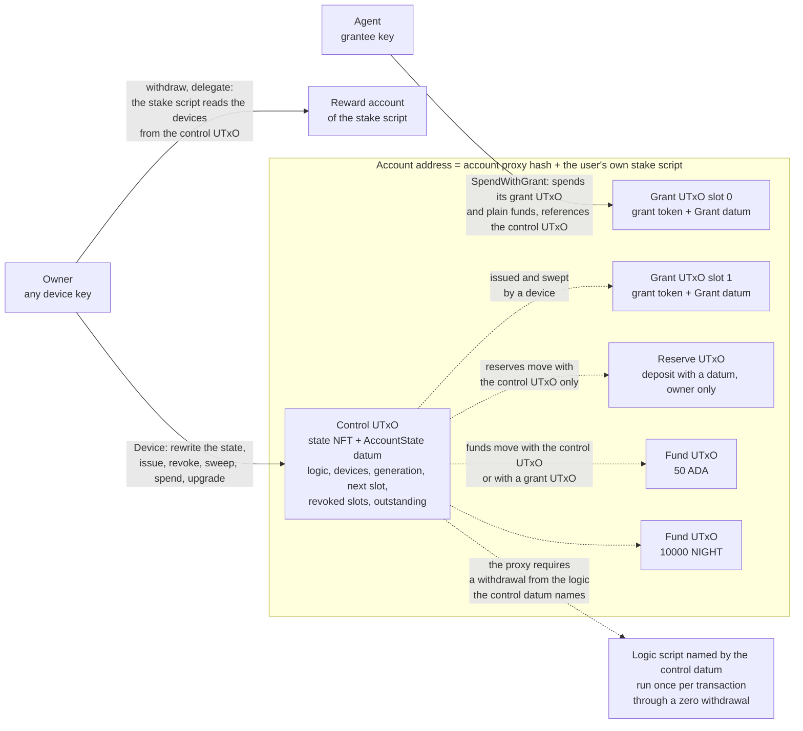
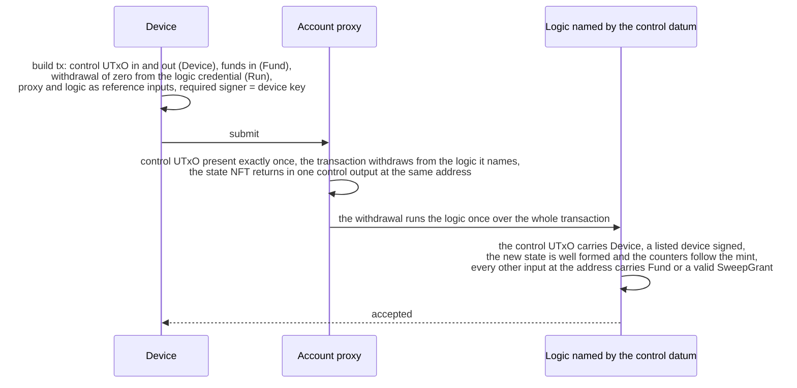
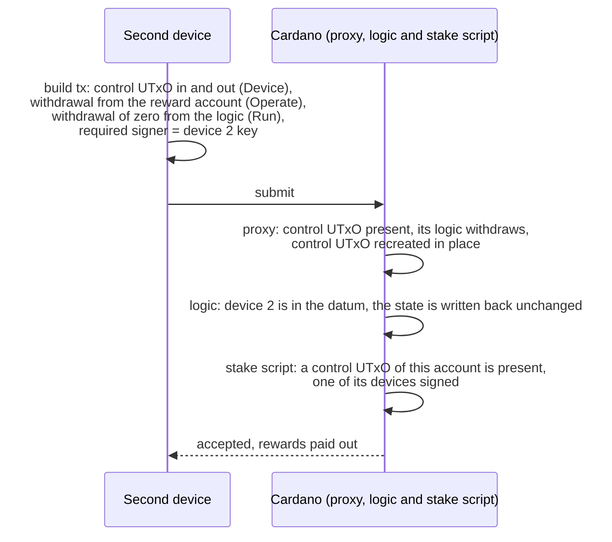
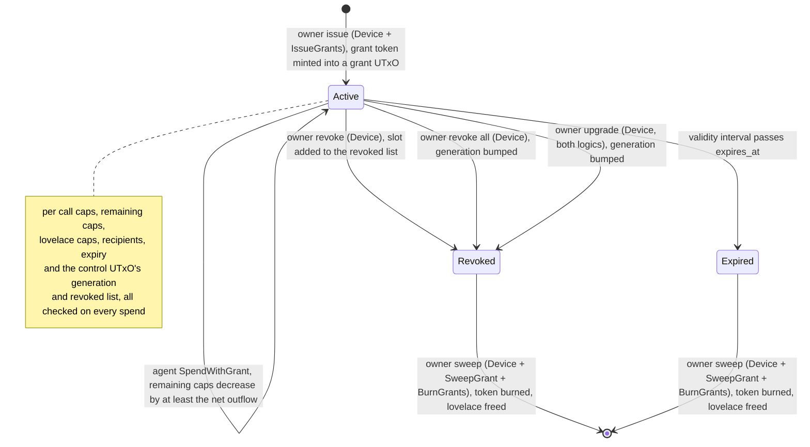
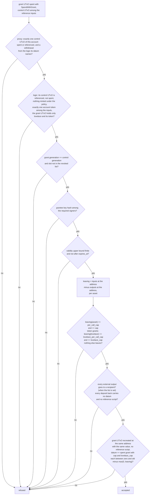
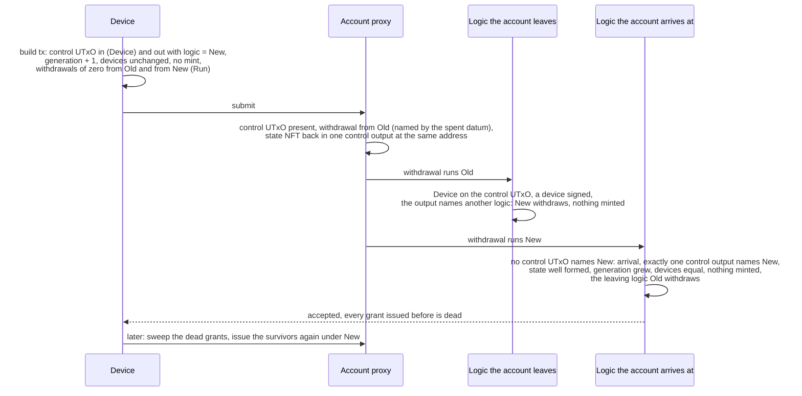
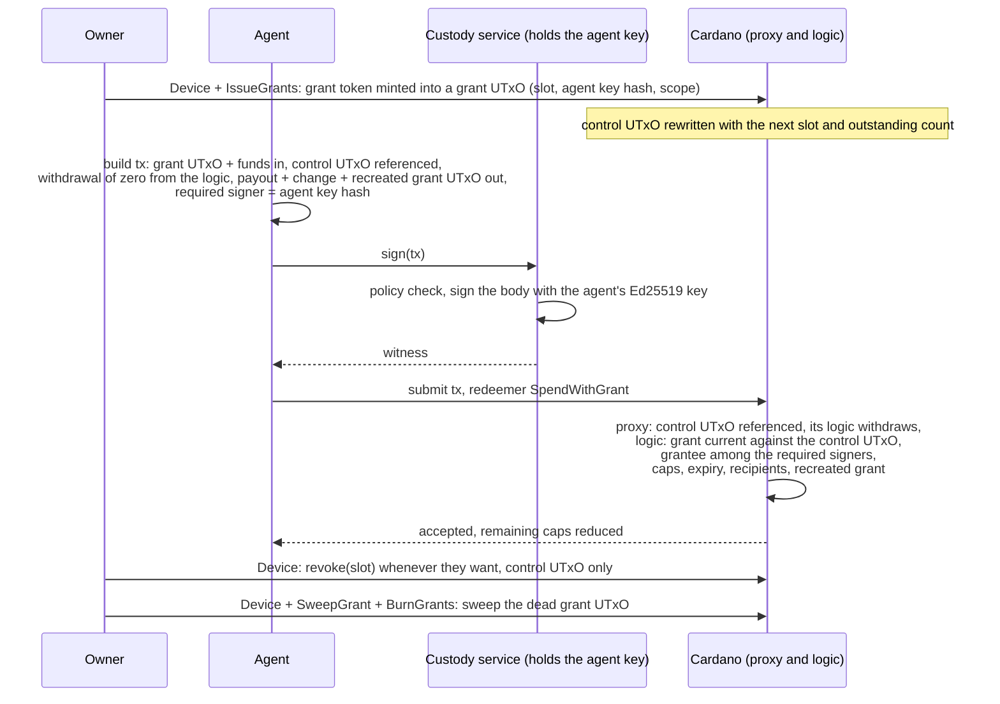

# Cardano Account Custody Contract

Cardano account custody contract in Aiken: a stable per-user address with owner keys, on-chain bounded, revocable agent grants (cap, expiry, destinations), and rules the owner can replace without changing the address.

This is the Cardano counterpart of the Midnight Passport Account Custody
Contract (ACC). The account is a script address: the owner holds full
authority through the device keys listed in the account state, and each
agent holds a grant that the rules check on every spend. A grant bounds
what the agent may move by asset, cap, expiry and destination. The rules
live in a logic script that each account names in its state; the
address, the tokens and the stake script are permanent.

## How it works

### Address and control UTxO

Every user gets one address. The payment part is the account proxy,
shared by everybody; its hash is also the policy id of every account
token. The stake part is the user's own stake script: the `account_stake`
validator applied to the user's first device key and to the proxy's hash.
That first device key is called the owner; it names the account, signs
its creation and is listed as a device from the start. Afterwards any
device controls the account, its rewards and its delegation. The hash of
the applied script is the user's stake credential, so each user gets
their own address and their own reward account on top of the shared
payment script.

Funds live at that address as normal UTxOs. Anybody can deposit with a
plain transfer, no datum needed, and the user earns staking rewards on all
of it.

Next to the funds sits one small UTxO, the control UTxO. It holds a state
NFT (minted by the proxy, named after the stake credential) and an inline
datum with the account state: the hash of the logic script whose rules
govern the account, the device keys and the grant bookkeeping (the grant
generation, the next slot, the revoked slots and the number of
outstanding grants). Each grant lives in its own grant UTxO at the same
address, holding a grant token named after the account and the grant's
slot and an inline datum with the grant. The stake script reads the
control UTxO too: a transaction that withdraws rewards or changes the
delegation must include it, spent or referenced, and be signed by one of
the devices listed in it.



A fund UTxO can only be spent in a transaction that also spends an account
token of the same account: the control UTxO on the owner path, a grant
UTxO on the agent path. A fund UTxO checks nothing else itself; the logic
checks the whole transaction once, over everything that enters and leaves
the address. A deposit that carries a datum is a reserve: it can only be
spent together with the control UTxO, so it is the owner's alone.

### Proxy and logic

The proxy is thin and permanent. On every spend under its address except
a plain fund spend, and on every mint under its policy except the creation
of an account, it requires that the control UTxO of the account is in the
transaction, spent or referenced, and that the transaction withdraws from
the reward account of the logic script that control UTxO names. A
withdrawal makes the ledger run the script of the credential it draws
from, once, with the whole transaction as its context: that run is the
logic, and the amount withdrawn is zero. The logic reads the proxy's
redeemers back from the script context and applies the rules of its
version to the whole transaction: the device signature on the owner path,
the grant on the agent path, the issuance and the sweep of grants, the
shape of the state written back. The proxy keeps only the rules no logic
may change: how tokens are named, that each is minted in quantity one and
burned in quantity minus one,
that every account token sits at the address of its own account, that
the state NFT comes back in exactly one control UTxO at the same address
with nothing but lovelace beside it, under an inline datum and without a
reference script, and that an account is created once, under a
registration its owner signs.

The contract has one logic version, `logic_v1`, and every account runs
it. A later version would be another script, and the owner moves an
account to it with one transaction; see
[Permanent and replaceable](#permanent-and-replaceable). Accounts under
different versions would share the address format, the tokens and the
stake script and differ only in the hash their control datum names.



### Owner operations

Any device key listed in the state has full authority. With a device
signature the owner can spend whatever they want, add or remove devices,
issue grants, revoke one grant or all of them, sweep dead grants, withdraw
the staking rewards, delegate to a pool or a DRep, and point the account
at another logic. The logic only insists that the state written back is
well formed (one to 8 distinct devices, at most 16 outstanding grants, at
most 32 revoked slots, a generation that never decreases, counters that
follow the grant tokens minted and burned), and the proxy that the NFT
comes back to the same address in exactly one control UTxO.

Devices are listed as key hashes, so a device is whatever signs Ed25519: a
normal Cardano payment key, a passkey derived key, a hardware wallet.
Rotating keys does not change the address. The owner key is the first
device: once a second device is in the list, the first one can be removed
like any other and the account keeps working, address, funds and rewards
included.

### Rewards and delegation from any device

Withdrawing rewards and delegating need a device signature, the same
check the owner path makes. A withdrawal or delegation transaction
references (or spends) the control UTxO, the stake script reads the
devices out of its datum, and one of them has to be among the required
signers. Any device listed in the state can withdraw rewards and
delegate, regardless of which device created the account or which earned
the rewards. Losing one device does not affect rewards or delegation
while another device remains in the state. The stake script reads the
device list and nothing else of the state, so rewards and delegation
answer to the devices whatever logic the account runs. Deregistering the
credential is refused outright; see [Permanence](#permanence).



### Grants

A grant is a permission the owner issues to one key. It lives in its own
grant UTxO under a grant token, and its datum carries:

| Field | Meaning |
| ----- | ------- |
| `slot` | identifier of the grant inside the account, taken from the control UTxO's next slot at issuance and never reused |
| `grantee` | the Ed25519 key hash of the agent, which signs the transaction as a required signer |
| `generation` | the account's grant generation at issuance; the grant dies when the account moves past it |
| `asset` | the one asset class this grant may move (lovelace or a token) |
| `per_call_cap` | most of that asset a single transaction may take out |
| `cap` | remaining total for that asset, decremented on every spend |
| `lovelace_per_call_cap` | most lovelace a single transaction may burn on fees and min UTxO when the asset is a token, zero for a lovelace grant |
| `lovelace_cap` | remaining lovelace total for the same purpose, decremented on every spend, zero for a lovelace grant |
| `expires_at` | POSIX time after which the grant is dead |
| `recipients` | optional list of addresses the agent may pay, empty means anywhere |

Issuing a grant is an owner transaction: it spends the control UTxO, mints
one grant token per grant and puts each token in a new grant UTxO with its
datum, paid for by the account. The agent spends with its own key; the
owner is not involved and gets no prompt. The logic checks the
transaction against the grant and, if it passes, recreates the grant UTxO
with the remaining caps (`cap` and `lovelace_cap`) reduced by at least
what actually left, fees included. The per call caps never change. Caps
only go down; a deposit in the same transaction does not refill them.



Revoking is an owner rewrite of the control datum: the slot goes into the
revoked list, or, to revoke every grant at once or when the list holds 32
slots, the generation is bumped and the list cleared. The grant UTxO is
not touched by the revoke. Expiry needs no transaction at all; the spend
stops validating. A dead grant UTxO stays at the address until the owner
sweeps it, which burns its token and frees its lovelace. An upgrade bumps
the generation as well, so it kills every grant; the owner issues the
survivors again under the new logic.

### Agent spend checks



The check is over the net value leaving the address, so the number of
fund UTxOs the agent spends and how it splits the change do not enter
into it. The logic has no check of the form "an output exists that pays
X", so there is no output check that two scripts could share. The control
UTxO is only read: an agent spend never spends it, so an owner's revoke
never competes with the agent for it.

### Upgrades

An upgrade is an owner transaction that rewrites the logic field of the
control datum. Both logics run: the one the account leaves approves the
leave on a device signature and requires that the new one runs; the one
the account arrives at finds no control UTxO naming it, treats the
control output that does as an arrival, and validates its state as fresh
under its own rules, requiring the grant generation to grow so that
every grant issued before is dead. The owner then sweeps the dead grant
UTxOs and issues again the grants that should survive, under the new
logic. The proxy pins the state NFT and the address through all of it.



### Custody services

The agent key may be held by a custody service that signs on request. On
chain the grantee is the hash of an Ed25519 key: the service holds that
key, the agent builds the transaction and hands it over, and the service
signs the transaction body. The logic only sees a required signer that
matches the grant. There is no other kind of grantee: a service that
cannot produce an Ed25519 witness over the transaction cannot be a
grantee.



A service holding the grantee key can spend at most what the grant
allows: the caps, the expiry and the recipient list are checked by the
logic on every spend, and the owner revokes the grant with one `Device`
transaction on the control UTxO.

### Account discovery

The address is a pure function of the owner key and the compiled scripts:
apply the stake script to the owner key hash and the proxy hash, hash the
result, and you have the stake credential, the address, the reward
account and the name of the state NFT. A passkey synced to a second
machine derives the same key and therefore the same account; that is what
`accountByOwner` does. A second device with its own key doesn't know the
owner key, so when it gets added it receives an account record (owner key
hash, stake script hash, address) in the add device handshake, persists it,
and every builder accepts the record in place of the owner key.
`accountExists` confirms the control UTxO is on chain and returns the
current state and the logic hash it names; `grantsOf` and `deadGrantsOf`
list an account's grant UTxOs by their tokens, all of them or only those
the owner can sweep.

Every account is also discoverable from the chain alone: list the UTxOs
under the account policy, read each control datum, and look for the
device key hash. The datum is public. The library has no helper for this.

### Caveats

Agent spends of one account run concurrently with each other and with the
owner's operations on the control UTxO; what they can collide on is a fund
UTxO both pick, since every path draws from the same plain deposits. There
is no rolling daily cap; a cap is a total the owner replaces by issuing a
new grant. Fees on an agent spend come out of the account and count
against the grant; the fee is bounded ahead of evaluation and the bound
counts against the caps. An account is permanent, with no delete. An
upgrade kills every grant; grants are issued again, never carried over.
Create the account before you share the address: until the ledger removes
the legacy registration certificate, anybody who learns the stake
credential first can register it with that certificate and block creation
at that address for good, which the key derivation convention below keeps
from happening by accident.

Details in [Limitations](#limitations) and in the
[security review](docs/security-review.md).

## Design

### Address, control UTxO and tokens

An account's address pairs the account proxy's script hash as its payment
credential with the hash of the account's own stake script as an inline
script stake credential. The proxy is multi purpose: the same script hash
is both the spend handler guarding every UTxO at that address and the
mint policy of the account's tokens. The state NFT is named after the
stake credential (28 bytes), so its policy id and name together identify
the account. It sits in exactly one control UTxO holding only lovelace,
the NFT and an inline `AccountState` datum, whose first field names the
logic. A grant token is named after the stake credential followed by the
grant's slot as four big endian bytes (32 bytes), and sits in exactly one
grant UTxO holding only lovelace, the token and an inline `Grant` datum.
Every other UTxO at the address is a deposit: a plain one with no datum,
spendable on the owner and the agent paths, or a reserve under any datum,
spendable with the control UTxO only. A deposit's datum is never read.

An output at the proxy whose stake part is anything but an inline script
credential belongs to no account and cannot be spent, because
`account.stake_script_hash_of` aborts on it.

### Proxy

`account` is the proxy: a validator with no parameters, so its hash, the
payment credential and the policy id, is fixed for every account on a
network.

Mint. `CreateAccount` accepts exactly one minted entry, a 28 byte name in
quantity one, and requires a `Publish` redeemer for a certificate
registering that credential (`account.registers_stake_credential`),
exactly one output at the account address of the name holding the NFT
under an inline datum (`account.find_control_output`), holding nothing
but lovelace and the NFT and carrying no reference script, every account
token among the outputs at its own account address
(`account.tokens_sit_at_their_own_addresses`), a 28 byte script hash in
the first field of that datum (`account.logic_of`,
`account.is_script_hash`) and a withdrawal from that hash
(`account.withdraws_from`). It reads nothing else of the state: the
logic named validates the initial state as an arrival. `IssueGrants`
requires every minted entry to be a 32 byte grant name prefixed by one
account's stake script hash, in quantity one (`account.mints_grants_of`),
the control UTxO of that account present exactly once among the inputs
and the reference inputs (`account.find_present_control`), a withdrawal
from the logic it names, and every account token among the outputs at
its own account address. `BurnGrants` requires the same names in quantity
minus one, with the same control UTxO and withdrawal; it checks no
placement, since a burn creates no account token output.
A 28 byte name is never a grant name, so only `CreateAccount` mints a
state NFT and no redeemer burns one.

Spend. `Fund` requires that the spent UTxO holds no token of the policy
and, with no datum, that some input at the same full address holds an
account token of the account (`account.has_account_token_input`), or,
with any datum, that the control UTxO is spent
(`account.has_control_input`). Every other redeemer requires the control
UTxO of the spent UTxO's own account present exactly once among the
inputs and the reference inputs and a withdrawal from the logic its
inline datum names; when the spent UTxO holds the state NFT, exactly one
output holds that NFT, at the same address, holding nothing but lovelace
and the NFT, under an inline datum and with no reference script
(`account.keeps_control_output`); and when the spent UTxO holds any token
of the policy, every account token among the outputs sits at its own
account address. These arms run once per input and read nothing of the
transaction but the inputs, the reference inputs, the outputs and the
withdrawals. The proxy does not decode the state beyond its first field,
does not check signatures and does not bind a redeemer to a kind of UTxO:
those are the logic's rules. A withdrawal of any amount from the logic
credential satisfies the proxy; the amount is not read.

### Logic v1

`logic_v1` is a validator parameterised by the proxy hash. Its applied
hash is a stake credential; the proxy requires a withdrawal from it
whenever a control UTxO naming it is spent or referenced, so the ledger
runs the `withdraw` handler once per transaction. The handler filters the
inputs and the reference inputs for control UTxOs under the proxy whose
datum names its own hash (`logic.is_own_control`: inline datum, the proxy
as payment credential, an inline script stake credential, the state NFT
of that stake credential, the first field equal to the hash) and branches
on what it finds. The path functions and the `publish` rule live in
`lib/cardano_account_custody_contract/logic.ak`, which every version
shares; `logic.validates_withdrawal` is the same dispatch for later
versions, and `logic_v1` writes it out in its handler because a call in
its place compiles to different code, and the compiled code of this
version is final: its applied hash is the credential every account
names.

- Exactly one, spent: the owner path. The control UTxO's proxy redeemer is
  `Device`; every output that is a control output naming this logic sits
  at the spent account's address; a mint under the policy carries
  `IssueGrants` or `BurnGrants` and passes `rules.issue_grants_rule` or
  `rules.burn_grants_rule` for this account, `CreateAccount` is refused;
  and every input at the account address spent under a proxy redeemer
  other than `Fund` passes the rule its redeemer names:
  `rules.device_rule` for `Device`, `rules.sweep_rule` for `SweepGrant`,
  `SpendWithGrant` refused. The redeemers are walked, not the inputs, so a
  `Fund` deposit costs one comparison.
- Exactly one, referenced: the agent path. Nothing is minted under the
  policy, no output is a control output naming this logic, and every
  input at the account address spent under a proxy redeemer other than
  `Fund` carries `SpendWithGrant` and passes `rules.grant_spend_rule`.
- None: an arrival. Exactly one output is a control output naming this
  logic, else the handler aborts; it holds only lovelace and the NFT and
  carries a well formed `AccountState`. Without a control UTxO of that
  account among the inputs the account is being created: the state NFT
  is the only mint under the policy and the counters are zero. With one,
  the account leaves another logic: the transaction withdraws from the
  logic the spent datum names, the generation grows strictly, the devices
  are equal, read positionally from the spent datum, and nothing is
  minted under the policy.
- Anything else, two control UTxOs naming this logic spent, referenced or
  both, is refused: one account per logic version per transaction.

The `publish` handler accepts the registration of a script credential,
from anyone, and refuses every other certificate, so the credential can
never be deregistered. The `else` handler fails.

### Stake script

`account_stake` is a parameterised validator taking `owner`, the
verification key hash of the account's initial device, and `proxy_hash`.
Applying both yields the user's stake script, and its hash is the
account's stake credential. The script has two handlers.

`publish` runs on every certificate naming the credential. A
`RegisterCredential` or `RegisterAndDelegateCredential` passes only when
`owner` is among the required signers, the account policy mints exactly
one token named after the credential, and the single control output
holding that token lists `owner` among the devices of its inline state
(`creates_the_account`). A `DelegateCredential`, whether to a pool, a
delegate representative or both, passes only under the device rule. An
`UnregisterCredential` and every other certificate kind are refused.

`withdraw` runs on every withdrawal from the credential's reward account,
of any amount including zero, under the same device rule. The device rule,
`account.is_authorised_by_a_device`, looks for the account's control UTxO
among the transaction's inputs or reference inputs, an output at the
account address holding the state NFT under an inline datum, and requires
one of that datum's devices among the required signers. The devices are
read positionally from the datum's second field (`account.devices_of`),
so the script answers to no logic version. The `else` handler fails.

### Registration gated creation

`CreateAccount` mints exactly one token under the account policy, named
after the stake credential, into a single control output whose datum
names a logic, and requires that the transaction's redeemers hold a
`Publish` entry for a certificate registering that credential. A publish
redeemer exists only when the ledger ran the stake script on that
certificate, which is when the owner's signature, the mint and the
owner's place in the device list were checked. The check reads the
redeemers and not the certificate list, because a registration in the
legacy certificate format carries no witness. The two handlers depend on
each other both ways: the stake script refuses a registration without the
mint, so a registration can never leave the credential registered with no
account behind it, and the mint handler refuses a mint without the
registration. The ledger registers a credential at most once and the
stake script refuses to deregister, so a second `CreateAccount` for the
same credential can never carry the registration it needs. The mint
handler does not read the stake script's code: an account created under
some other script's credential is that script's own account, with its own
name and address, and can touch no other.

The initial logic is chosen at creation: the control datum names it and
the proxy requires its withdrawal, so that logic validates the initial
state as an arrival with no control input. The contract's logic requires
zero counters and a well formed state. The library pins it unless the
creator names another logic it can attach.

### Owner path

A device key, found in `AccountState.devices`, authorises the owner path
by signing the transaction. Under logic v1 (`rules.device_rule`) the
spent UTxO holds the state NFT, every account token among the inputs and
the outputs sits at its own account address, and the control output
(`rules.recreates_control_output`) carries a well formed state under
this logic: at least one and at most eight distinct devices, at most
sixteen outstanding grants, at most thirty two revoked slots, non
negative counters, and a grant generation that never decreases. The next
slot moves by exactly the number of grant tokens minted and the
outstanding count by the tokens minted minus the tokens burned, read
from the mint field, so the counters cannot drift from the grant UTxOs
that exist. The device path can add or remove devices, revoke one slot
or every grant, and spend any amount of funds and reserves to any
destination. A control output naming another logic is an upgrade; see
[Permanent and replaceable](#permanent-and-replaceable).

Issuing grants adds the `IssueGrants` mint redeemer to a device spend of
the control UTxO: each minted token must be named for the next slots in
order, in quantity one, and land in exactly one output at the account
address holding only lovelace and that token, with no reference script and
an inline grant of that slot, issued under the recreated control's
generation, with a well formed scope. Sweeping dead grants adds
`SweepGrant` on each dead grant UTxO and the `BurnGrants` mint redeemer:
every entry burns one grant token of the account, and each swept grant is
dead against the state of the spent control UTxO, by an older generation,
a revoked slot, or a validity range starting after its expiry. The sweep
reads the slot and the generation through the stable prefix of the grant
datum and the expiry only when the datum decodes as a full `Grant`, so a
grant of another datum shape is swept once its generation is older than
the control's or its slot is revoked, and not for expiry alone. The mint
handler runs once per transaction with one redeemer, so an issuance and a
sweep cannot share a transaction, and a sweep is judged against the state
the control UTxO held before the transaction, so a revoke or a generation
bump and the sweep of the grants it kills cannot share one either.

Owner availability. The owner's revoke spends the control UTxO and, when
the fee comes from a reserve or from a sponsor, nothing an agent can
spend: the agent path never spends the control UTxO or a reserve. The
revoke is one control input and one control output besides what pays the
fee, whatever the number of grants outstanding. When the owner pays the
fee from plain funds instead, the transaction can lose a fund UTxO to an
agent spend that picks the same one and has to be rebuilt; that is the
residual contention and the reason for reserves.

### Reserves

A deposit at the account address that carries a datum, inline or by hash,
is spendable only in a transaction that spends the control UTxO, which
needs a device signature. Nothing reads the datum. Such a deposit is a
reserve: the owner's own operations draw their fee from it, spending it and
recreating it with the fee taken out, so that an owner operation never has
to touch a fund UTxO an agent may be spending. The off-chain library draws
only reserves whose datum is inline; one given by hash is listed and left
alone. An agent spend that includes a reserve among its inputs is refused
on the reserve's own `Fund` handler.

### Rewards and delegation

A withdrawal from the reward account and a delegation certificate are owner
operations in the same sense: the stake script accepts them when a control
UTxO of the account is spent or referenced and one of its devices signs.
The off-chain builders spend the control UTxO with `Device` and recreate
it with the same state, which puts the devices in front of the stake script
and lets the account pay the fee from its own reserve or funds; referencing
the control UTxO instead is equally valid on chain. A withdrawal of zero is
valid and runs the same check, so the path can be exercised before any
reward has accrued. The account's reward withdrawal and the logic's zero
withdrawal are two entries of the same map, keyed by credential.

### Agent path

A grant names a grantee, an Ed25519 verification key hash, its slot and
generation, and a scope: an asset class, a per call cap, a remaining
cumulative cap, a lovelace per call cap, a remaining lovelace cap, an
expiry and a recipient list. `SpendWithGrant` is spent on the grant UTxO
and judged by the logic's agent path (`rules.grant_spend_rule`): the UTxO
holds only lovelace and the grant token of its slot and is the only input
holding an account token, so the accounting runs over one grant and never
over the control UTxO. The control UTxO is referenced, not spent, and the
grant must be current against its state: the same generation and a slot
outside the revoked list. The rule checks, once over the whole
transaction, that the grantee is among the required signers and that the
validity range ends before the grant expires. The value leaving the
account address must stay within the per call cap and the remaining cap
for the scoped asset and, when that asset is not lovelace, within the
lovelace per call cap and the remaining lovelace cap; nothing of any
other asset may leave. Every output away from the account must go to an
allowed recipient when the list is non empty, and every output paid back
to the account other than the grant output must be a plain deposit: no
datum and no reference script. The grant UTxO is recreated at the same
address with the same value and no reference script, carrying the grant
with every field as spent except the remaining caps, each at most the
spent cap less what left of its asset and at least zero. Nothing is
minted or burned under the account policy, and every account token among
the inputs and outputs sits at its own account address.

### Fund path

A plain deposit is spent with the `Fund` redeemer, which only requires that
an account token of the deposit's own account, identified at the same full
address, is spent in the same transaction: the control UTxO on the owner
path or a grant UTxO on the agent path. A deposit carrying a datum requires
the control UTxO itself. The logic does the accounting once; the fund
UTxO itself carries no authorisation, needs no logic withdrawal of its
own and is not read for its datum.

### Lovelace caps

A grant scoped to a token asset still has a `lovelace_per_call_cap` and a
`lovelace_cap`, because every output the ledger accepts needs its minimum
UTxO value in lovelace and every transaction pays a fee in lovelace, both
charged against the account when the account pays them. The lovelace caps
bound the lovelace that leaves through the minimum UTxO values of the
outputs a token grant spend creates and the fee of the transaction that
moves them. The per call cap bounds one transaction; the cumulative cap
bounds the grant's lifetime. When the scope's asset is lovelace itself,
the asset caps cover lovelace and both lovelace caps must be zero.

### Token placement

The proxy enforces that a state NFT named N only ever sits at the account
address of N, in exactly one control UTxO, and that a grant token whose
prefix is N only ever sits at that same address, in quantity one, whatever
the logic of either account allows. This holds on every creation and
issuance, where every account token among the outputs is checked, and on
every spend of a UTxO holding an account token, where the same check runs
and the control output, when the state NFT is spent, is found by the NFT
and pinned to the same address, to lovelace and the NFT alone, to an
inline datum and to no reference script. Logic v1 repeats the placement
check on the inputs and the outputs of every device and grant spend. An
agent spend that strands its grant token on a plain deposit, or anywhere
else, is refused. The state NFT can never be relocated, duplicated or
parked under a foreign address, and no redeemer burns it; a grant token
is burned only by a sweep.

### Permanent and replaceable

Permanent. The proxy's hash, so the payment credential and the policy id;
the stake script's code and its parameters, the owner key and the proxy
hash, so every address, reward account and token name; the naming of
tokens and their quantity; the creation gate: the registration the owner
signs, tied to the mint, with the owner among the devices; the `Fund`
rule; the control output pinned to its address on every spend; and the
stable prefixes of the datums. `AccountState` keeps `logic`, `devices`
and `grant_generation` as its first three fields, in that order: the
proxy reads field 0, the stake script field 1, and a logic an account
arrives at fields 1 and 2 of the state it leaves, each positionally and
without decoding the rest. `Grant` keeps `slot`, `grantee` and
`generation` first, which is all a sweep reads. A later version may only
change what follows.

Replaceable. Everything else is the logic: the device rule, the grant
rules, the bounds, the shape of the fields after the prefix.

The upgrade transaction. A device spends the control UTxO with `Device`
and writes it back with the new logic in field 0, the generation
strictly greater, the devices unchanged, nothing minted or burned under
the policy, and two withdrawals of zero: from the old logic, which the
proxy requires because the spent datum names it, and from the new one,
which the old logic requires through `rules.recreates_control_output`
when the output names another logic, and which the proxy will require on
every later spend. The old logic checks the device signature, placement
and that the new logic runs, and reads nothing else of the arriving
state. The new logic finds no control UTxO naming it and validates the
arrival: the state under its own well formedness, the generation past
the one it leaves, the devices equal, read from the stable prefix of the
old state, so a state of another shape hands over. A device is the only
key that can do this: a grantee never spends the control UTxO, and on
the owner path lacks the signature.

Grants are reissued, never migrated. The generation bump kills every
grant issued before, under either logic, so no grant is ever interpreted
by a logic that did not issue it. The owner sweeps the dead grant UTxOs,
which the sweep rule judges by the prefix alone, and issues the survivors again under
the new logic from the list `survivingGrantRequests` computes, each step
its own transaction, since a sweep is judged against the state before
the bump and an issuance cannot share a transaction with a burn.

Downgrade. The mechanism allows moving to any version with both
withdrawals, an earlier one included; the library refuses only the logic
the account already runs. The signing device gates it.

Initial logic. Chosen at creation, as described under
[Registration gated creation](#registration-gated-creation).

One account per logic version per transaction. A logic validates exactly
one control UTxO naming it and refuses two, spent, referenced or one of
each. Two accounts under different logics can share a transaction, each
logic netting its own address, except when either mints: the proxy
admits grant tokens of one account per transaction, and each logic
validates a mint under the policy as its own account's.

The control UTxO is never spent and referenced in one transaction: the
proxy finds two and refuses, and the logic refuses the same.

Reference scripts. Every transaction but a plain deposit carries the
proxy and one logic, an upgrade two. The setup of a network parks the
proxy and each logic version once, each in its own UTxO at an always
fail script address nobody can spend from, and records the UTxOs in
`offchain/networks/<network>.json`; the builders reference them from
there and embed the scripts when the network records none.

Logic credential registration. The withdrawal needs the logic's
credential registered, once per network and per version, with the
registration deposit of 2 ADA, which anyone may pay: the `publish`
handler accepts the registration of a script credential from anyone and
refuses every other certificate, so nobody can deregister it. A
withdrawal of any amount runs the logic; zero is what the builders use.

Any registered script may be named as a logic. The proxy admits every 28
byte hash whose credential withdraws; it does not know which hashes are
versions of this contract. A device that signs an upgrade to an unknown
hash hands the account to that code, which is the one thing a device
signature can do under this design that it could not before. The
signer's list of known logic hashes is the gate, and the library attaches
only logics from the blueprint or those given to it.

Known logic hashes during an upgrade window. A signer or a sponsor
service that lists the logic hashes it serves must list both the version
accounts leave and the version they arrive at for as long as accounts
sit on either side: the upgrade transaction runs both, and every account
that has not moved yet keeps running the old one. Listing the new hash
alone would strand the accounts that are still on the old version, and
listing the old one alone would refuse the upgrade itself.

### Permanence

An account is never deleted. No redeemer burns a state NFT, and the stake
script refuses every deregistration, so the credential stays registered for
the life of the account. From creation on exactly one control UTxO of the
account exists at all times: every spend of it recreates it, under the
proxy's rule and whatever the logic, and a second one cannot be minted
while the credential is registered. That invariant keeps every deposit
spendable, since a plain deposit leaves alongside the control UTxO or a
grant UTxO, a reserve alongside the control UTxO, and the control UTxO is
always there to spend. A grant UTxO's lovelace is freed by the owner's
sweep once the grant is dead, so no value is stranded in a dead grant
either. The logic's credential stays registered too, so the withdrawal
every spend needs is always available.

The registration deposit and the control UTxO's minimum lovelace stay
locked for the life of the account, and a dormant account remains. There
is no close, no delete and no rescue path. No key can mint a second
control UTxO, and the owner key, after creation, is one device among the
others.

## Data types

All types live in `lib/cardano_account_custody_contract/types.ak`. Aiken
numbers a type's constructors in declaration order, starting at zero; that
index is the Plutus data constructor tag the on-chain datum or redeemer
carries.

- `Asset { policy_id, asset_name }`, a single constructor record. Lovelace
  is the empty policy id and the empty asset name.
- `Scope { asset, per_call_cap, cap, lovelace_per_call_cap, lovelace_cap,
  expires_at, recipients }`, a single constructor record with its seven
  fields in that order. `expires_at` is a POSIX millisecond timestamp and
  must be greater than zero; there is no value that means the grant never
  expires. `lovelace_per_call_cap` and `lovelace_cap` must be zero when
  `asset` is lovelace. `recipients` empty means any destination is allowed
  and holds at most 8 addresses.
- `Grant { slot, grantee, generation, scope }`, a single constructor
  record, the inline datum of a grant UTxO. `slot` is the grant's
  identifier within the account and the suffix of its token name;
  `grantee` is a 28 byte Ed25519 verification key hash; `generation` is
  the account's grant generation at issuance. The first three fields are
  the stable prefix: later versions keep them first and in this order and
  may only append fields after `scope`.
- `AccountState { logic, devices, grant_generation, next_slot, revoked,
  outstanding }`, a single constructor record, the inline datum of the
  control UTxO. `logic` is the 28 byte hash of the logic script. The
  first three fields are the stable prefix: the proxy reads `logic` at
  field 0, the stake script `devices` at field 1, and a logic an account
  arrives at `devices` and `grant_generation` at fields 1 and 2 of the
  state it leaves. Later versions keep them first and in this order and
  may only change what follows.
- `AccountRedeemer` (constructor index, no fields): `Device` is 0,
  `SpendWithGrant` is 1, `SweepGrant` is 2, `Fund` is 3. The proxy
  branches on it and the logic reads it back from the script context.
- `MintRedeemer` (constructor index, no fields): `CreateAccount` is 0,
  `IssueGrants` is 1, `BurnGrants` is 2.
- `StakeRedeemer` (constructor index): `Operate` is 0 and is the only
  constructor. Both stake handlers learn what they authorise from the
  script context, the withdrawal's credential or the certificate, so the
  redeemer carries no choice.
- `LogicRedeemer` (constructor index): `Run` is 0 and is the only
  constructor. The logic learns what it validates from the control UTxO
  that names it and the proxy redeemers beside its own.
- Token names under the account policy: the state NFT is the 28 byte stake
  script hash; the grant token of slot `s` is the stake script hash
  followed by `s` as four big endian bytes.
- Bounds, constants in `state.ak`: `max_devices` 8, `max_grants` 16
  outstanding, `max_revoked` 32, `max_recipients` 8. They belong to the
  logic: a later version is free to keep or change them.

## Grant accounting

A grant spend is checked once, over the whole transaction, by the logic.
The value leaving the account is the sum of every input at the
account address minus the sum of every output paid back to it, per asset
class, so deposits made in the same transaction count against what left.
The per call caps and the remaining caps are checked against that net
outflow. The recreated grant must carry the remaining cap of its asset and,
for a grant whose asset is not lovelace, the remaining lovelace cap at or
below the spent value less the net outflow of that asset, clamped at zero,
and never below zero. A spend may therefore decrement its caps by more
than the outflow: the fee is part of the outflow and the exact fee depends
on the execution units a builder only learns by evaluating the
transaction, so the builder decrements by the outputs plus a fee bound,
writes the datum once, and evaluates the scripts for real. A grantee that
decrements further costs itself headroom and nothing else. Only `cap` and
`lovelace_cap` ever change; the per call caps bound single transactions
and stay as issued.

A net inflow of an asset leaves its cap exactly as it was: a cap never
increases through an agent spend, whatever the agent deposits alongside.
Every output a grant spend pays back to the account, other than the
grant output, must be a plain deposit with no datum and no reference
script. A script output under a datum hash can only be spent by whoever
knows the preimage, a deposit under any datum is the owner's alone, value
paid back to the account does not count as leaving, and every transaction
that spends a UTxO pays a fee for the size of the reference script it
holds. The grant output a grant spend recreates may carry no reference
script either, and must hold exactly the value the grant UTxO held, so a
grant UTxO's lovelace neither drains nor grows through agent spends; the
lovelace the account paid for it at issuance comes back when the owner
sweeps the dead grant.

The validity range doubles as the grant's time check. For a spend its
upper bound must be finite and its value must be at most the grant's
`expires_at`, whether the bound is inclusive or exclusive; a transaction
with no upper bound is refused, since it could be applied after the grant
expired. For a sweep of a grant that is neither revoked nor of an older
generation, the lower bound must be finite and past `expires_at`, so the
sweep can only apply once the grant has expired. Both bounds are compared
as POSIX milliseconds, the unit of `expires_at`.

## Build and test

Requires [Aiken](https://aiken-lang.org) v1.1.24.

```sh
aiken fmt --check
aiken check -D
aiken build
```

`aiken build` writes the blueprint of the three validators to
`plutus.json`, which is committed so off-chain code can load it directly.
The proxy's hash in the blueprint is final. The logic's entry is the
parameterised code; its hash becomes the logic credential once the proxy
hash is applied, which the library does. The stake validator's entry is
the parameterised code too, and its hash only becomes an account's stake
credential once `owner` and `proxy_hash` are applied. The compiled code
of a published logic version is final as well, since its applied hash is
the credential every account on it names: a change to the shared
modules that alters the bytes of `logic_v1` is a new version, not an
edit, and the blueprint diff shows it.

The hashes of the committed blueprint:

- Account proxy, the payment credential and the token policy:
  `ed61963ac94d12c0b320be5a336c36af66bc02c380e0aa3001899253`.
- Logic: unapplied
  `7cf7daa6c0a5825e23a9dadece990d5a602fa1508d01f061eacaed52`, applied
  to the proxy hash
  `2cd68e398bdf9fbc8d257614b54403451ee722520ec785fe14f8df5a`, the
  credential every account names.
- Account stake script, unapplied:
  `edcfa41389b7b924916ad7408cd2d0f75a7a3dae8717f9bbf1a668c6`; applied
  to an owner key and the proxy hash it is that account's stake
  credential.

The off-chain library under `offchain/` requires Node 22.

```sh
cd offchain
npm ci
npm run lint
npm run typecheck
npm test
```

### Upgrade fixture

The upgrade mechanism of
[Permanent and replaceable](#permanent-and-replaceable) can only be
proven against a chain with a second logic script to move an account to,
and the contract has only one. `fixtures/upgrade-logic` is an Aiken
project of its own holding that second script, `logic_v2`: the shared
rules plus one bound a user can see, `max_grant_batch`, so at most 8
tokens are minted or burned under the account policy in one transaction
and an issuance or a sweep of more grants is refused where the
contract's logic accepts whatever fits the execution budget. The bound
exists to make the move observable, not because the contract wants it.

The project is not part of the contract. No account runs the script, it
is absent from `plutus.json`, and nothing ships it: it is a fixture, and
the security review puts it out of scope. It compiles the contract's
library through a relative symlink, `lib/cardano_account_custody_contract`,
and commits its own blueprint, so a flow run needs no extra build step.
Its hashes: unapplied
`03489f90cbd00ec38d8669cb582fa7014becd1122b9ba3a03c7b7dc1`, applied to
the proxy hash
`69baa8a8c877247028c56c8130449e186e3658d541536d168f92db3d`, which the
devnet evidence names as the credential the upgraded account runs.

```sh
cd fixtures/upgrade-logic
aiken fmt --check
aiken check -D
aiken build
```

Its `validators/logic_v2.test.ak` proves the bound against the contract's
logic, which it runs through `logic.validates_withdrawal`, that logic's
withdraw handler whole, and the handover in both directions with both
logics running. The devnet run in `docs/devnet-evidence.md` proves the
upgrade, the dead grant, its sweep, the reissue, a spend under the second
logic and the grantee's refused move back on a chain, as steps 43 to 54
of the flow plan.

## Off-chain library

`offchain/` is a TypeScript library, built on `@biglup/cometa`, that
derives an account's identifiers from the committed blueprint and builds
every transaction the validators accept. `Cometa.ready()` must be awaited,
through `offchain/src/cometa.ts`, before any of it is used. See the JSDoc
in `offchain/src/index.ts` and the modules it re-exports for the full
surface.

- Parameter application. `stakeScript` applies the owner key hash and the
  proxy hash to the blueprint's stake validator in pure TypeScript
  (`applyParameters`), byte for byte what `aiken blueprint apply`
  produces, and `stakeScriptHash` gives the stake credential.
  `logicScript` applies the proxy hash to a logic validator the same
  way, and `logicValidator` reads the one logic validator a blueprint
  carries, refusing a blueprint with none or with several.
  `currentLogicScript` and `currentLogicHash` give the logic of the
  blueprint applied to the proxy hash, what every account runs, and
  `logicCatalog` holds it plus any script given alongside, keyed by
  hash, which is how a builder serves an account an upgrade moved to a
  logic the blueprint does not carry. `accountAddress`, `rewardAddress`,
  `stateNftAssetId` and `grantAssetId` derive the rest.
- Discovery. `accountByOwner` computes the record of an account from the
  owner key hash alone; `accountExists` confirms the control UTxO on chain
  and returns the current state and the logic hash the control datum
  names, read from its first field; `grantsOf` lists the grant UTxOs of
  an account, each by its stable prefix and, when its datum has the
  shape the current logic issues, the whole grant, and `deadGrantsOf`
  those the owner can sweep; `classifyAccountUtxos` sorts the UTxOs at
  the address into the control UTxO, grant UTxOs, reserves and funds.
  Every builder takes either `owner` or a persisted `AccountRecord`.
- Builders. `createAccount`, `deposit`, `spendWithDevice`, `rewriteState`,
  `upgradeLogic`, `addDevice`, `removeDevice`, `issueGrant`,
  `revokeGrant`, `revokeAllGrants`, `sweepGrant`, `withdrawRewards`,
  `delegateStake` and `spendWithGrant`, with the datum, redeemer and
  token name encoders in `data.ts` and `address.ts` and the state helpers
  in `state.ts`. Every builder but `deposit` runs the logic the control
  UTxO names through a zero withdrawal with the `Run` redeemer, and an
  upgrade runs the old and the new logic. `issueGrant` takes a list of
  grantee and scope pairs, assigns the next slots and mints one grant
  token per grant into its own grant UTxO at its minimum lovelace, paid
  by the account; `sweepGrant` burns the tokens of dead grants and frees
  their lovelace, reading only the stable prefix of each grant, so a
  grant whose datum has another shape is swept once its generation or
  its slot is dead; both take
  at most `MAX_GRANT_BATCH` (8) grants per transaction. `revokeGrant`
  appends the slot to the revoked list until the list holds
  `MAX_REVOKED` (32) slots, then bumps the generation instead; after a
  bump, by a revoke or by an upgrade, the owner sweeps the dead grants
  and issues the survivors again, each its own transaction, with
  `survivingGrantRequests` listing them. `upgradeLogic` writes the new
  logic into the state with the generation bumped and the revoked list
  cleared, refuses the logic the account already runs and any hash the
  catalog does not hold, and leaves a downgrade to the signing device.
  Every builder on an existing account takes `validUntilSlot`. There is
  no delete.
- Reference scripts. `loadNetworkScripts(network)` reads
  `offchain/networks/<network>.json`, one record per script hash with
  the transaction id, the index, the address and the lovelace of the
  UTxO holding the script, in the form
  `{"network":"preprod","references":[{"scriptHash","txId","index","address","lovelace":"<string>"}]}`.
  A builder given it references the proxy and the logic from those
  UTxOs instead of embedding them, and embeds them when the network
  records none; a file that names another network or holds a malformed
  record is refused. `createAccount` needs the logic credential
  registered on the network.
- Sponsor. Every builder of an owner operation, and `createAccount`, accepts an optional
  `sponsor` wallet that pays the fee, the collateral, the growth of the
  control output and, at creation, the control UTxO and the registration
  deposit, and receives the change, so the device wallet only signs.
  Without a sponsor an owner operation draws its fee from a reserve UTxO
  when one can cover its own minimum UTxO value plus the most a
  transaction can cost under the protocol parameters plus a plain change
  output, about 4.4 tADA under preprod's parameters, spending it and
  recreating it with the fee taken out, so that no owner operation depends
  on a fund UTxO an agent may be spending; otherwise it is paid from the
  fund UTxOs with the fee reserved at the most a transaction can cost and
  the surplus returned to the account as change. Creation without a
  sponsor is paid by the device wallet, since there is no account to pay
  from yet. A grant spend is always paid from the account and refuses a
  `sponsor`; the collateral wallet below is its one option.
- Collateral wallet. The builders of operations on an existing account,
  owner operations, stake operations and grant spends, also accept an
  optional `collateral` wallet in place of a sponsor: the account pays
  the outputs, the fee and the control output's growth from its own
  reserve and fund UTxOs, the collateral and its return come from that
  wallet, and the transaction spends none of its UTxOs, so the device or
  agent wallet only signs. Use `sponsor` when another wallet is to pay for
  the transaction, as at creation, and `collateral` when the account can
  pay for itself and only the collateral has to come from elsewhere, as it
  does for a wallet that holds no ADA of its own; the two cannot be given
  together, and the grant path takes `collateral` only.
- Reserves. `deposit` with `reserve: true` writes the reserve datum on the
  deposit; the proxy lets a deposit under any datum be spent only with
  the control UTxO, so reserves are the owner's alone. `findAccountUtxos`
  treats every UTxO at the address with a datum and no account token as a
  reserve, never as a fund, and draws reserves for outputs only when the
  funds cannot cover them. A UTxO at the address that carries only a datum
  hash is listed among the reserves and is inert: no builder spends it, for
  the fee or for outputs, since the ledger needs the datum itself to spend
  it. A deposit with a datum, inline or by hash, is the owner's alone.
- Stake operations. `withdrawRewards` and `delegateStake` are device
  spends: they spend the control UTxO with `Device`, recreate it with the
  same state, and add the withdrawal or the certificate with the `Operate`
  redeemer and the account's stake script attached. The withdrawn amount
  defaults to the provider's reward balance, which may be zero.
- Fee bound. A grant spend cannot write the exact caps left after the fee
  before the fee is known, so it reduces the remaining caps by the outputs
  plus `DEFAULT_GRANT_FEE_BOUND` (1.5 tADA, overridable through
  `feeBound`), lets the provider evaluate the scripts, and the logic
  accepts caps anywhere between zero and the exact reduction; the fee ends
  at or below the bound, the difference returns to the account as change,
  and a fee above the bound is refused before submission. The fee of a
  grant spend over a handful of fund UTxOs measures about 0.76 tADA with
  the proxy and the logic referenced from their parked UTxOs and about
  1.05 tADA with both embedded, most of it the size of the logic. The fee
  counts against the grant's caps alongside the payout, bound included: a
  lovelace grant is charged on `per_call_cap` and `cap`, a token grant on
  the lovelace caps, so a token grant can only spend while its lovelace
  caps cover the lovelace of its outputs plus the bound, and never when
  they are below the bound. The end to end run's 8 tADA spends fit under
  a 10 tADA per call cap with the bound included.
- Fund inputs. A checked `spendWithGrant` takes at most `MAX_FUND_INPUTS`
  (12) fund UTxOs, since on chain every script execution pays to decode
  the whole transaction context and each fund input adds a proxy run; a
  spend needing more is refused with the bound named, and `fundBatches`
  splits the funds into sweeps of at most that many, largest first, the
  change of each being a fund UTxO the next may take.
- Account only funding. On the agent path `accountOnlyCoinSelector` spends
  nothing beyond the account's own UTxOs, so a spend the account cannot
  cover fails instead of reaching into the agent's wallet. A spend built
  `unchecked`, to show the logic refusing it, carries
  `UNCHECKED_EXECUTION_UNITS` instead of an evaluation
  (`fixedBudgetEvaluator`): the logic's withdrawal gets the logic budget
  and every other redeemer the proxy budget. A checked build that fails
  is built again with fixed budgets and evaluated through the provider,
  so that the validator's refusal is reported rather than a bare build
  failure (`buildChecked`). The owner builders take `unchecked` the same
  way: the wallet's key signs whether or not it is a device and the
  transaction carries the fixed budgets, so that the node, and the logic
  the account runs, is the one to refuse it.
- Control output lovelace. The control output's lovelace rises
  automatically with the size of the state it carries
  (`minimumUtxoLovelace`), staying at or above the network's minimum UTxO
  value for that output; every device and revoked slot enlarges the datum,
  while grants live in their own UTxOs.
- Creation checks. `createAccount` accepts an optional `provider`; when
  given, it refuses to build while a UTxO holding the account's state NFT
  already exists. It also refuses an initial state that does not list the
  owner among its devices, since the stake script refuses that
  registration, one whose counters are not zero, and a logic the catalog
  does not hold. `findAccountUtxos` treats a UTxO holding the state NFT
  as the control UTxO, one holding a grant token as a grant UTxO, one
  carrying any datum as a reserve and the rest as funds; a deposit with a
  datum is owner only.

## Running the flow script

```sh
cd offchain
npm run e2e
```

The script needs `BLOCKFROST_PREPROD_PROJECT_ID` and `FUNDING_MNEMONIC` in
the repository root `.env`; see `.env.example` for the variable names. On
its first run, with no funding mnemonic set, it generates one, stores it in
`.env`, prints the funding address and exits: fund that address with tADA
from the preprod faucet and rerun. The funding wallet is account 0 of the
mnemonic. Because an account is permanent, every run creates a fresh one:
the owner wallet is the first account index from 15 upwards, in strides
of ten, whose stake credential is not yet registered on preprod, and the
agent, the recipient and the rotation keys take the indexes that follow
it, at offsets one, two and three to nine, so that no run shares a key
with another.

The owner wallet holds nothing but one collateral UTxO; the funding wallet
sponsors the creation and the final sweep, and every other owner operation
is paid from the account itself. `offchain/scripts/flow-plan.ts` lists
the setup of a network, the logic credential registration and the parking
of the proxy and the logic as reference scripts, and the flows of a run,
owner, stake and agent, happy path and refused, up to the largest state,
a batched agent sweep of many deposits and an upgrade to a second logic.
The script reads the network file, runs the fifty four flows against the
live network, reads the execution units of every confirmed transaction
back from the chain and rewrites `docs/<network>-evidence.md` with the
result. Steps 43 to 54 prove the upgrade mechanism. They need a second
logic script to move an account to, and use the throwaway one of
`fixtures/upgrade-logic`, which no account runs and the blueprint does
not carry; see [Upgrade fixture](#upgrade-fixture). The second logic is
registered and parked on the network and appended to the network file, a
deposit the owner steps are paid from, a grant issued under the
contract's logic, the upgrade with both logics running from their parked
UTxOs and its execution units set against the upgrade row of the budget
table, the grant dead by the generation bump, refused by the builder and
by the second logic and swept under it, issued again under it from
`survivingGrantRequests`, a spend under it, the move back refused to the
grantee by the builder and, built unchecked, by the second logic on the
node, and a final sweep that leaves the control UTxO under the second
logic. The runner checks the generation it finds before the
upgrade against the plan, which the earlier steps fix at two. Before the
flows it runs the setup of the network when
`offchain/networks/<network>.json` does not already record the proxy and
the current logic: it registers the logic credential,
parks the proxy and the logic as reference scripts at the address of the
logic script, which has no spend handler and so can never be spent from,
and shows two zero withdrawals refused by the node: a bare one from the
registered credential, which with neither a control input nor a control
reference input makes the logic take its arrival path, where it expects
exactly one control output and a transaction that creates no account has
none, and one from an unregistered logic credential, which the node
refuses in phase one before any script runs.

`CARDANO_NETWORK` picks the network the script runs against, `preprod` by
default and `devnet` for the local devnet below; `PROVIDER_BASE_URL`
overrides the endpoint of either. The network magic, the slot
configuration, the validity windows and how often the script asks the
provider again follow it, and the evidence is written to
`docs/<network>-evidence.md`. The devnet chain itself runs network magic
42 with testnet addresses, the magic of the cluster the devnet image
creates; the library is still given preprod's magic, which is fine
because cometa uses a magic only to pick the testnet network id of the
addresses it derives and a slot configuration for the wallet, which the
run replaces with the one read from the devnet genesis, and the node
checks nothing against it on submission.

## Running the devnet

The devnet is a single Cardano node with a Blockfrost compatible API in
front of it, running Conway at the protocol version of preprod over a
chain of its own with one second blocks and five minute epochs. The
setup and the fifty four flows, which take hours on preprod, take
5 minutes 3 seconds on it, the setup of the second logic and the upgrade
path included, and cost nothing. How far its parameters and its cost models
follow preprod's is below.

```sh
cd offchain
npm run devnet:start
npm run devnet:bootstrap
npm run devnet:e2e
npm run devnet:stop
```

`devnet:start` brings the containers up on a fresh chain, waits until the
API answers and copies the Shelley genesis of the chain it created to
`offchain/devnet/run`, from which the scripts read the slot configuration.
The devnet creates its cluster from scratch on every start, so a start
deletes the chain of the previous one and the network file that recorded
its reference scripts; that is also what a run needs, since an account is
permanent and the owner keys are the same on every devnet.
`devnet:bootstrap` fills the funding wallet from the wallet the devnet
genesis funds and confirms one plain transaction through the provider.
`devnet:e2e` runs the setup and the flows and writes
`docs/devnet-evidence.md`. `devnet:stop` stops the containers and
`devnet:reset` stops them and deletes the chain, its database and the
network file.

The committed devnet configuration is in `offchain/devnet`:
`node.properties` holds the genesis parameters, written from the preprod
parameters endpoint by `npm run devnet:parameters`, which also records
what it read in `preprod-parameters.json`; `devnet.env` holds the keys and
the network name of a devnet run, which are not secret;
`blockfrost-compat.mjs` is the service in front of the devnet store that
corrects the answers the store gives differently from the hosted API.

Continuous integration stays on the unit suites: a devnet run needs a
container image of about four gigabytes, a container runtime and five
minutes of chain time. Run the devnet locally with the commands above.

What the devnet copies from preprod is the list `COPIED_PARAMETERS` in
`offchain/scripts/devnet-parameters.ts` holds: `min_fee_a`, `min_fee_b`,
`max_block_size`, `max_tx_size`, `max_block_header_size`, `key_deposit`,
`pool_deposit`, `e_max`, `n_opt`, `min_pool_cost`, `max_val_size`,
`collateral_percent`, `max_collateral_inputs`, `max_tx_ex_mem`,
`max_tx_ex_steps`, `max_block_ex_mem`, `max_block_ex_steps`,
`protocol_major_ver`, `protocol_minor_ver` and
`min_fee_ref_script_cost_per_byte`, with `coins_per_utxo_size`,
`price_mem` and `price_step` converted to the cost per word and the price
fractions the genesis takes. Nothing else is copied. The monetary
expansion rate and the treasury growth rate come out equal to preprod's
0.003 and 0.2 because those are the image's own defaults, not because
they are copied. The pool pledge influence is 0 against preprod's 0.3 and
the minimum committee size 0 against 3; no transaction of this contract
depends on either.

The cost models are the devnet's own. Its Conway genesis carries the 251
entry Plutus V3 model while preprod reports 350 entries, and 7 of the 251
entries they share differ: the division coefficients at indexes 54
(`divideInteger`), 119 (`modInteger`), 135 (`quotientInteger`) and 146
(`remainderInteger`) are 549 on the devnet against 960 on preprod, and
the three `equalsByteString` CPU entries at indexes 64, 65 and 66, the
constant, the intercept and the slope, are 24548, 29498 and 38 against
30623, 28755 and 75. The Plutus V1 model has 166 entries against
preprod's 332 and the V2 model 175 against 332, each differing in the
same three byte string equality entries, and the devnet's parameters
endpoint reports no V2 model at all. Every differing entry is a CPU
entry, so the memory budget, the binding figure in these documents, is
priced identically on both chains; integer division and byte string
equality over more than a couple of bytes cost fewer steps on the devnet
than on preprod, so a step budget measured on the devnet is close to
what preprod charges for the same work and a little below it.

Preprod's full cost models ship in the image at
`/app/config/plutus-costmodels-v11.json` and neither route the image
offers puts them on the chain. Replacing `plutusV3CostModel` in the
cluster's `node/genesis/conway-genesis.json` with those 350 entries and
starting the node over it, `/app/cardano-bin/cardano-node run --config
configuration.json --topology topology.json --database-path db
--socket-path node.sock --port 3001`, ends in
`CardanoProtocolInstantiationConwayGenesisReadError (GenesisDecodeError
"./genesis/conway-genesis.json" "Error in $: Number of parameters
supplied 350 does not match the expected number of 251")`, since
cardano-node 11.0.1 reads the Conway genesis model at 251 entries. The
image's other route submits that file as a parameter change governance
action on the first run of a cluster and logs
`Plutus cost models update failed: Cannot invoke "String.length()"
because "hexString" is null` on every start, so the proposal never
reaches the chain.

## Security review and chain evidence

`docs/security-review.md` is an adversarial review of the three
validators, organised by vulnerability class, with each attack reproduced
as a transaction in `validators/attacks.test.ak` that the validators are
shown to refuse. It records the findings that needed a code change and
how each was closed, the properties the proxy holds whatever logic an
account runs, the attacks specific to the logic split and the upgrade
path, the budget of every path over the largest well formed state
measured with `aiken check` and on the devnet, the residual risks, and
what an audit covers.

`docs/devnet-evidence.md` records the last full run of
`offchain/scripts/preprod-e2e.ts` over the fifty four flows on the
devnet, the upgrade path included, with the transaction ids, the
refusals, the ledger errors and the execution units the chain charged for
every script transaction. Those are the on-chain figures the sections
above quote.

`docs/preprod-evidence.md` records an earlier run of the same script
against the Cardano preprod network through Blockfrost on the date it
states. That run predates the per grant model and the logic split, so its
hashes are not the current hashes and none of its figures measures the
proxy and logic split; it is superseded until the next preprod run
replaces it.

## Prior art

Bullet ([orbistry/bullet](https://github.com/orbistry/bullet)) was
evaluated before this contract was written. It is an Aiken smart wallet
with hot, cold and intention validators, a vault, and Ed25519 keys that
sign as ordinary transaction witnesses. Its intention constraints
(`lib/intention_types.ak`, checked in `lib/constraint_utils.ak`) are equality checks on outputs, inputs,
redeemers and mint quantities: there is no per key spending cap, no
cumulative cap and no per key expiry, and `AfterVal` and `BeforeVal` bound
the transaction's validity interval, not a key's lifetime. The grant
semantics this contract needs, a per call cap, a cumulative cap, lovelace
caps, an expiry and a recipient list per agent, revocable by the owner,
are not expressible as those constraints and would have required
rewriting the intention validator. The contract was written from scratch
for that reason.

## Limitations

- The agent path and the owner path share the account's plain deposits.
  An owner operation paid from a fund UTxO can lose it to an agent spend
  and has to be rebuilt; a reserve or a sponsor avoids that. A grantee can
  fragment the plain deposits at zero outflow and run no-op spends against
  its own grant UTxO; neither touches the control UTxO, so the owner's
  revoke always lands, and the loss is the owner's sweeping cost.
- A grant has per call caps, cumulative caps and an expiry but no rolling
  period caps such as a daily or epoch limit, so a grantee can exhaust the
  cumulative cap at once, in as many transactions as the per call cap
  allows.
- An account is permanent: the registration deposit and the control UTxO's
  minimum lovelace stay locked for its life, there is no close, no delete
  and no rescue path, and a dormant account remains; see
  [Permanence](#permanence).
- The stake credential squat. Until the Dijkstra era, anyone can register
  a stake credential with the legacy certificate, which needs no witness
  and runs no script, and whoever registers an account's credential first
  blocks its creation at that address for good; the owner then moves to
  the next account index, which gives a new owner key and a new address.
  Until then the squat is prevented at the key layer: the owner key of a
  custody account is derived on a path that differs per network class,
  mainnet and testnets using distinct account index ranges by convention
  of the signer and the SDK, so a key used on a testnet never corresponds
  to a mainnet credential, signers refuse custody operations outside
  their network class, and the stake script hash of an account becomes
  public only in the creation transaction that registers it. The ledger
  references and the residual case are in the
  [security review](docs/security-review.md).
- A grant spend reduces the grant's caps by a fee bound of 1.5 tADA by
  default before the fee is known; the bound, not the fee, is what the
  caps lose on each spend, so caps must be sized with that margin; see
  [Off-chain library](#off-chain-library).
- The state is bounded at 8 devices, 16 outstanding grants, 32 revoked
  slots and 8 recipients per grant; the bounds are constants in
  `state.ak`. Issuing sixteen grants in one transaction costs about
  16.4 M memory units net over the largest state in the test runner and
  sweeping sixteen about 19.3 M, against the limit of 17.5 M, which
  the runner understates since it charges nothing for decoding the
  transaction context, so neither fits on chain; batches of eight cost
  about 7.7 M and 8.1 M. On the devnet an eight grant issue measured 45.2
  and 47.5 percent of the limit and an eight grant sweep 49.5 and 52.5
  percent, so the builder batches at most 8 grant issues or sweeps per
  transaction. A device rewrite or revoke over the largest state measured
  8.7 to 9.9 percent on the devnet.
- Every script execution on chain pays to decode the whole transaction
  context and, under the split, the proxy execution of its own input,
  neither of which the test runner charges, so each fund input of an
  agent spend costs more on chain than the runner measures. On the devnet
  a grant spend over twelve fund UTxOs, the most a checked spend takes,
  measured about 6.20 M memory units, each fund input between 0.26 M and
  0.40 M against the 0.16 M of the runner, and the builder refused a
  spend over thirteen; a checked grant spend therefore takes at most 12
  fund inputs, and `fundBatches` splits a larger sweep.
- One account per logic version per transaction: a logic refuses two
  control UTxOs naming it, and two accounts under different logics cannot
  share a transaction when either mints. The builders operate one account
  per transaction.
- The control UTxO can be spent or referenced in a transaction, never
  both.
- Every transaction but a plain deposit carries the proxy and a logic, an
  upgrade two logics. Without the reference scripts a network's setup
  parks, the builders embed both scripts and a grant spend's fee rises
  from about 0.76 to about 1.05 tADA.
- An upgrade kills every grant, since the generation bumps; grants are
  issued again under the new logic, never migrated. A downgrade is a
  change like any other, which only the signing device gates; the proxy
  admits any registered script credential as a logic, so the signer's
  list of known logic hashes is what keeps a device from pointing the
  account at unknown code.
- The proxy and logic code has only run on the local devnet, whose chain
  carries preprod's parameters, and has had no independent audit; the
  recorded preprod run is of the superseded single validator model, so
  treat the contract as unaudited and as never having met a public chain.

## Transaction builder requirements

The off-chain library here is built on cometa.js. A port of the builders
to another transaction builder must be able to:

- Spend Plutus V3 script inputs with a redeemer, with an inline datum (the
  control UTxO, grant UTxOs and reserves) and without any datum (fund
  UTxOs).
- Mint and burn several token names under one Plutus V3 policy with one
  redeemer.
- Register a script stake credential with the Conway deposit, delegate it
  and withdraw from its reward account, each with a redeemer and the stake
  script attached as a witness; and register the logic's credential once
  per network.
- Withdraw zero from the logic credential with the `Run` redeemer on
  every transaction but a plain deposit, reading the logic hash from the
  first field of the control datum rather than from a configured default,
  and from two credentials on an upgrade.
- Write inline datums on outputs.
- Add the control UTxO as a reference input on every grant spend, and the
  UTxOs holding the proxy and the logic as reference inputs on every
  transaction, or embed the scripts when the network records none.
- Select and return collateral from a wallet other than the account.
- Evaluate every transaction through the provider, and set a fixed
  execution budget per redeemer only for an unchecked grant spend built
  to be refused, the logic's withdrawal getting the logic budget and every
  other redeemer the proxy budget.
- Apply parameters to the blueprint's stake validator to derive the per
  user stake script and its hash, and to each logic validator to derive
  the logic credential.
- Declare required signers and gather witnesses from more than one wallet,
  the device and the sponsor.
- Size the control output's and each new grant output's lovelace to the
  minimum UTxO value.
- Set a validity lower bound (sweeping an expired grant) and an upper
  bound (every grant spend, optionally every owner operation).
- Set an exact minimum fee, so that a reserve can be recreated with the
  fee taken out and nothing else changes.
- Return change to the account address with no datum.
- Spend only account UTxOs on the grant path, with the agent's wallet, or
  a collateral wallet standing in for it, used for collateral alone, and
  at most 12 fund UTxOs per grant spend.
- Read the fee of a built transaction back, to check it against the bound
  the caps were reduced by and to settle a reserve's recreated value.

## License

Apache-2.0
