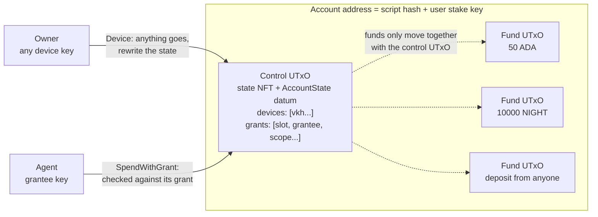
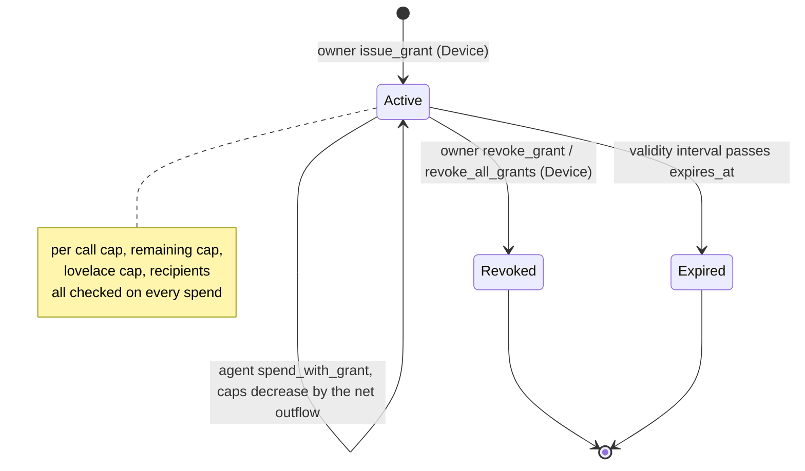
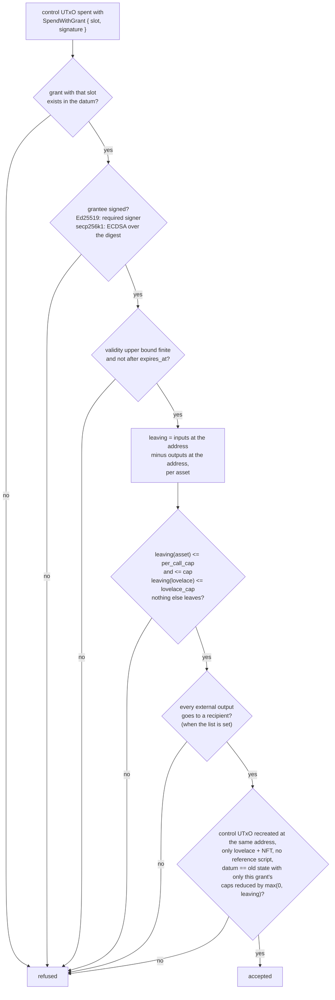
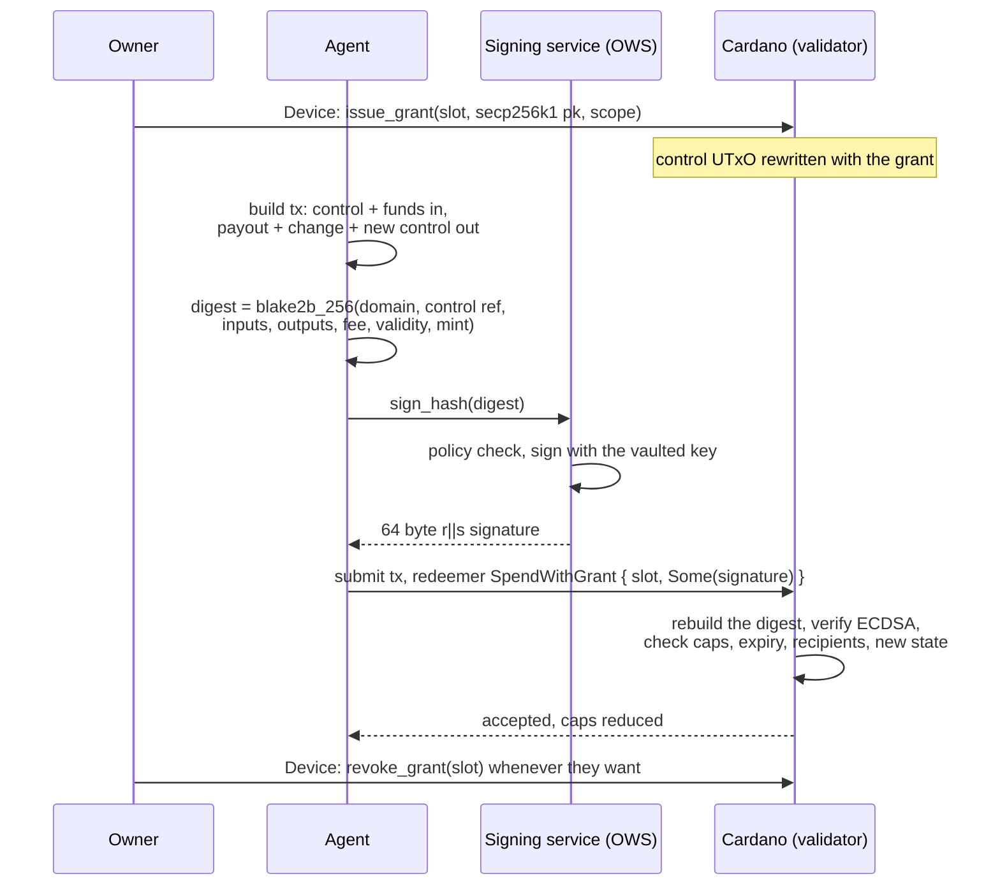

# cardano-account-custody-contract

Cardano account custody contract in Aiken: a stable per-user address with owner keys and on-chain bounded, revocable agent grants (cap, expiry, destinations).

This is the Cardano counterpart of the Midnight Passport Account Custody
Contract (ACC). The problem is the same on both chains: a user wants to let
an agent (a bot, a service, another device) act on their money within limits
they set, and those limits have to be enforced by the chain, not by whatever
software the agent happens to go through. A plain key cant do that, a key
either signs or it doesnt. So the account becomes a script, the owner keeps
full authority through their device keys, and every agent gets a grant the
script checks on every spend.

## How it works

### One address, one state UTxO

Every user gets one address. The payment part is this validator, the stake
part is the user's own stake key, so each user ends up with their own address
even tho everybody shares the same script. Funds live there as normal UTxOs,
anybody can deposit with a plain transfer, no datum needed, and the user
keeps earning staking rewards on all of it.

Next to the funds sits one small UTxO we call the control UTxO. It holds a
state NFT (minted by this same script, named after the user's stake key hash)
and an inline datum with the account state: the device keys and the list of
grants. That datum is the only place the rules live.



The trick that keeps the accounting honest is that a fund UTxO can only be
spent in a transaction that also spends the control UTxO of the same
account. The fund UTxOs check almost nothing themselves, they just require
the NFT to be among the inputs, and the control UTxO does the real work once
per transaction over everything that enters and leaves the address.

### What the owner can do

Any device key listed in the state has full authority. With a device
signature the owner can spend whatever they want, add or remove devices,
issue grants, revoke one grant or all of them, or delete the account (the NFT
gets burned). The only thing the validator insists on is that the state
written back is well formed (at most 8 devices, 16 grants, 8 recipients per
grant, caps not negative, expiry set) and that the NFT comes back to the same
address in exactly one control UTxO.

Devices are listed as key hashes, so a device is just a normal Cardano
payment key, a passkey derived one, a hardware wallet, whatever signs
Ed25519. Rotating keys never changes the address, which is what makes
"onboard once" possible.

### What an agent can do

A grant is a permission the owner writes into the state for one key:

| Field | Meaning |
| ----- | ------- |
| `slot` | identifier of the grant inside the account |
| `grantee` | an Ed25519 key hash, or a 33 byte secp256k1 public key |
| `asset` | the one asset class this grant may move (lovelace or a token) |
| `per_call_cap` | most of that asset a single transaction may take out |
| `cap` | remaining total for that asset, decremented on every spend |
| `lovelace_cap` | remaining lovelace the agent may burn on fees and min UTxO when the asset is a token |
| `expires_at` | POSIX time after which the grant is dead |
| `recipients` | optional list of addresses the agent may pay, empty means anywhere |

The agent spends with its own key, the owner is not involved and gets no
prompt, and the validator checks the transaction against the grant. If it
passes, the control UTxO is recreated with that grant's caps reduced by what
actually left (fees included). Caps only ever go down, a deposit in the same
transaction doesnt refill them.



Revoking is a normal owner rewrite of the datum, expiry needs no transaction
at all, the spend just stops validating.

### What the validator checks on an agent spend



Everything is measured at the address level, so it doesnt matter how many
fund UTxOs the agent pulls in or how it splits the change, only the net
amount that left counts. That is also why double satisfaction doesnt apply
here, there is no "an output exists that pays X" check that two scripts
could share.

### Agents that sign through a service

Ed25519 agents are the easy case, the key hash goes in the grant and the
agent signs the transaction like any wallet would. But most agent setups
(Midnight City goes through OWS, the Open Wallet Standard signing service
from WingRiders) keep the agent key in a custody service that only signs a
32 byte hash on request, and those keys are secp256k1, which Cardano cannot
use as a transaction witness.

So for a secp256k1 grantee the signature goes in the redeemer instead, over
a digest the validator can rebuild from the transaction itself: a domain
string, the control UTxO being spent, every input, every output, the fee,
the validity range and the mint, serialised as Plutus data and hashed with
blake2b-256. The custody service never needs to understand Cardano, it signs
the hash as it does today, and the hash cannot be reused because the control
UTxO reference is unique per transaction. The exact byte layout is in
[Grantee signatures](#grantee-signatures).



If the service misbehaves it can at most spend what the grant allows, the
cap, the expiry and the recipient list are enforced by the chain, and the
owner can cut it off with one transaction.

### Things to know before relying on it

Grant spends are serialised through the single control UTxO, so one agent
spend per block per account, which is fine for a handful of agents but is
not a high throughput design. There is no rolling daily cap yet, a cap is a
total that the owner tops up by rewriting the grant. Fees on an agent spend
come out of the account and count against the grant, and because grant
spends use fixed execution budgets they overpay the fee a bit. And the stake
key is the root of trust: whoever holds it can mint a fresh control UTxO for
that address, so a stake key compromise is an account compromise, same as
losing the owner device keys. Details in [Limitations](#limitations) and in
the [security review](docs/security-review.md).

## Design

### Address, control UTxO and state NFT

An account's address pairs the validator's own script hash as its payment
credential with the user's stake key hash as an inline verification key
stake credential. The validator is multi purpose: the same script hash is
both the spend handler guarding every UTxO at that address and the mint
policy of the account's state NFT, so the two handlers can trust each
other's checks within one transaction. The state NFT is named after the
stake key hash, so its policy id and name together identify the account,
and it sits in exactly one control UTxO holding only lovelace, the NFT and
an inline `AccountState` datum. Every other UTxO at the address is a plain
deposit, with an inline datum or none, since a deposit's datum is never read.

### Owner path

A device key, found in `AccountState.devices`, authorises the owner path by
signing the transaction. With a device signature the control UTxO may be
spent and rewritten freely, as long as the new state stays well formed: at
least one and at most eight distinct devices, at most sixteen grants with
distinct slots, and every grant's caps and recipient list within their
bounds. The device path can add or remove devices, issue, revoke or revoke
all grants, spend any amount of funds to any destination, and delete the
account by burning the state NFT.

### Agent path

A grant names a grantee, either an Ed25519 verification key hash or a 33
byte compressed secp256k1 public key, and a scope: an asset class, a per
call cap, a remaining cumulative cap, a remaining lovelace cap, an expiry
and a recipient list. `SpendWithGrant` checks, once over the whole
transaction, that the grantee authorised it, that the validity range ends
before the grant expires, that the value leaving the account address stays
within the per call cap and the remaining caps for the scoped asset and for
lovelace, that nothing of any other asset leaves, that every output away
from the account goes to an allowed recipient when the list is non empty,
and that every output paid back to the account other than the control
output carries no datum. The control UTxO is recreated with the same state
except the spent grant's caps, reduced by what left.

### Fund path

A plain deposit is spent with the `Fund` redeemer, which only requires that
the account's own control UTxO, identified by its state NFT at the same
full address, is spent in the same transaction. The control UTxO's own
handler does the accounting once; the fund UTxO itself carries no
authorisation and is not read for its datum.

### Why the lovelace cap exists

A grant scoped to a token asset still has a `lovelace_cap`, because every
output the ledger accepts needs its minimum UTxO value in lovelace and
every transaction pays a fee in lovelace, both charged against the account
when the account pays them. Without a separate lovelace bound, a grant
scoped to a token could drain unbounded lovelace through the minimum UTxO
values of the outputs it creates and the fee of the transaction that moves
them, even though its token cap stayed respected. When the scope's asset is
lovelace itself, the asset cap already covers lovelace, so `lovelace_cap`
must then be zero to avoid a cap counted twice.

### The state NFT placement invariant

The validator enforces that a state NFT named N only ever sits at the
account address of N, in exactly one control UTxO, or is burned. This holds
on every mint, on every device rewrite and on every grant spend: the
control output is always found at the spent input's own full address, and
its value is checked to hold only lovelace and that one NFT, so it can
never be relocated, duplicated or parked under a foreign address.

### Trust assumption

The mint handler cannot prove that an account's state NFT does not already
exist, so whoever holds a stake key can always mint a second control UTxO
at that account's address, with devices of their choosing, and spend every
deposit through it. A stake key compromise therefore equals a full account
compromise, independently of the device keys. In the intended deployment
the stake key and the device keys derive from the same credential, so this
adds no trust beyond what the devices already carry, but off-chain code
must check that no state NFT of the stake key exists before creating an
account. The adversarial review in `docs/security-review.md` records this
and every other vulnerability class that was attacked, with the tests in
`validators/attacks.test.ak` that show each attempt refused.

## Vocabulary

Terms with no established Cardano equivalent keep their Midnight ACC name.
Where Cardano already has an established term, that term is used.

| Midnight ACC term    | This contract's term  | Meaning                                                   |
| --------------------- | ---------------------- | ---------------------------------------------------------- |
| devices                | devices                | The owner's keys; any one authorises the owner path       |
| grants                 | grants                 | The account's bounded, revocable permissions                |
| slot                   | slot                   | A grant's identifier, distinct within `grants` but not its list index |
| scope                  | scope                  | A grant's bounds: asset, caps, expiry, recipients           |
| issue_grant            | issue_grant            | Owner action that adds a grant to the state                 |
| revoke_grant           | revoke_grant           | Owner action that removes one grant from the state          |
| revoke_all_grants      | revoke_all_grants      | Owner action that clears every grant from the state         |
| grant_generation       | grant_generation       | Counter bumped by `revoke_all_grants` only                  |
| withdraw                | spend                   | Taking funds out of the account (`spend_with_device`, `spend_with_grant`) |
| fund                   | deposit                | Adding funds to the account, a plain transfer with no datum |
| account token          | state NFT               | The NFT marking the account's control UTxO                  |
| account identity       | stake key hash          | The key hash that makes the account's address its owner's own |

## Data types

All types live in `lib/cardano_account_custody_contract/types.ak`. Aiken
numbers a type's constructors in declaration order, starting at zero; that
index is the Plutus data constructor tag the on-chain datum or redeemer
carries.

- `Grantee` (constructor index): `Ed25519(VerificationKeyHash)` is 0,
  `Secp256k1(VerificationKey)` is 1. The Secp256k1 key is a 33 byte
  compressed public key.
- `Asset { policy_id, asset_name }`, a single constructor record. Lovelace
  is the empty policy id and the empty asset name.
- `Scope { asset, per_call_cap, cap, lovelace_cap, expires_at, recipients }`,
  a single constructor record. `expires_at` is a POSIX millisecond
  timestamp and must be greater than zero; there is no value that means
  the grant never expires. `lovelace_cap` must be zero when `asset` is
  lovelace. `recipients` empty means any destination is allowed.
- `Grant { slot, grantee, scope }`, a single constructor record. `slot`
  identifies the grant within `AccountState.grants`, independent of its
  position in the list.
- `AccountState { devices, grants, grant_generation }`, a single
  constructor record.
- `AccountRedeemer` (constructor index): `Device` is 0, `SpendWithGrant
  { slot, signature }` is 1, `Fund` is 2. `signature` is `Some(ByteArray)`,
  the 64 byte `r || s` secp256k1 signature, for a `Secp256k1` grantee, and
  `None` for an `Ed25519` grantee.
- `MintRedeemer` (constructor index): `CreateAccount` is 0, `DeleteAccount`
  is 1.

## Grant accounting

A grant spend is checked once, over the whole transaction, on the control
UTxO. The value leaving the account is the sum of every input at the
account address minus the sum of every output paid back to it, per asset
class, so deposits made in the same transaction count against what left.
The caps are checked against that net outflow, and the recreated state
reduces the grant's remaining cap by the net outflow of its asset and, for
a grant whose asset is not lovelace, the remaining lovelace cap by the net
outflow of lovelace, each clamped at zero. A net inflow of an asset leaves
its cap exactly as it was: a cap never increases through an agent spend,
whatever the agent deposits alongside. Every output a grant spend pays
back to the account, other than the control output, must be a plain
deposit with no datum: a script output under a datum hash can only be
spent by whoever knows the preimage, so without this rule a grantee could
put the whole balance beyond reach without any of it counting as leaving.
The control output a grant spend recreates may carry no reference script:
every transaction that spends a UTxO pays a fee for the size of the
reference script it holds, so a grantee could otherwise attach a large
script to the state and raise the cost of the owner's next spend.

## Grantee signatures

A grant names its grantee either as an Ed25519 verification key hash or as
a 33 byte compressed secp256k1 public key. An Ed25519 grantee authorises a
`SpendWithGrant` spend by signing the transaction itself and appearing in
its required signers; the redeemer's `signature` is `None`. A secp256k1
grantee cannot sign a Cardano transaction, so the redeemer carries its
signature over a message that the validator rebuilds from the transaction
it is validating. Off-chain code must build the same message byte for byte:

1. Build the tuple, in this order:
   1. the domain prefix, the 32 UTF-8 bytes of
      `cardano_account_custody:grant:v1`, as a byte string;
   2. the output reference of the control UTxO being spent;
   3. the output references of every input of the transaction, in the
      transaction's input order;
   4. the outputs of the transaction, in order;
   5. the fee, in lovelace;
   6. the validity range;
   7. the mint.
   Each element is encoded as Plutus data exactly as the Plutus V3 script
   context presents it, and the tuple itself is a plain data list of seven
   elements.
2. Serialise the tuple to CBOR with the ledger's `serialiseData` encoding
   of Plutus data, which is what `aiken/cbor.serialise` produces:
   - a constructor with index `i` is a tagged array, with tag `121 + i`
     for `i < 7` and tag `1280 + (i - 7)` for `7 <= i < 128`, whose content
     is the list of its fields;
   - a non empty list, including a non empty list of constructor fields,
     is an indefinite length array, `0x9f` followed by the elements and
     closed by `0xff`; an empty list is the definite `0x80`;
   - a map is a definite length map;
   - a byte string of at most 64 bytes is a definite length byte string; a
     longer one is an indefinite length byte string made of 64 byte chunks;
   - an integer in the range a plain CBOR integer covers is encoded as one;
     a larger one is a bignum.
   The whole tuple therefore starts with `0x9f 0x58 0x20` and the domain
   prefix. A transaction with no mint serialises the mint as the empty map
   `0xa0`, and the fee is a plain integer. CBOR libraries that default to
   definite length arrays produce different bytes for the lists and
   constructor fields, and therefore a different digest; use the Plutus
   data encoding of the library, or encode the arrays as indefinite.
3. Hash the serialisation with blake2b-256. The 32 byte digest is the message.
4. Sign the digest with ECDSA over secp256k1, signing the digest as is and
   without hashing it again, and encode the signature as the 64 byte
   concatenation `r || s`, each as a 32 byte big-endian integer. The
   signature must be in low s form: the verification builtin follows
   libsecp256k1 and rejects a signature whose `s` is above half the curve
   order, so normalise `s` to `n - s` when a signer produces the high form.
   Validate lengths before submitting: a public key that is not 33 bytes,
   a message that is not 32 bytes or a signature that is not 64 bytes makes
   the builtin error instead of returning false, which fails the
   transaction in phase two and costs the collateral.

The redeemer then carries `Some(signature)`. Because the control UTxO's
output reference is part of the message and is consumed by the spend, a
signature authorises exactly one transaction and can never be replayed.

The message leaves out the rest of the transaction body on purpose:
withdrawals, certificates, reference inputs, redeemers, required signers,
witness datums, votes, proposals, the treasury donation and the collateral.
Everything the grant bounds, the value leaving the account, the recipients
and the recreated state, is a function of the inputs and outputs alone, and
those are signed. Any withdrawal or certificate touching the user's stake
credential needs the user's own stake key witness, which no agent holds.
Any extra inflow, such as a withdrawal from a different reward account,
can only balance into the signed outputs, the fee or a deposit, so it
cannot move value the agent did not sign for. The transaction id itself
cannot be part of the message, because the redeemer carrying the signature
is covered by the script data hash in the body, which the id hashes.

The validity range doubles as the grant's time check. Its upper bound must
be finite and its value must be at most the grant's `expires_at`, whether
the bound is inclusive or exclusive; a transaction with no upper bound is
refused, since it could be applied after the grant expired. The bound is
compared as POSIX milliseconds, the unit of `expires_at`.

## Build and test

Requires [Aiken](https://aiken-lang.org) v1.1.24.

```sh
aiken fmt --check
aiken check -D
aiken build
```

`aiken build` writes the contract's blueprint to `plutus.json`, which is
committed so off-chain code can load it directly.

The off-chain library under `offchain/` requires Node 22.

```sh
cd offchain
npm ci
npm run lint
npm run typecheck
npm test
```

## Off-chain library

`offchain/` is a TypeScript library, built on `@biglup/cometa`, that
derives an account's identifiers from the committed blueprint and builds
every transaction the validator accepts: `createAccount`, `deposit`,
`spendWithDevice`, `rewriteState`, `addDevice`, `removeDevice`,
`issueGrant`, `revokeGrant`, `revokeAllGrants`, `spendWithGrant` and
`deleteAccount`, together with the datum and redeemer encoders, account
address derivation, state helpers, and `granteeMessage` and
`signGrantMessage` for a secp256k1 grantee's signature. `Cometa.ready()`
must be awaited, through `offchain/src/cometa.ts`, before any of it is
used. See the JSDoc in `offchain/src/index.ts` and the modules it
re-exports for the full surface.

A grant spend never runs the validator to measure its cost, because the
recreated state depends on the fee and the fee depends on the execution
units: instead it assumes a fixed execution budget per redeemer, 4 million
memory units and 2 billion steps for the control UTxO's spend and 500
thousand memory units and 200 million steps for each fund UTxO, overridable
through `executionUnits`. Overpaying the real cost this way spends roughly
290 thousand additional lovelace in fees per grant spend, and since the
account pays its own fee, that amount counts against the grant's lovelace
cap alongside the payout; a lovelace grant with a 10 tADA per call cap
needs an 8 tADA payout plus about 1.3 tADA of fee and allowance to fit. The
fixed fund budget also bounds how many fund UTxOs one grant spend can
sweep: at the defaults, about 20 fund UTxOs before the transaction's 14
million memory unit ceiling is reached, so an account that expects agent
spends should be kept to a handful of fund UTxOs between owner steps;
`spendWithDevice` can consolidate them. The control output's lovelace
rises automatically with the size of the state it carries, staying at or
above the network's minimum UTxO value for that output.
`createAccount` accepts an optional `provider`; when given, it refuses to
build a second account for a stake key hash that already has a control
UTxO at its address, which is the off-chain side of the trust assumption
below. `findAccountUtxos` treats every UTxO at the account address that
does not hold the state NFT as a fund, so a deposit must never be sent
under a datum hash if it is meant to be spent by this script.

## Running the preprod script

```sh
cd offchain
npm run e2e
```

The script needs `BLOCKFROST_PREPROD_PROJECT_ID` and `FUNDING_MNEMONIC` in
the repository root `.env`; see `.env.example` for the variable names. On its first
run, with no funding mnemonic set, it generates one, stores it in `.env`,
prints the funding address and exits: fund that address with tADA from the
preprod faucet and rerun. Every later run exercises the full set of flows,
owner and agent, happy path and refused, against the live network, and
rewrites `docs/preprod-evidence.md` with the resulting transactions.

## Security review and preprod evidence

`docs/security-review.md` is an adversarial review of the validator,
organised by vulnerability class, with each attack reproduced as a
transaction in `validators/attacks.test.ak` that the validator is shown to
refuse. It found two issues that needed a code change: a grant spend could
return the whole account balance under a datum hash with no known
preimage, locking it on every path, fixed by requiring every non-control
output a grant spend pays back to the account to carry no datum; and a
grant spend could attach a reference script to the recreated control
output, raising the fee of every later spend of it, fixed by forbidding a
reference script on that output. Both fixes are covered by dedicated
tests, and `plutus.json` was regenerated after each. The review's budget
guidance measures the heaviest handlers over the largest well formed state
and finds the worst case, a device rewrite, at about 72 percent of the
mainnet transaction memory limit, with the batch size of a grant spend
sweeping many deposits as the other parameter to watch; both figures are
measured by `aiken check` and must be confirmed on preprod with
the real transaction builder.

`docs/preprod-evidence.md` records a full run of the script above against
the Cardano preprod network through Blockfrost: creating an account,
depositing, an owner spend, issuing and spending an Ed25519 grant and a
secp256k1 grant, a grant spend refused for exceeding its remaining cap and
for paying outside its recipients, both rejected first by the builder and
then, unchecked, by the node in phase two, a grant spend refused after
revocation, a grant left to expire and refused, adding and removing a
device, revoking every grant, and deleting the account, each linked to its
transaction on the preprod explorer.

## Limitations

- One control UTxO per account serialises every operation on it: owner and
  agent spends cannot run concurrently, and a grantee can churn the
  control UTxO with a zero outflow spend to contest an owner's revoke,
  though the loss stays bounded by the caps already granted.
- A grant has a per call cap, a cumulative cap and an expiry, with no
  rolling period caps such as a daily or epoch limit; a grantee can exhaust
  the cumulative cap at once, in as many transactions as the per call cap
  allows.
- The mint handler cannot prove that a stake key's state NFT does not
  already exist, so the owner must check that no such NFT exists before
  creating an account; `createAccount` performs this check itself when
  given a provider.
- A grant spend assumes a fixed execution budget rather than measuring the
  real one, which lets the defaults sweep at most about 20 fund UTxOs per
  spend and overpays the fee by roughly 290 thousand lovelace, charged
  against the grant's lovelace cap, so caps must be sized with that
  margin.
- The contract has only run on the Cardano preprod testnet and has not had
  an independent audit; treat it as unaudited and testnet only.

## License

Apache-2.0
