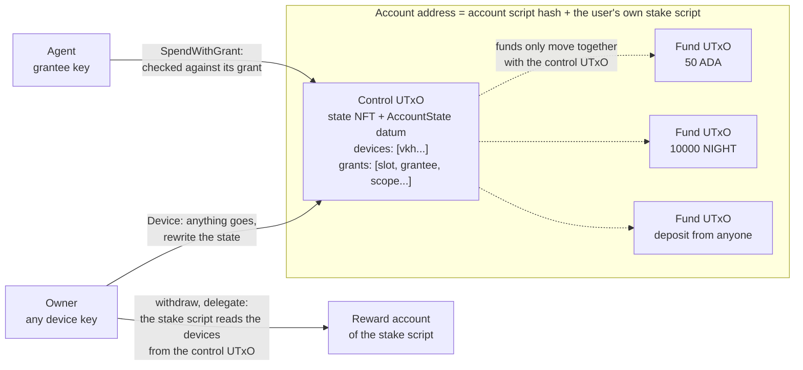
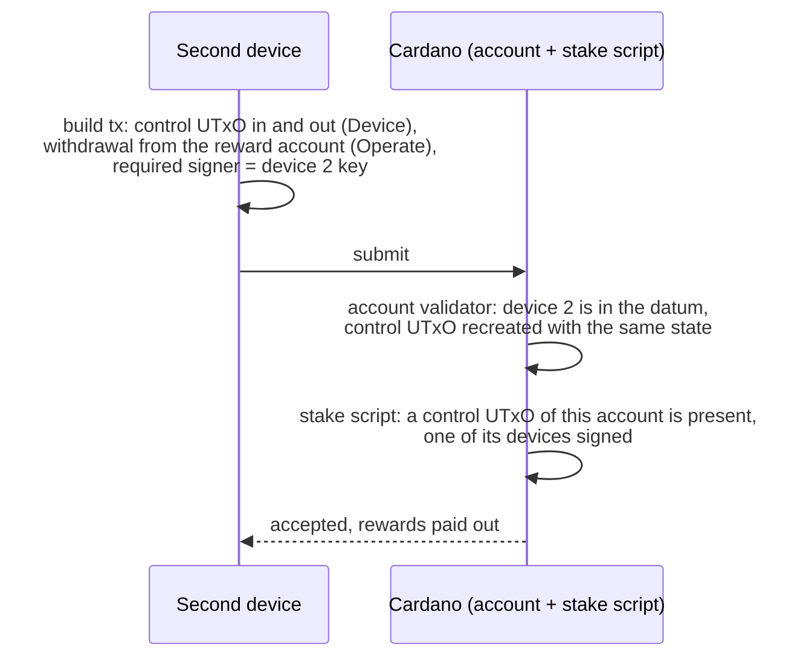
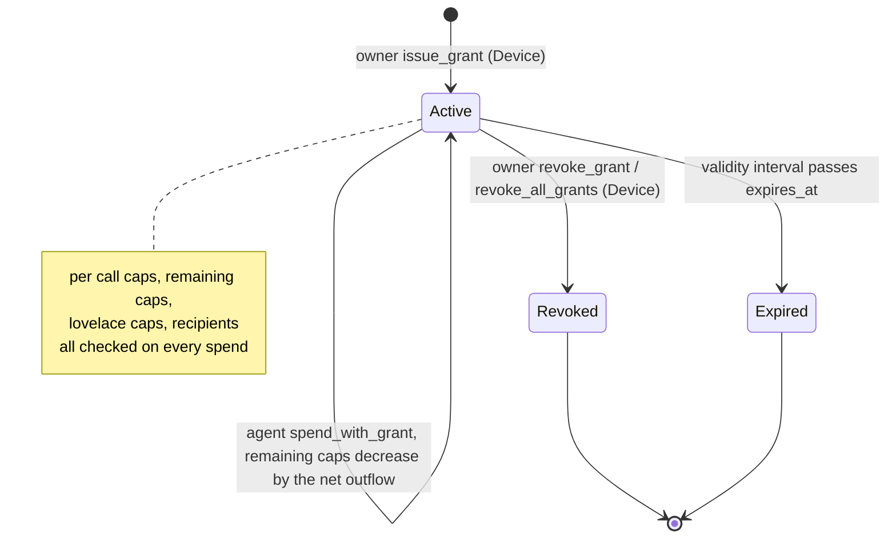
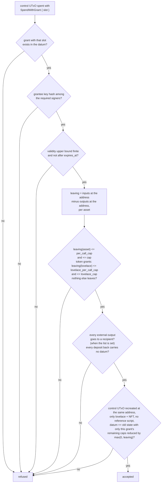
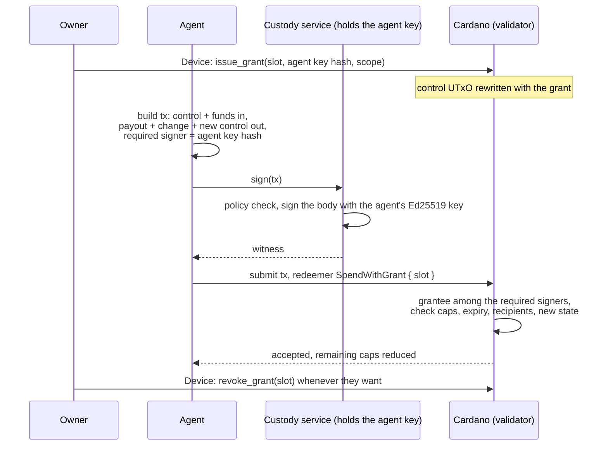

# cardano-account-custody-contract

Cardano account custody contract in Aiken: a stable per-user address with owner keys and on-chain bounded, revocable agent grants (cap, expiry, destinations).

This is the Cardano counterpart of the Midnight Passport Account Custody
Contract (ACC). The problem is the same on both chains: a user wants to let
an agent (a bot, a service, another device) act on their money within limits
they set, and those limits have to be enforced by the chain, not by whatever
software the agent happens to go through. A plain key cant do that, a key
either signs or it doesnt. So the account becomes a script, the owner keeps
full authority through their device keys, and every agent gets a grant the
script checks on every spend.

## How it works

### One address, one state UTxO

Every user gets one address. The payment part is the account validator,
shared by everybody. The stake part is a small stake script of the user's
own: the `account_stake` validator applied to the user's first device key
(we call that key the owner) and to the account validator's hash. The hash
of that applied script is the user's stake credential, so each user ends up
with their own address and their own reward account even tho everybody
shares the same payment script. Funds live there as normal UTxOs, anybody
can deposit with a plain transfer, no datum needed, and the user keeps
earning staking rewards on all of it.

Next to the funds sits one small UTxO we call the control UTxO. It holds a
state NFT (minted by the account validator, named after the stake
credential) and an inline datum with the account state: the device keys and
the list of grants. That datum is the only place the rules live, and the
stake script reads it too: whoever wants to touch the rewards or the
delegation has to show the control UTxO and sign with one of the devices
listed in it.



The trick that keeps the accounting honest is that a fund UTxO can only be
spent in a transaction that also spends the control UTxO of the same
account. The fund UTxOs check almost nothing themselves, they just require
the NFT to be among the inputs, and the control UTxO does the real work once
per transaction over everything that enters and leaves the address.

Creating the account is one transaction: it registers the stake credential
(the stake script lets that through only with the owner's signature, and
this is the one and only time the owner key matters on its own) and mints
the state NFT into the control UTxO. The mint handler refuses to run
without that registration in the same transaction, and the ledger refuses
to register a credential that is already registered, so an account can only
be created once. Nobody, not even the owner key, can mint a second control
UTxO later.

### What the owner can do

Any device key listed in the state has full authority. With a device
signature the owner can spend whatever they want, add or remove devices,
issue grants, revoke one grant or all of them, withdraw the staking rewards
and delegate to a pool or a DRep. The only thing the validator insists on
is that the state written back is well formed (at most 8 devices, 16
grants, 8 recipients per grant, caps not negative, expiry set) and that the
NFT comes back to the same address in exactly one control UTxO.

Devices are listed as key hashes, so a device is just a normal Cardano
payment key, a passkey derived one, a hardware wallet, whatever signs
Ed25519. Rotating keys never changes the address, which is what makes
"onboard once" possible. The owner key is just the first device: once a
second device is in the list the first one can be removed like any other
and the account keeps working, address, funds and rewards included.

### Rewards and delegation with any device

The rewards used to be the weak spot of this kind of design: when the stake
part is a key, losing that key means losing the rewards and the delegation
forever, and whoever holds it can go behind the devices' backs. Here the
stake part is a script that asks the same question the spend path asks: is
a device of this account signing. A withdrawal or a delegation transaction
references (or spends) the control UTxO, the stake script reads the devices
out of its datum, and one of them has to be among the required signers. So
a second device added last week can withdraw the rewards the first device
earned, and a lost passkey costs nothing but a device removal.
Deregistering the credential is refused outright, more on that under
permanence below.



### What an agent can do

A grant is a permission the owner writes into the state for one key:

| Field | Meaning |
| ----- | ------- |
| `slot` | identifier of the grant inside the account |
| `grantee` | the Ed25519 key hash of the agent, which signs the transaction as a required signer |
| `asset` | the one asset class this grant may move (lovelace or a token) |
| `per_call_cap` | most of that asset a single transaction may take out |
| `cap` | remaining total for that asset, decremented on every spend |
| `lovelace_per_call_cap` | most lovelace a single transaction may burn on fees and min UTxO when the asset is a token, zero for a lovelace grant |
| `lovelace_cap` | remaining lovelace total for the same purpose, decremented on every spend, zero for a lovelace grant |
| `expires_at` | POSIX time after which the grant is dead |
| `recipients` | optional list of addresses the agent may pay, empty means anywhere |

The agent spends with its own key, the owner is not involved and gets no
prompt, and the validator checks the transaction against the grant. If it
passes, the control UTxO is recreated with that grant's remaining caps
(`cap` and `lovelace_cap`) reduced by what actually left (fees included).
The per call caps never change. Caps only ever go down, a deposit in the
same transaction doesnt refill them.



Revoking is a normal owner rewrite of the datum, expiry needs no transaction
at all, the spend just stops validating.

### What the validator checks on an agent spend



Everything is measured at the address level, so it doesnt matter how many
fund UTxOs the agent pulls in or how it splits the change, only the net
amount that left counts. That is also why double satisfaction doesnt apply
here, there is no "an output exists that pays X" check that two scripts
could share.

### Agents that sign through a custody service

Most agent setups dont keep the agent key on the agent's machine, they keep
it in a custody service that signs on request and applies its own policy
first. That changes nothing on chain. The grantee is the hash of an Ed25519
key, the service holds that key, the agent builds the transaction and hands
it over, the service signs the transaction body like any wallet would, and
the witness goes in the transaction. The validator only sees a required
signer that matches the grant. There is no other kind of grantee: a service
that cannot produce an Ed25519 witness over the transaction cant be a
grantee as is.



If the service misbehaves it can at most spend what the grant allows, the
caps, the expiry and the recipient list are enforced by the chain, and the
owner can cut it off with one transaction.

### Finding the account again

The address is a pure function of the owner key and the compiled scripts:
apply the stake script to the owner key hash and the account script hash,
hash the result, and you have the stake credential, the address, the
reward account and the name of the state NFT. A passkey synced to a second
machine derives the same key and therefore the same account, that is what
`accountByOwner` does. A second device with its own key cant do that, it
doesnt know the owner key, so when it gets added it receives an account
record (owner key hash, stake script hash, address) in the add device
handshake, persists it, and every builder accepts the record in place of
the owner key. `accountExists` confirms the control UTxO is on chain and
returns the current state. As a last resort every account is discoverable
from the chain alone: list the state NFT policy, read each control datum,
look for the device key hash. We havent written that helper, but nothing is
hidden. This is one place where Cardano is easier than Midnight: there the
state is private and discovery needs the viewing secret envelopes, here the
datum is public.

### Things to know before relying on it

Grant spends are serialised through the single control UTxO, so one agent
spend per block per account, which is fine for a handful of agents but is
not a high throughput design. There is no rolling daily cap yet, a cap is a
total that the owner tops up by rewriting the grant. Fees on an agent spend
come out of the account and count against the grant, and because grant
spends use fixed execution budgets they overpay the fee a bit. An account
is permanent: the credential stays registered with its deposit, the control
UTxO stays where it is, and there is no delete. And create the account
before you share the address: anybody who learns the stake credential first
can register it with a plain certificate, and then the account can never be
created at that address. Details in [Limitations](#limitations) and in the
[security review](docs/security-review.md).

## Design

### Address, control UTxO and state NFT

An account's address pairs the account validator's script hash as its
payment credential with the hash of the account's own stake script as an
inline script stake credential. The account validator is multi purpose:
the same script hash is both the spend handler guarding every UTxO at that
address and the mint policy of the account's state NFT, so the two handlers
can trust each other's checks within one transaction. The state NFT is
named after the stake credential, so its policy id and name together
identify the account, and it sits in exactly one control UTxO holding only
lovelace, the NFT and an inline `AccountState` datum. Every other UTxO at
the address is a plain deposit, with an inline datum or none, since a
deposit's datum is never read. An output at the account script whose stake
part is anything but an inline script credential belongs to no account and
cannot be spent, because `account.stake_script_hash_of` aborts on it.

### The account stake script

`account_stake` is a parameterised validator taking `owner`, the
verification key hash of the account's initial device, and `account_hash`,
the account validator's hash. Applying both yields the user's stake
script, and its hash is the account's stake credential. The script has two
handlers. `publish` runs on every certificate naming the credential: a
`RegisterCredential` or `RegisterAndDelegateCredential` passes only with
`owner` among the required signers; a `DelegateCredential`, whether to a
pool, a delegate representative or both, passes only under the device
rule; an `UnregisterCredential` and every other certificate kind are
refused. `withdraw` runs on every withdrawal from the credential's reward
account, of any amount including zero, under the same device rule. The
device rule, `account.is_authorised_by_a_device`, looks for the account's
control UTxO among the transaction's inputs or reference inputs, an output
at the account address holding exactly one state NFT and an inline state,
and requires one of that state's devices among the required signers. The
`else` handler fails, so the stake script never acts as anything else.

### Registration gated creation

`CreateAccount` mints exactly one token under the account policy, named
after the stake credential, into a single valid control output, and
requires that the transaction's redeemers hold a `Publish` entry for a
certificate registering that credential
(`account.registers_stake_credential`). A publish redeemer exists only when
the ledger ran the stake script on that certificate, which is when the
owner's signature was checked; the certificate list alone would not do,
since a registration in the legacy certificate format needs no witness at
all. The ledger registers a credential at most once and the stake script
refuses to deregister, so a second `CreateAccount` for the same credential
can never carry the registration it needs. The mint handler does not read
the stake script's code: an account created under some other script's
credential is simply that script's own account, with its own name and
address, and can touch no other.

### Owner path

A device key, found in `AccountState.devices`, authorises the owner path by
signing the transaction. With a device signature the control UTxO may be
spent and rewritten freely, as long as the new state stays well formed: at
least one and at most eight distinct devices, at most sixteen grants with
distinct slots, and every grant's caps and recipient list within their
bounds. The device path can add or remove devices, issue, revoke or revoke
all grants, and spend any amount of funds to any destination.

### Rewards and delegation

A withdrawal from the reward account and a delegation certificate are owner
operations in the same sense: the stake script accepts them when a control
UTxO of the account is spent or referenced and one of its devices signs.
The off-chain builders spend the control UTxO with `Device` and recreate
it with the same state, which puts the devices in front of the stake script
and lets the account pay the fee from its own funds; referencing the
control UTxO instead is equally valid on chain. A withdrawal of zero is
valid and runs the same check, so the path can be exercised before any
reward has accrued.

### Agent path

A grant names a grantee, an Ed25519 verification key hash, and a scope: an
asset class, a per call cap, a remaining cumulative cap, a lovelace per
call cap, a remaining lovelace cap, an expiry and a recipient list.
`SpendWithGrant` checks, once over the whole transaction, that the grantee
is among the required signers, that the validity range ends before the
grant expires, that the value leaving the account address stays within the
per call cap and the remaining cap for the scoped asset and, when that
asset is not lovelace, within the lovelace per call cap and the remaining
lovelace cap, that nothing of any other asset leaves, that every output
away from the account goes to an allowed recipient when the list is non
empty, and that every output paid back to the account other than the
control output carries no datum. The control UTxO is recreated with the
same state except the spent grant's remaining caps, reduced by what left,
and with no reference script.

### Fund path

A plain deposit is spent with the `Fund` redeemer, which only requires that
the account's own control UTxO, identified by its state NFT at the same
full address, is spent in the same transaction. The control UTxO's own
handler does the accounting once; the fund UTxO itself carries no
authorisation and is not read for its datum.

### Why the lovelace caps exist

A grant scoped to a token asset still has a `lovelace_per_call_cap` and a
`lovelace_cap`, because every output the ledger accepts needs its minimum
UTxO value in lovelace and every transaction pays a fee in lovelace, both
charged against the account when the account pays them. Without a
separate lovelace bound, a grant scoped to a token could drain unbounded
lovelace through the minimum UTxO values of the outputs it creates and the
fee of the transaction that moves them, even though its token cap stayed
respected. The per call cap bounds one transaction, so a grantee cannot
burn the whole lovelace allowance in one go; the cumulative cap bounds the
grant's lifetime. When the scope's asset is lovelace itself, the asset caps
already cover lovelace, so both lovelace caps must then be zero to avoid a
cap counted twice.

### The state NFT placement invariant

The validator enforces that a state NFT named N only ever sits at the
account address of N, in exactly one control UTxO. This holds on every
mint, on every device rewrite and on every grant spend: the control output
is always found at the spent input's own full address, and its value is
checked to hold only lovelace and that one NFT, so it can never be
relocated, duplicated or parked under a foreign address, and no redeemer
burns it.

### Permanence

An account is never deleted. The mint handler only creates, so no
redeemer burns a state NFT, and the stake script refuses every
deregistration, so the credential stays registered for the life of the
account. From creation on exactly one control UTxO of the account exists at
all times: every spend of it recreates it, and a second one cannot be
minted while the credential is registered. That invariant is what keeps
every fund UTxO spendable, since a deposit can only leave alongside the
control UTxO and the control UTxO is always there to spend. The price is
that the registration deposit and the control UTxO's minimum lovelace stay
locked per account, and a dormant account simply remains. This replaces
the trust assumption a key stake credential would carry: no key can mint a
parallel control UTxO behind the devices' backs, and the owner key, after
creation, is one device among the others.

## Vocabulary

Terms with no established Cardano equivalent keep their Midnight ACC name.
Where Cardano already has an established term, that term is used.

| Midnight ACC term    | This contract's term  | Meaning                                                   |
| --------------------- | ---------------------- | ---------------------------------------------------------- |
| devices                | devices                | The owner's keys; any one authorises the owner path       |
| grants                 | grants                 | The account's bounded, revocable permissions                |
| slot                   | slot                   | A grant's identifier, distinct within `grants` but not its list index |
| scope                  | scope                  | A grant's bounds: asset, caps, expiry, recipients           |
| issue_grant            | issue_grant            | Owner action that adds a grant to the state                 |
| revoke_grant           | revoke_grant           | Owner action that removes one grant from the state          |
| revoke_all_grants      | revoke_all_grants      | Owner action that clears every grant from the state         |
| grant_generation       | grant_generation       | Counter bumped by `revoke_all_grants` only                  |
| withdraw                | spend                   | Taking funds out of the account (`spend_with_device`, `spend_with_grant`); on Cardano "withdraw" is reserved for rewards |
| fund                   | deposit                | Adding funds to the account, a plain transfer with no datum |
| account token          | state NFT               | The NFT marking the account's control UTxO                  |
| account identity       | stake credential        | The hash of the account's own stake script, which makes the address and the NFT name the owner's own |
| owner                  | owner                   | The initial device key, the stake script's parameter; authorises creation only |

## Data types

All types live in `lib/cardano_account_custody_contract/types.ak`. Aiken
numbers a type's constructors in declaration order, starting at zero; that
index is the Plutus data constructor tag the on-chain datum or redeemer
carries.

- `Asset { policy_id, asset_name }`, a single constructor record. Lovelace
  is the empty policy id and the empty asset name.
- `Scope { asset, per_call_cap, cap, lovelace_per_call_cap, lovelace_cap,
  expires_at, recipients }`, a single constructor record with its seven
  fields in that order. `expires_at` is a POSIX millisecond timestamp and
  must be greater than zero; there is no value that means the grant never
  expires. `lovelace_per_call_cap` and `lovelace_cap` must be zero when
  `asset` is lovelace. `recipients` empty means any destination is allowed.
- `Grant { slot, grantee, scope }`, a single constructor record. `slot`
  identifies the grant within `AccountState.grants`, independent of its
  position in the list. `grantee` is a 28 byte Ed25519 verification key
  hash.
- `AccountState { devices, grants, grant_generation }`, a single
  constructor record.
- `AccountRedeemer` (constructor index): `Device` is 0, `SpendWithGrant
  { slot }` is 1 with the slot as its only field, `Fund` is 2.
- `MintRedeemer` (constructor index): `CreateAccount` is 0 and is the only
  constructor.
- `StakeRedeemer` (constructor index): `Operate` is 0 and is the only
  constructor. Both stake handlers learn what they authorise from the
  script context, the withdrawal's credential or the certificate, so the
  redeemer carries no choice.

## Grant accounting

A grant spend is checked once, over the whole transaction, on the control
UTxO. The value leaving the account is the sum of every input at the
account address minus the sum of every output paid back to it, per asset
class, so deposits made in the same transaction count against what left.
The per call caps and the remaining caps are checked against that net
outflow, and the recreated state reduces the grant's remaining cap by the
net outflow of its asset and, for a grant whose asset is not lovelace, the
remaining lovelace cap by the net outflow of lovelace, each clamped at
zero. Only `cap` and `lovelace_cap` ever change; the per call caps bound
single transactions and stay as issued. A net inflow of an asset leaves
its cap exactly as it was: a cap never increases through an agent spend,
whatever the agent deposits alongside. Every output a grant spend pays
back to the account, other than the control output, must be a plain
deposit with no datum: a script output under a datum hash can only be
spent by whoever knows the preimage, so without this rule a grantee could
put the whole balance beyond reach without any of it counting as leaving.
The control output a grant spend recreates may carry no reference script:
every transaction that spends a UTxO pays a fee for the size of the
reference script it holds, so a grantee could otherwise attach a large
script to the state and raise the cost of the owner's next spend.

The validity range doubles as the grant's time check. Its upper bound must
be finite and its value must be at most the grant's `expires_at`, whether
the bound is inclusive or exclusive; a transaction with no upper bound is
refused, since it could be applied after the grant expired. The bound is
compared as POSIX milliseconds, the unit of `expires_at`.

## Build and test

Requires [Aiken](https://aiken-lang.org) v1.1.24.

```sh
aiken fmt --check
aiken check -D
aiken build
```

`aiken build` writes the blueprint of both validators to `plutus.json`,
which is committed so off-chain code can load it directly. The account
validator's hash in the blueprint is final; the stake validator's entry is
the parameterised code, and its hash only becomes an account's stake
credential once `owner` and `account_hash` are applied.

The off-chain library under `offchain/` requires Node 22.

```sh
cd offchain
npm ci
npm run lint
npm run typecheck
npm test
```

## Off-chain library

`offchain/` is a TypeScript library, built on `@biglup/cometa`, that
derives an account's identifiers from the committed blueprint and builds
every transaction the validators accept. `Cometa.ready()` must be awaited,
through `offchain/src/cometa.ts`, before any of it is used. See the JSDoc
in `offchain/src/index.ts` and the modules it re-exports for the full
surface.

- Parameter application. `stakeScript` applies the owner key hash and the
  account script hash to the blueprint's stake validator in pure
  TypeScript (`applyParameters`), byte for byte what `aiken blueprint
  apply` produces, and `stakeScriptHash` gives the stake credential.
  `accountAddress`, `rewardAddress` and `stateNftAssetId` derive the rest.
- Discovery. `accountByOwner` computes the record of an account from the
  owner key hash alone; `accountExists` confirms the control UTxO on chain
  and returns the current state; every builder takes either `owner` or a
  persisted `AccountRecord`.
- Builders. `createAccount`, `deposit`, `spendWithDevice`, `rewriteState`,
  `addDevice`, `removeDevice`, `issueGrant`, `revokeGrant`,
  `revokeAllGrants`, `withdrawRewards`, `delegateStake` and
  `spendWithGrant`, with the datum and redeemer encoders in `data.ts` and
  the state helpers in `state.ts`. There is no delete.
- Sponsor. Every builder accepts an optional `sponsor` wallet that pays
  the fee, the collateral, the growth of the control output and, at
  creation, the control UTxO and the registration deposit, and receives
  the change, so the device wallet only signs. Without a sponsor an owner
  operation is paid from the account's own fund UTxOs, with the fee
  reserved at the most a transaction can cost and the surplus returned to
  the account as change; creation without a sponsor is paid by the device
  wallet, since there is no account to pay from yet.
- Stake operations. `withdrawRewards` and `delegateStake` are device
  spends: they spend the control UTxO with `Device`, recreate it with the
  same state, and add the withdrawal or the certificate with the `Operate`
  redeemer and the account's stake script attached. The withdrawn amount
  defaults to the provider's reward balance, which may be zero.
- Fixed budgets. A grant spend never runs the validator to measure its
  cost, because the recreated state depends on the fee and the fee depends
  on the execution units: `fixedBudgetEvaluator` assigns 4 million memory
  units and 2 billion steps to the control UTxO's spend and 500 thousand
  memory units and 200 million steps to each fund UTxO, overridable through
  `executionUnits`. Overpaying the real cost this way costs a few hundred
  thousand lovelace of fee per grant spend, and since the account pays its
  own fee, the fee counts against the grant's caps alongside the payout: a
  lovelace grant is charged on `per_call_cap` and `cap`, a token grant on
  the lovelace caps. The preprod run's 8 tADA spends fit under a 10 tADA
  per call cap with the fee included. The transaction is rebuilt until the
  state it carries matches the value that actually leaves.
- The fund UTxO ceiling. The fixed fund budget bounds how many fund UTxOs
  one grant spend can sweep: at the defaults, about 20 before the
  transaction's 14 million memory unit ceiling is reached, so an account
  that expects agent spends should be kept to a handful of fund UTxOs
  between owner steps; `spendWithDevice` can consolidate them. On the
  agent path `accountOnlyCoinSelector` spends nothing beyond the account's
  own UTxOs, so a spend the account cannot cover fails instead of reaching
  into the agent's wallet.
- Control output lovelace. The control output's lovelace rises
  automatically with the size of the state it carries
  (`minimumUtxoLovelace`), staying at or above the network's minimum UTxO
  value for that output; every grant and device enlarges the datum.
- Creation checks. `createAccount` accepts an optional `provider`; when
  given, it refuses to build while a UTxO holding the account's state NFT
  already exists. `findAccountUtxos` treats every UTxO at the account
  address that does not hold the state NFT as a fund, so a deposit must
  never be sent under a datum hash if it is meant to be spent by this
  script.

## Running the preprod script

```sh
cd offchain
npm run e2e
```

The script needs `BLOCKFROST_PREPROD_PROJECT_ID` and `FUNDING_MNEMONIC` in
the repository root `.env`; see `.env.example` for the variable names. On
its first run, with no funding mnemonic set, it generates one, stores it in
`.env`, prints the funding address and exits: fund that address with tADA
from the preprod faucet and rerun. The funding wallet is account 0 of the
mnemonic and the agent wallet account 1. Because an account is permanent,
every run creates a fresh one: the owner wallet is the first account index
from 2 upwards whose stake credential is not yet registered on preprod.
The owner wallet holds nothing but one collateral UTxO; the funding wallet
sponsors the creation and the final sweep, and every other owner operation
is paid from the account itself. Every run exercises the full set of
flows, owner, stake and agent, happy path and refused, against the live
network, and rewrites `docs/preprod-evidence.md` with the resulting
transactions.

## Security review and preprod evidence

`docs/security-review.md` is an adversarial review of both validators,
organised by vulnerability class, with each attack reproduced as a
transaction in `validators/attacks.test.ak` that the validators are shown
to refuse. It found two issues that needed a code change, a grant spend
parking the balance under a datum hash and a grant spend attaching a
reference script to the control output, both fixed and covered by tests;
it records how registration gated creation removes the parallel control
UTxO problem a key stake credential had, measures the heaviest handlers
over the largest well formed state with `aiken check` (a device rewrite
is the worst case, at about 72 percent of the mainnet memory limit), and
lists the residual risks, the pre registration of a credential by a third
party first among them.

`docs/preprod-evidence.md` records a full run of the script above against
the Cardano preprod network through Blockfrost: a sponsored account
creation that registers the stake credential and mints the state NFT, a
deposit, an owner spend paid from the account, a reward withdrawal and a
pool delegation signed by the owner device, issuing and spending a grant,
grant spends refused for exceeding the remaining cap and for paying
outside the recipients, each first by the builder and then, built
unchecked, by the node in phase two, a grant spend refused after
revocation, a grant left to expire and refused, adding a second device
that then spends and withdraws rewards from the persisted account record
alone, removing it, revoking every grant, and a final sweep that leaves
only the control UTxO in place. The document carries the transaction
links and the ledger errors.

## Limitations

- One control UTxO per account serialises every operation on it: owner and
  agent spends cannot run concurrently, and a grantee can churn the
  control UTxO with a zero outflow spend to contest an owner's revoke,
  though the loss stays bounded by the caps already granted.
- A grant has per call caps, cumulative caps and an expiry, with no
  rolling period caps such as a daily or epoch limit; a grantee can exhaust
  the cumulative cap at once, in as many transactions as the per call cap
  allows.
- An account is permanent. The registration deposit and the control UTxO's
  minimum lovelace stay locked for the life of the account, there is no
  delete, and a dormant account simply remains.
- A stake credential can be registered by anyone in the legacy certificate
  format, which needs no witness. Whoever learns an account's stake
  credential before the account exists can register it first, after which
  the owner's registration fails as already registered and the account can
  never be created at that address. The rule is: create the account before
  sharing the address, never deposit to an address whose control UTxO does
  not exist, and when creation fails with an already registered credential
  move on to the next owner key.
- A grant spend assumes a fixed execution budget rather than measuring the
  real one, which lets the defaults sweep at most about 20 fund UTxOs per
  spend and overpays the fee by a few hundred thousand lovelace, charged
  against the grant's caps, so caps must be sized with that margin.
- The state is bounded at 8 devices, 16 grants and 8 recipients per grant
  so that the heaviest owner operation, a device rewrite over the largest
  state, stays within the transaction's execution budget; those bounds are
  constants in `state.ak`.
- The contract has only run on the Cardano preprod testnet and has not had
  an independent audit; treat it as unaudited and testnet only.

## What a transaction builder needs

The off-chain library here uses cometa.js as a proving ground; a production
integration will port the builders onto another transaction builder. The
port must be able to:

- Spend Plutus V3 script inputs with a redeemer, with an inline datum (the
  control UTxO) and without any datum (fund UTxOs).
- Mint under a Plutus V3 policy with a redeemer.
- Register a script stake credential with the Conway deposit, delegate it
  and withdraw from its reward account, each with a redeemer and the stake
  script attached as a witness.
- Write inline datums on outputs.
- Add reference inputs (optionally).
- Select and return collateral from a wallet other than the account.
- Set a fixed execution budget per redeemer instead of evaluating, because
  a grant spend cannot be evaluated by a provider: the datum depends on
  the fee.
- Apply parameters to the blueprint's stake validator to derive the per
  user stake script and its hash.
- Declare required signers and gather witnesses from more than one wallet,
  the device and the sponsor.
- Size the control output's lovelace to the minimum UTxO value as the
  datum grows.
- Return change to the account address with no datum.
- Spend only account UTxOs on the grant path, with the agent's wallet used
  for collateral alone.
- Read the inputs, outputs and fee of a built transaction back, to rebuild
  a grant spend until its state matches what leaves.

## License

Apache-2.0
