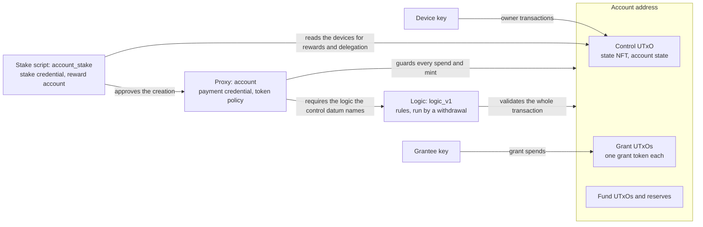

# Cardano Account Custody Contract

A Cardano account in Aiken: one permanent address that several device
keys control, with bounded, revocable grants for agents.

> **Status.** The contract has no independent audit. Treat it as
> unaudited and testnet only. It is deployed on preprod. How it is
> verified is in [Verification](docs/verification.md), and the risks that
> remain are in [Known issues](docs/security/known-issues.md).

## What it is

The contract is the Cardano counterpart of the Midnight Passport Account
Custody Contract. Each user gets one script address. Anyone can deposit
to it, and once a device delegates the account, everything at it earns
staking rewards. The address never changes while the user adds and
removes devices, and while the rules that govern the account are
replaced.

Under `logic_v1`, any device has full authority. An agent holds a grant:
a permission bounded by one asset, per call and remaining caps, an expiry
and a recipient list. The rules check the grant on every spend, and any
device can revoke it in one transaction. The [overview](docs/overview.md)
states the problem and the guarantees in full.

## Who can do what

The rules below are those of `logic_v1`, except creation, rewards and
delegation, which the stake script enforces for every account. The full
table is in [Actors and authority](docs/overview.md#actors-and-authority).

- **Owner key.** Signs the creation and must be a device then. Afterwards
  it is one device like any other.
- **Any device.** Spends funds and reserves, changes the devices,
  issues, revokes and sweeps grants, withdraws rewards, delegates, and
  moves the account to another logic.
- **Grantee.** Spends within its grant's scope while the grant is
  current, directly or through an agent key signer.
- **Fee sponsor.** Pays for creation and owner transactions. It gains no
  authority.
- **Anyone.** Deposits, reads an account's state, registers a logic
  credential and parks reference scripts.

## Three validators

A permanent proxy holds the funds and mints the tokens. A replaceable
logic holds the rules and runs once per transaction. A per owner stake
script gives each account its own address and reward account. The
[architecture](docs/architecture.md) explains how they divide the work.

## Preprod deployment

The validator hashes, derived from the committed [blueprint](plutus.json):

| Validator | Hash |
| --- | --- |
| Proxy, `account` | `ed61963ac94d12c0b320be5a336c36af66bc02c380e0aa3001899253` |
| Logic, `logic_v1`, applied to the proxy hash | `2cd68e398bdf9fbc8d257614b54403451ee722520ec785fe14f8df5a` |
| Stake script, `account_stake`, unapplied | `edcfa41389b7b924916ad7408cd2d0f75a7a3dae8717f9bbf1a668c6` |

The logic credential is registered on preprod. The proxy and the logic
are parked as reference scripts:

| Script | Parked UTxO |
| --- | --- |
| Proxy | `574e6c3d2e64303015f4db89930848b47fef501c65c448a59d843a383a63fc7e#0` |
| Logic | `000b0715bb8613761555becc9b50105dd3e23b93f91bce01dea72c3bbd0228f8#0` |

The network file [offchain/networks/preprod.json](offchain/networks/preprod.json)
records them. [Network setup](docs/operations/network-setup.md#preprod)
gives the parking address and the logic's reward address.

## Quick start

[Quickstart](docs/guides/quickstart.md) runs the whole life of a grant on
preprod from a checkout: create an account, deposit, issue a grant, spend
under it, revoke it and sweep it. The off-chain library is described in
[offchain/README.md](offchain/README.md).

## Documentation

[docs/README.md](docs/README.md) lists every document with its purpose.

Newcomer:

- [Overview](docs/overview.md), [Glossary](docs/glossary.md),
  [Architecture](docs/architecture.md)

Integrator, building a wallet, an agent or a service:

- [Quickstart](docs/guides/quickstart.md), [Devices](docs/guides/devices.md),
  [Grants](docs/guides/grants.md), [Upgrade](docs/guides/upgrade.md),
  [Signers](docs/guides/signers.md)
- [Off-chain library](offchain/README.md),
  [Transactions](docs/protocol/transactions.md),
  [Lifecycle](docs/protocol/lifecycle.md)

Operator:

- [Network setup](docs/operations/network-setup.md)
- [Known issues](docs/security/known-issues.md)

Auditor:

- [Security](docs/security/README.md): scope,
  [Invariants](docs/security/invariants.md),
  [Trust assumptions](docs/security/trust-assumptions.md),
  [Threat model](docs/security/threat-model.md),
  [Known issues](docs/security/known-issues.md)
- [Validators](docs/protocol/validators.md),
  [Datums and redeemers](docs/protocol/datums-and-redeemers.md)
- [Verification](docs/verification.md),
  [preprod evidence](docs/preprod-evidence.md),
  [devnet evidence](docs/devnet-evidence.md)
- [Decision records](docs/README.md#decision-records)

Contributor:

- [CONTRIBUTING.md](CONTRIBUTING.md): build, test, the flow script, the
  devnet and the documentation rules

## Prior art

Bullet ([orbistry/bullet](https://github.com/orbistry/bullet)) is an
Aiken smart wallet with hot, cold and intention validators. It has no
per agent grant with caps and an expiry, so this contract is written
from scratch. [ADR 0006](docs/adr/0006-a-custom-contract-rather-than-bullet.md)
records the reasoning.

## License

[Apache-2.0](LICENSE)
