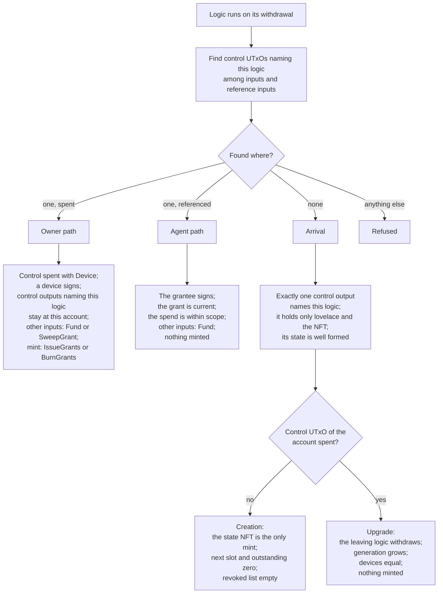

# Architecture

The contract is three Plutus V3 validators. A permanent **proxy** holds
every account's funds and mints every account token. A replaceable
**logic** holds the rules and runs once per transaction. A per owner
**stake script** gives each account its own address and reward account.
This document explains how they divide the work. The
[protocol reference](#protocol-reference) holds the exact checks. Terms
are defined in the [glossary](glossary.md).

## The three validators

| Validator | Source | Parameters | Handlers |
| --- | --- | --- | --- |
| Proxy, `account` | [validators/account.ak](../validators/account.ak) | none | `mint`, `spend` |
| Logic, `logic_v1` | [validators/logic_v1.ak](../validators/logic_v1.ak) | `proxy_hash` | `withdraw`, `publish` |
| Stake script, `account_stake` | [validators/account_stake.ak](../validators/account_stake.ak) | `owner`, `proxy_hash` | `withdraw`, `publish` |

Every other purpose fails in each validator. The shared rules live in
[lib/cardano_account_custody_contract](../lib/cardano_account_custody_contract).
The compiled validators are in [plutus.json](../plutus.json). For the
parameterised `logic_v1` and `account_stake` it holds the unapplied code
and hash. Each is applied to its parameters before use. The applied
hashes are the credentials an account uses.

## Division of work

### The proxy

The proxy has no parameters, so its hash is the same for every account
on a network. That hash is the payment credential of every account
address and the policy id of every account token.

The proxy keeps the rules no logic may change:

- How tokens are named, and that each is minted in quantity one. Only a
  grant token is ever burned, in quantity minus one.
- That every account token sits at its own account's address.
- That the state NFT returns in exactly one control UTxO at the same
  address, holding only lovelace and the NFT, under an inline datum, with
  no reference script.
- That the state NFT is minted only beside a registration of the
  account's stake credential, which the stake script approves. The
  ledger refuses a second registration of a credential. That makes
  creation happen once; see [Permanence](#permanence).
- That a fund UTxO is spent only beside an account token of its own
  account, and a reserve only beside its spent control UTxO.

For everything else the proxy defers to the logic. Every spend except
`Fund` and every mint except `CreateAccount` requires two things. The
account's control UTxO must be present exactly once, spent or
referenced. The transaction must withdraw from the logic credential that
the control datum names. The proxy does not check signatures and does
not decode the state beyond that first field.

Everything the proxy leaves to the logic is a rule of the logic version
the account names, not of the contract as a whole. The rest of this
document describes those rules as `logic_v1` enforces them.

### The logic

A withdrawal from a script credential makes the ledger run that script
once, with the whole transaction as its context. The logic uses this.
The proxy demands the withdrawal, and the logic validates the whole
transaction in one run: device signatures, grant scopes, issuance and
sweeps, and the state written back. The amount withdrawn is not read and
is zero in practice.

The logic reads the proxy's redeemers back from the transaction. The
proxy runs once per account input, so it reads only what each input
needs. The logic does the accounting once, however many fund UTxOs move.

The logic is replaceable and trusted. Each account names its logic by
hash in its state, and a device can point the account at another
version. See
[Upgrades](#upgrades). One version exists, `logic_v1`.

### The stake script

The stake script is applied to the owner's key hash and the proxy hash.
Its hash is the account's stake credential. Each account therefore has
its own address and reward account on top of the shared proxy.

The ledger runs the stake script on every withdrawal from the account's
reward account and on every certificate naming its credential, except
the legacy stake registration certificate:

- A registration, alone or with a delegation, creates the account. It
  needs the owner's signature, one state NFT of the credential minted,
  and the owner among the devices of the new control output.
- A delegation, to a pool, a DRep or both, needs a device signature.
- A reward withdrawal of any amount needs a device signature.
- A deregistration, or any other certificate, is refused.

The legacy stake registration certificate needs no witness and runs no
script. See
[stake credential squat](security/known-issues.md#stake-credential-squat).

The stake script reads only the device list from the state. A reward
withdrawal or a delegation can reference the control UTxO without
spending it. Such a transaction runs the stake script alone. Rewards and
delegation therefore answer to the devices whatever logic the account
runs.

## How they find each other

| Who | Finds | How |
| --- | --- | --- |
| Proxy | The account a UTxO belongs to | The stake credential of the UTxO's address |
| Proxy | The account a grant mint belongs to | The 28 byte prefix of the minted token names |
| Proxy | The control UTxO | The state NFT of that account, among the inputs and reference inputs |
| Proxy | The logic | Field 0 of the control datum; the transaction must withdraw from it |
| Proxy | The stake script, at creation | A publish redeemer for a certificate registering the credential the NFT is named after |
| Logic | The proxy | Its `proxy_hash` parameter |
| Logic | Its accounts | Control UTxOs under the proxy whose field 0 equals the logic's own hash |
| Stake script | The control UTxO | Its own hash names the state NFT under `proxy_hash` |

The proxy never reads the stake script's code. The registration
redeemer proves the stake script ran and approved the creation.

## The account address and its tokens

An account address pairs the proxy hash, as payment credential, with the
account's stake script hash, as an inline script stake credential. The
address is a pure function of the owner key and the proxy: anyone with
the owner key hash and the blueprint derives the address, the reward
account and the state NFT name. A device other than the owner cannot
derive them from its own key, so it keeps an account record.

Funds sent to the proxy with a stake part that is not an inline script
credential belong to no account and cannot be spent.

Two kinds of token live under the proxy policy:

| Token | Name | Held by |
| --- | --- | --- |
| State NFT | The stake script hash, 28 bytes | The control UTxO |
| Grant token | The stake script hash followed by the grant's slot as 4 big endian bytes, 32 bytes | One grant UTxO |

The UTxOs at an account address are of four kinds: the
[control UTxO](glossary.md#control-utxo),
[grant UTxOs](glossary.md#grant-utxo),
[fund UTxOs](glossary.md#fund-utxo) and [reserves](glossary.md#reserve).

## The logic's dispatch

This section describes `logic_v1`. The logic looks for control UTxOs
whose datum names it, among the inputs and the reference inputs. Where
it finds them decides the path.

- **Owner path.** A device spends the control UTxO and recreates it.
  The device may spend any fund or reserve, rewrite the state within its
  bounds, issue grants or sweep dead ones.
- **Agent path.** A grantee spends its grant UTxO and plain funds. The
  control UTxO is only referenced, so an agent never competes with the
  owner for it. The grant UTxO returns with its remaining caps reduced.
- **Arrival.** The account is created under this logic, or moves to it
  from another.

`logic_v1` accepts one account that names it per transaction.

## Upgrades

An upgrade is an owner transaction that rewrites field 0 of the control
datum with another logic's hash. Both logics run:

1. The leaving logic takes its owner path. As the leaving logic,
   `logic_v1` checks the device signature, requires the arriving logic
   to withdraw and requires nothing to be minted. It reads nothing else
   of the new state.
2. The arriving logic finds no control UTxO naming it and takes its
   arrival path. It validates the new state under its own rules. As the
   arriving logic, `logic_v1` requires the leaving logic to withdraw,
   the generation to grow, the devices to stay the same and nothing to
   be minted.
3. The proxy pins the state NFT to the same address throughout.

After the upgrade the proxy routes every spend, `SpendWithGrant`
included, to the logic the control datum names. The leaving logic has no
say over it. An arriving logic must therefore kill the grants issued
before it. `logic_v1` does this through the generation bump, which kills
every grant issued under the leaving state's generation or an older one.
The owner then sweeps the dead grant UTxOs and issues the surviving
grants again under the new logic.

Later versions must keep the **stable prefix** of each datum. The proxy,
the stake script, an arriving logic and a sweep read these fields by
position without decoding the rest:

- `AccountState`: `logic`, `devices`, `grant_generation`.
- `Grant`: `slot`, `grantee`, `generation`.

The proxy admits any registered script as a logic, and that logic sets
every rule the proxy does not. The wallet that signs an upgrade must
refuse a logic hash it does not know.

## Permanence

What never changes for an account:

- The proxy hash, so the payment credential and the token policy.
- The stake script and its parameters, so the address, the reward
  account and the token names.
- The token naming and placement rules, the creation gate and the
  `Fund` rule.
- The stable prefixes of the datums.

An account is never deleted. No redeemer burns a state NFT, and the
stake script refuses to deregister the credential. The ledger registers
a credential once, so a second account can never be created at the same
address. The registration deposit and the control UTxO's minimum
lovelace stay locked for the life of the account.

A logic credential is permanent too. Its `publish` handler accepts a
registration from anyone and refuses every other certificate.

## Reserves and fee payment

Every transaction that runs a script needs collateral as well as a fee.
The payer depends on the operation:

| Operation | Fee paid by | Collateral from |
| --- | --- | --- |
| Creation | The fee sponsor, or the device wallet | The same wallet |
| Owner transaction with a fee sponsor | The fee sponsor | The fee sponsor |
| Owner transaction without one | A reserve, else the account's fund UTxOs | The device wallet or a collateral wallet |
| Grant spend | The account's fund UTxOs | The agent wallet or a collateral wallet |

A reserve keeps the owner out of the agents' way. Agents draw on the
same fund UTxOs, so an owner transaction paid from funds can lose an
input to a grant spend and must be rebuilt. An owner transaction paid
by a fee sponsor, or from a reserve, spends fund UTxOs only for what it
pays out. On the reserve path it also spends them for any growth of the
control output; see [revokeGrant](protocol/transactions.md#revokegrant).
Without a sponsor, the library draws the fee from the largest reserve
that can cover the most a transaction can cost and still be recreated.
It recreates that reserve with the fee taken out.

A grant spend is always paid by the account, and the fee counts against
the grant's caps. The exact fee is known only after evaluation, so the
library reduces the remaining caps by the outputs plus a fee bound,
1.5 ADA by default. The contract accepts any remaining cap between zero
and the exact reduction. The library refuses a fee sponsor on a grant
spend.

## Reference scripts

Every transaction the library builds, except a plain deposit, runs the
proxy and one logic. An upgrade runs two logics. A transaction either
embeds each script in its witness set or references a UTxO that carries
it.

The network setup does two things once per network:

- It registers each logic credential, which the withdrawal needs.
- It parks the proxy and each logic version as reference scripts.

The scripts are parked at the script address of `logic_v1`, with no
stake part. The logic has no spend handler, so nobody can ever spend a
parked UTxO. The library reads the parked UTxOs from
`offchain/networks/<network>.json` and embeds a script when the network
records none.

The proxy and one logic the size of `logic_v1` fit in one transaction
embedded. The proxy and two logics of that size exceed the maximum
transaction size. An upgrade between such logics needs at least one of
them parked.

## Protocol reference

- [Validators](protocol/validators.md): every handler and check.
- [Datums and redeemers](protocol/datums-and-redeemers.md): field
  indexes, token names, redeemer indexes and bounds.
- [Transactions](protocol/transactions.md): the shape of every
  operation.
- [Lifecycle](protocol/lifecycle.md): the states of an account, a device
  and a grant.
