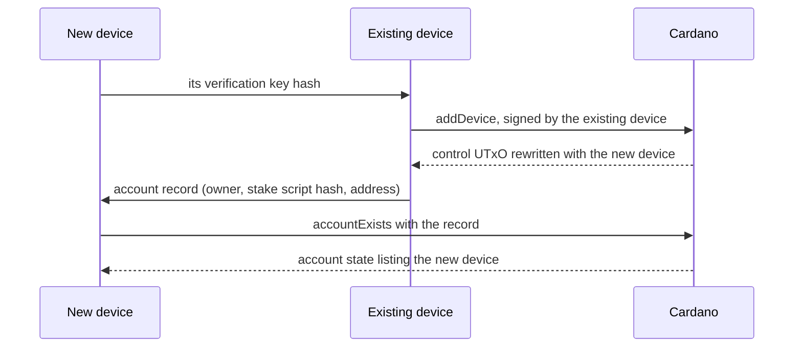

# Devices

A [device](../glossary.md#device) is a verification key hash listed in
the account state. Under `logic_v1` any device has full authority over
the account. This guide adds a device, removes one, and explains what
losing every device means. It assumes the setup of the
[quickstart](quickstart.md). The snippets extend the quickstart script
and import what they use from `./src/index.js`.

## What a device is

- A device is the hash of an Ed25519 verification key: a payment key, a
  passkey derived key or a hardware wallet key. The account does not know
  which.
- Under `logic_v1`, an account lists one to eight distinct devices.
- The [owner](../glossary.md#owner) is the first device. After creation it
  is one device among the others, and any device can remove it.
- The stake script reads the device list too. Reward withdrawals and
  delegation need a device signature whatever logic the account runs.

The library takes key hashes as 56 character lowercase hex strings. It
does not check their length, and neither do the validators. A key hash of
the wrong length is a device that can never sign. Check the length before
adding one.

## Add a device

Adding a device is an [owner transaction](../glossary.md#owner-transaction)
signed by an existing device. The new device then needs the
[account record](../glossary.md#account-record), because it cannot derive
the account address from its own key.



The existing device builds the transaction:

```ts
const tx = await addDevice({
  owner: ownerKey,
  wallet: owner,
  collateral: sponsor,
  provider,
  network,
  device: newDeviceKey,
});
```

`addDevice` takes `owner` or `record`, like every builder. The wallet's
payment key must be a device of the account. Sign the transaction with
the wallet, and with the collateral wallet when one is given.

## The account record

The record is three strings:

| Field | Meaning |
| --- | --- |
| `owner` | The owner key hash the stake script is applied to |
| `stakeScriptHash` | The account's stake credential |
| `address` | The account address |

The library has no channel for handing the record over. The integrator
moves it from the existing device to the new one, for example during
pairing. The new device must persist it. Without it the library cannot
find the account.

An integrator can still find it from the chain alone. List the UTxOs
that hold a state NFT under the proxy policy, read each
[control datum](../glossary.md#control-datum) and look for the
device's key hash in its devices. The datum is inline and public. The
library has no helper for this.

The new device verifies the record before it trusts it:

```ts
const derived = accountByOwner(record.owner);
if (derived.stakeScriptHash !== record.stakeScriptHash || derived.address !== record.address) {
  throw new Error('The record does not describe the account of its owner');
}
const live = await accountExists(provider, record);
if (!live || !live.state.devices.includes(newDeviceKey)) {
  throw new Error('This key is not a device of the account');
}
```

Every builder also refuses a record whose stake script hash does not
match its owner.

The new device then builds with the record in place of the owner:

```ts
const tx = await spendWithDevice({ record, wallet: newDevice, provider, network, outputs });
```

A passkey synced to another machine derives the same key. It is the same
device, and `accountByOwner` finds its account when it is the owner.

## Remove a device

```ts
const tx = await removeDevice({ record, wallet: newDevice, provider, network, device: ownerKey });
```

- Any device can remove any device, the owner and itself included.
- The account keeps at least one device. The builder and the logic
  refuse a state with none.
- A device that removes itself loses its authority once the transaction
  confirms.

To replace a key in one transaction, rewrite the device list with
`rewriteState`. The counters must stay as they are:

```ts
const { state } = await findAccountUtxos(provider, { record, wallet: newDevice });
const tx = await rewriteState({
  record,
  wallet: newDevice,
  provider,
  network,
  newState: { ...state, devices: state.devices.map((key) => (key === retiredKey ? replacementKey : key)) },
});
```

Two devices that spend the control UTxO at the same time race for it.
One transaction confirms and the other becomes invalid. Set
`validUntilSlot` on owner transactions so that the loser leaves the
mempool quickly.

## Losing every device

The account has no recovery path. When no device key remains:

- Nobody can spend the control UTxO. The state, the devices and the logic
  never change again.
- Reserves can never be spent.
- Rewards can never be withdrawn and the delegation never changes.
- No grant can be issued, revoked or swept. Current grants stay
  spendable by their grantees, within their scopes, until they expire or
  their caps run out. Fund UTxOs, including later deposits, stay
  spendable only through those grants.
- The owner key regains nothing. After creation it is only a device.

An upgrade needs a device too, so no later logic can restore access.
Keep at least two devices on separate hardware, and keep the record
wherever a device may need to be restored. The rationale for permanence
is in [ADR 0002](../adr/0002-no-stake-credential-deregistration.md).

## Related

- [Signers](signers.md#device-wallet): what a device wallet checks before
  it signs a device change.
- [Transactions](../protocol/transactions.md): the shape of the device
  family of owner transactions.
