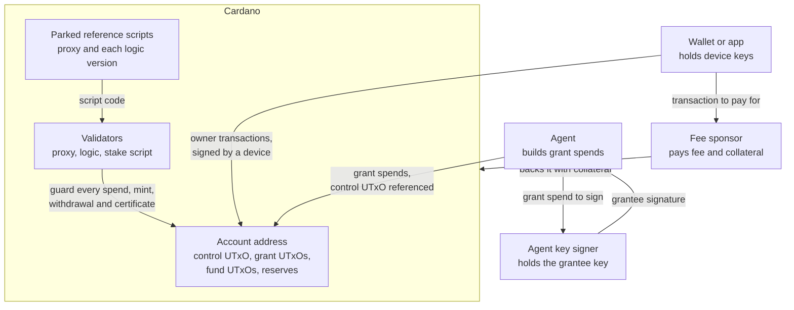

# Overview

The Cardano account custody contract gives a user one permanent address
that several keys control, and lets the user hand bounded, revocable
spending rights to agents. It is written in Aiken for Plutus V3 and ships
with a TypeScript reference library that builds each operation. Terms in this document are defined in the
[glossary](glossary.md).

## The problem

A plain Cardano wallet ties funds to one key. Losing the key loses the
funds, and rotating it means moving every UTxO to a new address. A key
also cannot be shared in part: anyone who holds it can spend everything.

Agents need narrower rights. An agent may pay invoices, run a trading
strategy or settle subscriptions on the user's behalf. The user wants to
cap what it can move, stop it at a fixed time, restrict where funds go,
and cut it off at once without moving any funds.

The contract solves both problems on chain:

- The **account address** never changes. Funds stay there while the
  user adds and removes **devices**, and while the rules that govern the
  account are replaced.
- Under `logic_v1`, any device has full authority over the account.
  Losing one device costs nothing while another remains.
- An **agent** holds a **grant**: a permission bounded by asset, caps,
  expiry and recipients, checked on chain on every spend and revocable
  by any device in one transaction.

## Actors and authority

| Action | Who may do it |
| --- | --- |
| Create the account | The owner key, which signs the registration of the account's stake credential |
| Deposit funds, plain or as a reserve | Anyone |
| Spend funds and reserves to any destination | Any device |
| Add or remove a device, or rewrite the account state | Any device |
| Issue, revoke or sweep grants | Any device |
| Withdraw staking rewards, delegate the stake credential | Any device |
| Move the account to another logic version | Any device |
| Spend funds within a grant's scope | The grantee of a current grant, or an agent key signer holding its key |
| Pay the fee and collateral of a creation or an owner transaction | A fee sponsor, which gains no authority |
| Register a logic credential, park reference scripts | Anyone |
| Read an account's state and grants | Anyone |

The stake script enforces the creation and staking rows for every
account. The rows on spending, devices, grants and upgrades are rules of
the logic the account names. The table shows the rules of `logic_v1`.

The **owner** is the key the account is derived from. It must be among
the devices at creation and is then one device like any other. A device
can remove it.

An **agent** spends without the owner's involvement. Its key may live in
an **agent key signer**, a service that signs on the agent's behalf. On
chain the signer is indistinguishable from the grantee, and the grant
bounds what either can sign for.

A **fee sponsor** pays for a transaction so that a device wallet needs no
ADA of its own. The sponsor co-signs as a payer and cannot change what a
device signed.

## Context

## Trust model

The proxy and the stake script are permanent. They enforce a small set
of invariants whatever logic an account names. The logic is replaceable
and trusted code. Every other rule is a rule of the logic the account
names, and a device can name another logic. Under `logic_v1`, every
device is trusted with the whole account. A grantee is trusted only up
to its grant's scope, and only while the grant is current. The agent key
signer holds the grantee's authority and nothing more. The fee sponsor
holds none. A wallet must vet any logic before an upgrade names it; see
[Upgrades](architecture.md#upgrades). The contract relies on the Cardano
ledger for balance, signatures, validity intervals and the single
registration of a stake credential.

## Guarantees

The proxy and the stake script guarantee, whatever logic an account
names:

- The address, the state NFT and the reward account of an account never
  change, through device rotation and logic upgrades alike.
- Exactly one control UTxO exists for each account from creation on. It
  never leaves the account address and is never burned.
- Every account token sits at its own account's address.
- Every account token mint, and every spend under a redeemer other
  than `Fund`, runs the logic that the account's control datum names.
  A spend under `Fund` holds no account token. It needs an input that
  holds a token of its own account, and that input runs the logic.
- Only a device can withdraw rewards or delegate the stake credential.
- An account is never deleted. See
  [Permanence](architecture.md#permanence).

`logic_v1` guarantees, while the account names it:

- Only a transaction a device signs can spend the control UTxO or a
  reserve, change the devices, issue or sweep grants, or change the
  logic.
- A grantee can move at most its grant's caps of one asset, plus lovelace
  within its lovelace caps, before the expiry, to the listed recipients,
  while the grant is current. Remaining caps never increase.
- A revoke needs only the control UTxO. Paid by a fee sponsor, it
  spends nothing an agent can spend. Paid by a reserve, it spends
  nothing an agent can spend unless the control output must grow; see
  [revokeGrant](protocol/transactions.md#revokegrant). Once it confirms,
  no spend under the revoked grant can confirm.
- Plain deposits and reserves stay spendable by a device, except one
  under a datum hash with no known preimage; see
  [deposits under a datum hash](security/known-issues.md#deposits-under-a-datum-hash).
  A dead grant's lovelace becomes spendable by a device when the grant is
  swept. An upgrade into `logic_v1` that writes the outstanding count
  too low strands grant lovelace; see
  [counters written on arrival](security/known-issues.md#counters-written-on-arrival).
- When the account leaves `logic_v1`, `logic_v1` requires only that the
  arriving logic runs and that nothing is minted. The arriving logic's
  rules govern the account from then on.
- When the account arrives at `logic_v1` from another logic, `logic_v1`
  requires a higher generation. This kills every grant issued under the
  leaving state's generation or an older one.

## Further reading

- [Architecture](architecture.md): the three validators and how they
  divide the work.
- [Glossary](glossary.md): every term these documents use.
