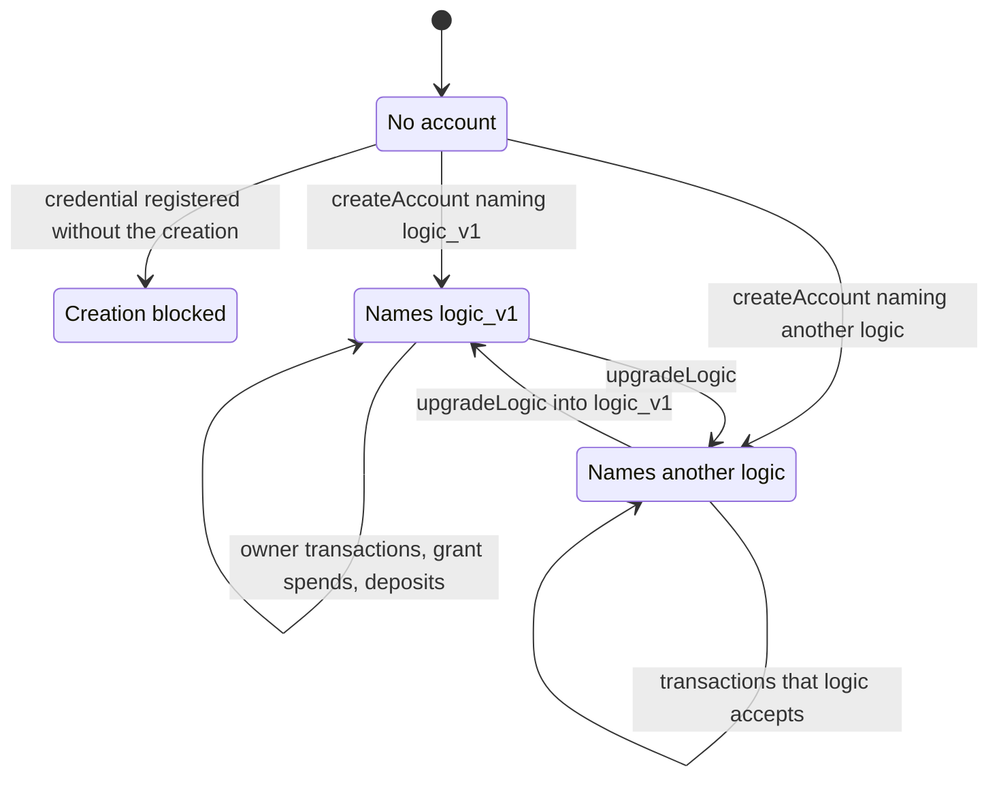
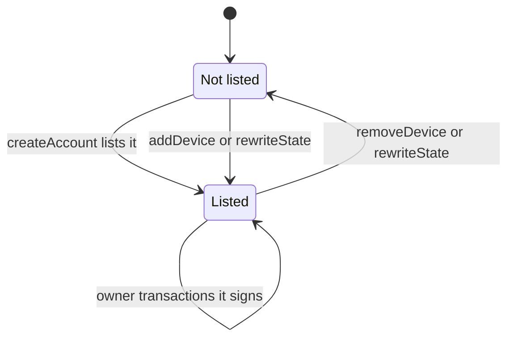
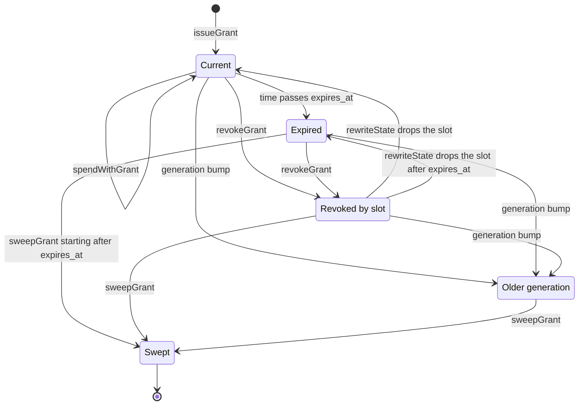

# Lifecycle

This document gives the states of an account, a device and a grant, and
the transaction that moves each from one state to the next. The shape
of each transaction is in [Transactions](transactions.md). Terms are
defined in the [glossary](../glossary.md).

The account's lifecycle rests on the proxy and the stake script, and
holds whatever logic the account names. The device and grant lifecycles
are rules of `logic_v1`. They hold while the account names `logic_v1`.

## Account

- **No account.** The address, the reward account and the state NFT name
  derive from the owner key and the proxy. Anyone who knows the owner key
  hash can compute them. A deposit made before creation becomes
  spendable once the account exists.
- **Creation.** [createAccount](transactions.md#createaccount) registers
  the stake credential and mints the state NFT in one transaction. The
  ledger registers a credential once, so creation happens at most once
  per address.
- **Creation blocked.** A registration in the legacy certificate format
  needs no witness, and the stake script does not run on it. Anyone who
  knows the credential can register it that way without the creation.
  The ledger then refuses the second registration that creation needs.
  The owner key can never create an account at that address. See
  [Stake credential squat](../security/known-issues.md#stake-credential-squat).
- **Live.** From creation on, exactly one control UTxO of the account
  exists. Every spend of it recreates it at the same address. The proxy
  enforces this whatever logic the account names.
- **Upgrade.** A device moves the account to another logic with
  [upgradeLogic](transactions.md#upgradelogic). The address, the state
  NFT and the reward account stay the same. Moving into `logic_v1` from
  another logic requires a higher generation and the same devices. See
  [Validators](validators.md#arrival).

The account has no final state. No redeemer burns the state NFT, and the
stake script refuses to deregister the credential. The registration
deposit and the control UTxO's minimum lovelace stay locked for the life
of the account. See [Permanence](../architecture.md#permanence).

## Device

- A device is a key hash in field 1 of the account state.
- The owner key must be listed at creation. Other keys may be listed
  at creation too.
- A listed device signs owner transactions under `logic_v1`, and reward
  withdrawals and delegations under the stake script for any logic.
- Under `logic_v1` the list holds one to 8 distinct keys. The last
  device cannot be removed. A device can remove itself and the owner.
- An upgrade into `logic_v1` keeps the list as it was, in the same
  order. Once the owner is removed, it has no more authority than any
  other key outside the list.

## Grant

A grant is judged against the account state of the transaction: the
referenced control UTxO in a grant spend, the spent one in a sweep.

| State | Condition | Spendable | Sweepable |
| --- | --- | --- | --- |
| Current | Its generation equals the account's and its slot is not revoked | Yes, with a validity range that ends no later than `expires_at` | No |
| Expired | Current by generation and slot, and past `expires_at` | No | Yes, with a validity range that starts after `expires_at` |
| Revoked by slot | Its slot is in the revoked list | No | Yes |
| Older generation | Its generation is lower than the account's | No | Yes |
| Swept | Its grant UTxO is spent and its token burned | No | No |

The checks are [`is_current`](../../lib/cardano_account_custody_contract/grant.ak#L90),
[`ends_before_expiry`](../../lib/cardano_account_custody_contract/grant.ak#L41)
and [`is_dead`](../../lib/cardano_account_custody_contract/grant.ak#L71).

Transitions:

- **Issue.** [issueGrant](transactions.md#issuegrant) mints the grant
  token into a new grant UTxO. The grant takes the next slot and the
  account's generation. `next_slot` and `outstanding` grow by one.
- **Spend.** [spendWithGrant](transactions.md#spendwithgrant) lowers the
  remaining caps and leaves the grant current. A grant whose caps are
  used up stays current. A device revokes it to sweep it.
- **Expire.** No transaction is needed. Once time passes `expires_at`,
  no transaction whose validity range ends by `expires_at` can be
  applied, so no grant spend validates.
- **Revoke by slot.** [revokeGrant](transactions.md#revokegrant) appends
  the slot to the revoked list. The grant UTxO is not touched.
- **Restore.** [rewriteState](transactions.md#rewritestate) can drop a
  slot from the revoked list. The grant is current again, or expired if
  its expiry has passed, as long as the generation has not moved.
- **Generation bump.** A device raises the account's generation with
  [revokeAllGrants](transactions.md#revokeallgrants), with
  [revokeGrant](transactions.md#revokegrant) when the revoked list holds
  32 slots, or with [rewriteState](transactions.md#rewritestate). An
  [upgradeLogic](transactions.md#upgradelogic) into `logic_v1` must
  raise it too. The bump kills every grant issued under the leaving
  state's generation or an older one. `logic_v1` never lets the
  generation decrease. The kill is final while the account names
  `logic_v1`.
- **Upgrade out of `logic_v1`.** The library raises the generation on
  every upgrade ([stateWithLogic](../../offchain/src/state.ts#L184)).
  `logic_v1` reads only the logic named in the state the account moves
  to ([rules.ak#L238](../../lib/cardano_account_custody_contract/rules.ak#L238),
  [rules.ak#L257](../../lib/cardano_account_custody_contract/rules.ak#L257)).
  Whether the grants die is a rule of the arriving logic.
- **Sweep.** [sweepGrant](transactions.md#sweepgrant) spends the dead
  grant UTxO, burns its token and returns its lovelace to the account.
  `outstanding` drops by one. A grant must be dead in the state before
  the sweep. A revoke and the sweep of the grant it kills are two
  transactions.

Under `logic_v1` every grant is issued under the account's generation,
so a bump kills every grant outstanding. A grant written by another
logic with a generation above the account's is neither current nor
dead by generation.

An arrival into `logic_v1` does not constrain `next_slot`. It can set
it below a slot already issued. Once the account has arrived,
`next_slot` only grows, by the grants issued
([rules.ak#L254](../../lib/cardano_account_custody_contract/rules.ak#L254)).

A grant written by another logic, of a shape `logic_v1` cannot decode,
is swept by generation or revocation, never by expiry.

After a generation bump, the grants that should survive are issued
again as new grants, in new slots, under the new generation.
[`survivingGrantRequests`](../../offchain/src/transactions.ts#L1177)
lists them with their remaining caps and expiry.
