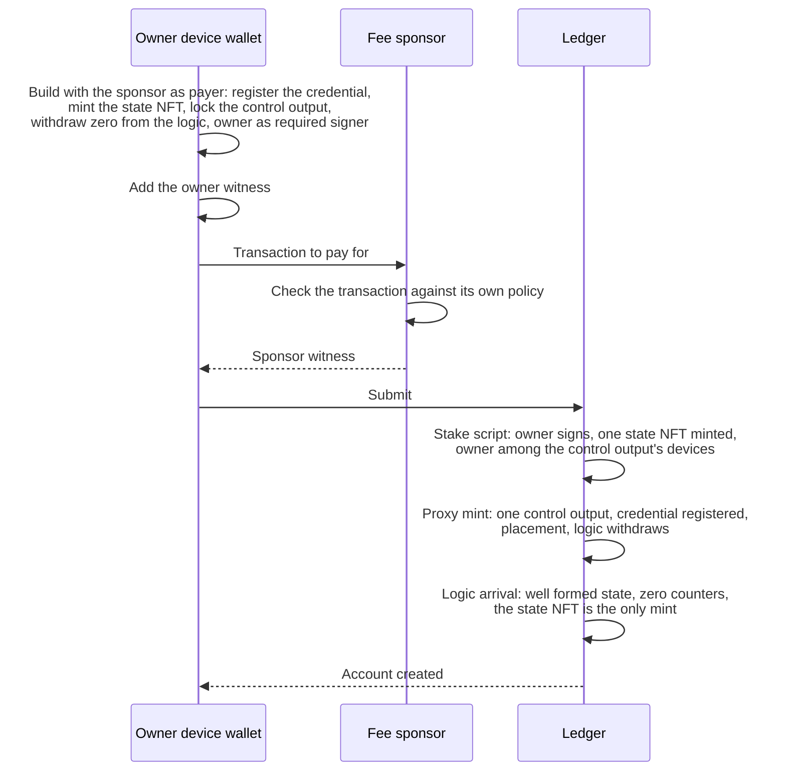
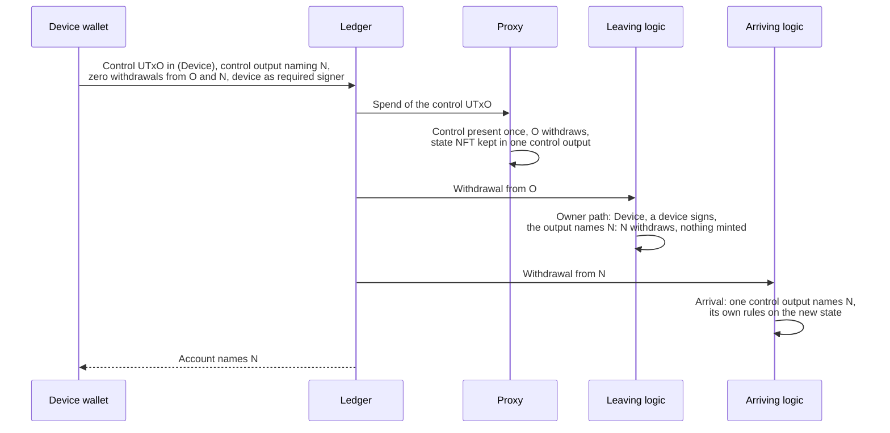
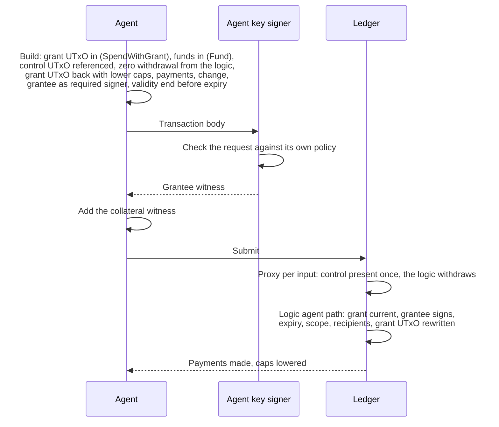

# Transactions

This document gives the shape of every transaction the off-chain
library builds. The builders are in
[offchain/src/transactions.ts](../../offchain/src/transactions.ts). The
on-chain checks each transaction must pass are in
[Validators](validators.md), and the data it carries is in
[Datums and redeemers](datums-and-redeemers.md). Terms are defined in
the [glossary](../glossary.md).

The on-chain rules that run on an account's transactions are the rules
of the logic the account names. The checks named below are those of
`logic_v1`.

## Template

Every operation has a short purpose and one table with these rows:

| Row | Content |
| --- | --- |
| Signer | The keys whose witnesses the transaction needs |
| Inputs | Each input, with its redeemer when it is a script input |
| Reference inputs | UTxOs read but not spent |
| Mint | Tokens minted or burned under the proxy policy, with the redeemer |
| Withdrawals and certificates | Reward withdrawals and certificates, with the redeemer |
| Outputs | Each output, with its value and datum |
| Validity | The validity interval the builder sets |
| Scripts that run | Each script the ledger runs, and the path it takes |

A sequence diagram follows the table where several parties take part.

## Common parts

### Finding the account's UTxOs

[`findAccountUtxos`](../../offchain/src/transactions.ts#L528) lists the
UTxOs at the account address and sorts them by kind:

- The control UTxO holds the state NFT. Its datum is decoded as the
  account state.
- A grant UTxO holds a grant token.
- A reserve is any other UTxO with a datum.
- A fund UTxO is any other UTxO.

### Scripts and the logic withdrawal

The proxy and each logic are referenced from their
[parked reference scripts](../glossary.md#parked-reference-script) when
the network file records them, and embedded in the witness set
otherwise. See [Reference scripts](../architecture.md#reference-scripts).
With a provider, the builder confirms that each recorded UTxO still
carries its script
([network.ts#L151](../../offchain/src/network.ts#L151)). The stake
script is unique to the account and is always embedded.

Every transaction except a deposit and the network setup withdraws zero
lovelace from the credential of the logic the control datum names, with
the `Run` redeemer ([runLogic](../../offchain/src/transactions.ts#L500)).
The builder attaches only a logic it knows, from the blueprint or the
`logics` option, and refuses any other
([L470](../../offchain/src/transactions.ts#L470)).

### Owner transaction base

Every [owner transaction](../glossary.md#owner-transaction) is built by
[`buildDeviceSpend`](../../offchain/src/transactions.ts#L964). Each
device operation below starts from this shape and states what it adds.

Purpose: spend the control UTxO with a device signature and write the
next state back.

| Row | Content |
| --- | --- |
| Signer | A device key, the payment key of the device wallet, as a required signer ([L653](../../offchain/src/transactions.ts#L653)). The fee sponsor, when one pays. The collateral wallet, when one provides the collateral. |
| Inputs | The control UTxO (`Device`). Fund UTxOs covering what the operation pays out (`Fund`), and reserves only for what the funds cannot cover (`Fund`) ([L594](../../offchain/src/transactions.ts#L594)). Payment inputs, as below. |
| Reference inputs | The parked proxy and the parked logic, when recorded. |
| Mint | None. |
| Withdrawals and certificates | A zero withdrawal from the current logic (`Run`). |
| Outputs | The control output: the account address, the lovelace the control UTxO held or the minimum UTxO value of the new state if higher, the state NFT, and the next state inline ([L982](../../offchain/src/transactions.ts#L982)). The operation's payments. Change, as below. |
| Validity | No lower bound. An upper bound at `validUntilSlot` when given ([L1017](../../offchain/src/transactions.ts#L1017)). |
| Scripts that run | The proxy, once per account input. The current logic, on its owner path. |

The builder checks the next state before it builds. It must be well
formed. Under the same logic, the generation must not decrease and the
counters must follow the grants issued and swept
([L888](../../offchain/src/transactions.ts#L888)). Under another logic
it must be an upgrade ([L907](../../offchain/src/transactions.ts#L907)).

The fee is paid in one of three ways. The
[architecture](../architecture.md#reserves-and-fee-payment) explains
why reserves exist.

| Payer | Extra inputs | Extra outputs | Collateral |
| --- | --- | --- | --- |
| Fee sponsor ([L1027](../../offchain/src/transactions.ts#L1027)) | The sponsor's UTxOs, for the fee and the control output's growth | Any surplus of the selected funds, as a plain output to the account. The sponsor's change. | The sponsor |
| A reserve ([L1050](../../offchain/src/transactions.ts#L1050)) | The fee reserve (`Fund`) | The fee reserve recreated with its datum and tokens, less the fee. Change, plain, to the account. | The device wallet or the collateral wallet |
| The account's funds ([L1042](../../offchain/src/transactions.ts#L1042)) | Funds covering the protocol's maximum fee as well | Change, plain, to the account | The device wallet or the collateral wallet |

Without a sponsor, the fee reserve is the largest reserve with an inline
datum that holds at least its own minimum UTxO value, the protocol's
maximum fee and the minimum change
([pickFeeReserve](../../offchain/src/transactions.ts#L869)). Without
such a reserve the funds pay. The builder takes either a sponsor or a
collateral wallet, never both
([L781](../../offchain/src/transactions.ts#L781)). With a collateral
wallet, none of that wallet's UTxOs is spent
([L803](../../offchain/src/transactions.ts#L803)).

## Creation

### createAccount

[`createAccount`](../../offchain/src/transactions.ts#L751). Purpose:
register the account's stake credential, mint its state NFT and write
the first control UTxO.

| Row | Content |
| --- | --- |
| Signer | The owner key, as a required signer. The paying wallet: the fee sponsor, or else the wallet. |
| Inputs | UTxOs of the paying wallet. No script input. |
| Reference inputs | The parked proxy and the parked logic, when recorded. |
| Mint | One state NFT, named after the stake script hash (`CreateAccount`). |
| Withdrawals and certificates | A registration of the account's stake credential, with the deposit (`Operate`). A zero withdrawal from the logic the initial state names (`Run`). |
| Outputs | The control output: the account address, the requested lovelace, 2,000,000 by default, or the minimum UTxO value if higher, the state NFT, and the initial state inline. The paying wallet's change. |
| Validity | None. |
| Scripts that run | The stake script, on `publish`: the creation gate. The proxy, on `mint` with `CreateAccount`. The logic, on its arrival path as a creation. |

The builder refuses an initial state that is not well formed, has non
zero counters, or does not list the owner among its devices. The logic
defaults to the one the blueprint carries. With a provider, the builder
also refuses while a UTxO holding the state NFT exists at the address.
The fee sponsor pays the fee, the collateral, the control output's
lovelace and the registration deposit.

The ledger registers a credential once. Creation therefore happens once
per owner key, and fails if the credential is already registered. See
[Permanence](../architecture.md#permanence).

## Deposits

### deposit

[`deposit`](../../offchain/src/transactions.ts#L816). Purpose: send
value to the account, as a fund UTxO or a reserve.

| Row | Content |
| --- | --- |
| Signer | The depositing wallet. Anyone may deposit. |
| Inputs | UTxOs of the depositing wallet. |
| Reference inputs | None. |
| Mint | None. |
| Withdrawals and certificates | None. |
| Outputs | Plain: the value at the account address, with no datum. Reserve: the value at the account address, with the inline reserve datum, constructor 0 with no fields. The depositor's change. |
| Validity | None. |
| Scripts that run | None. |

A deposit must use the account address with its stake part. Value sent
to the proxy with another stake part belongs to no account and cannot
be spent.

## Owner transactions

Each table below lists what the operation adds to the
[owner transaction base](#owner-transaction-base). A row that says
"Base" is unchanged.

### spendWithDevice

[`spendWithDevice`](../../offchain/src/transactions.ts#L1076). Purpose:
pay value from the account to any destination, and optionally rewrite
the state.

| Row | Content |
| --- | --- |
| Signer | Base. |
| Inputs | Base, with the funds and reserves covering the payments. |
| Reference inputs | Base. |
| Mint | None. |
| Withdrawals and certificates | Base. |
| Outputs | Base, with the payments. The control output carries `newState` when given, else the same state. |
| Validity | Base. |
| Scripts that run | Base. |

### rewriteState

[`rewriteState`](../../offchain/src/transactions.ts#L1086). Purpose:
write any next state the logic accepts.

| Row | Content |
| --- | --- |
| Signer | Base. |
| Inputs | Base. |
| Reference inputs | Base. |
| Mint | None. |
| Withdrawals and certificates | Base. A state naming another logic adds that logic's withdrawal, as in [upgradeLogic](#upgradelogic). |
| Outputs | Base, with `newState` in the control output. |
| Validity | Base. |
| Scripts that run | Base. |

Under `logic_v1` a rewrite may change the devices and the revoked list
and raise the generation. Dropping a slot from the revoked list makes
that grant current again, if its generation is still the account's.

### addDevice

[`addDevice`](../../offchain/src/transactions.ts#L1117). Purpose: append
a device key to the state.

| Row | Content |
| --- | --- |
| Signer | Base. Any existing device. |
| Inputs | Base. |
| Reference inputs | Base. |
| Mint | None. |
| Withdrawals and certificates | Base. |
| Outputs | Base. The control output's devices gain the new key at the end. |
| Validity | Base. |
| Scripts that run | Base. |

The builder refuses a duplicate key and a ninth device. A device other
than the owner cannot derive the account address from its own key. It
needs the [account record](../glossary.md#account-record).

### removeDevice

[`removeDevice`](../../offchain/src/transactions.ts#L1121). Purpose:
remove a device key from the state.

| Row | Content |
| --- | --- |
| Signer | Base. Any existing device, the one removed included. |
| Inputs | Base. |
| Reference inputs | Base. |
| Mint | None. |
| Withdrawals and certificates | Base. |
| Outputs | Base. The control output's devices lose the key. |
| Validity | Base. |
| Scripts that run | Base. |

At least one device must remain. The owner key can be removed like any
other.

### revokeGrant

[`revokeGrant`](../../offchain/src/transactions.ts#L1154). Purpose: kill
one grant without touching its grant UTxO.

| Row | Content |
| --- | --- |
| Signer | Base. |
| Inputs | Base. Only the control UTxO and the payment inputs. |
| Reference inputs | Base. |
| Mint | None. |
| Withdrawals and certificates | Base. |
| Outputs | Base. While the revoked list holds fewer than 32 slots, the slot is appended to it. When it holds 32, the generation grows by one and the list is cleared instead, which kills every grant issued under the old generation or an older one. |
| Validity | Base. An upper bound limits how long the revoke can wait in a mempool if another device spends the control UTxO first. |
| Scripts that run | Base. |

The builder refuses a slot the account has not issued and a slot that
is already revoked. Paid by a fee sponsor, a revoke spends nothing an
agent can spend. Paid by a reserve, it spends nothing an agent can
spend unless the control output must grow. Appending a slot enlarges
the datum. The library draws the growth from fund UTxOs before
reserves ([selectFundUtxos](../../offchain/src/transactions.ts#L594)).

### revokeAllGrants

[`revokeAllGrants`](../../offchain/src/transactions.ts#L1185). Purpose:
kill every grant at once.

| Row | Content |
| --- | --- |
| Signer | Base. |
| Inputs | Base. |
| Reference inputs | Base. |
| Mint | None. |
| Withdrawals and certificates | Base. |
| Outputs | Base. The generation grows by one and the revoked list is cleared. |
| Validity | Base. |
| Scripts that run | Base. |

The bump kills every grant issued under the old generation or an older
one. [`survivingGrantRequests`](../../offchain/src/transactions.ts#L1177)
lists the grants to issue again, with their remaining caps and expiry.

### withdrawRewards

[`withdrawRewards`](../../offchain/src/transactions.ts#L1240). Purpose:
withdraw the account's staking rewards.

| Row | Content |
| --- | --- |
| Signer | Base. |
| Inputs | Base. |
| Reference inputs | Base. |
| Mint | None. |
| Withdrawals and certificates | Base, plus a withdrawal of the whole reward balance from the account's reward account (`Operate`). The ledger accepts only the whole balance. Zero is valid. |
| Outputs | Base. The control output keeps the same state. Without a sponsor, the withdrawn lovelace returns to the account as change. With a sponsor, it joins the sponsor's change. |
| Validity | Base. |
| Scripts that run | Base. The stake script, on `withdraw`: the [stake device rule](validators.md#stake-device-rule). |

The stake script also accepts the control UTxO as a reference input,
without the proxy or the logic. The library spends it.

### delegateStake

[`delegateStake`](../../offchain/src/transactions.ts#L1250). Purpose:
delegate the account's stake credential to a pool.

| Row | Content |
| --- | --- |
| Signer | Base. |
| Inputs | Base. |
| Reference inputs | Base. |
| Mint | None. |
| Withdrawals and certificates | Base, plus a delegation certificate of the account's stake credential to the pool (`Operate`). |
| Outputs | Base. The control output keeps the same state. |
| Validity | Base. |
| Scripts that run | Base. The stake script, on `publish`: the [stake device rule](validators.md#stake-device-rule). |

On chain the stake script accepts delegation to a pool, a DRep or both.
The library builds pool delegation only.

### issueGrant

[`issueGrant`](../../offchain/src/transactions.ts#L1132). Purpose: create
one to 8 grants, each in its own grant UTxO.

| Row | Content |
| --- | --- |
| Signer | Base. |
| Inputs | Base, with the funds covering each grant UTxO's lovelace. The account pays it even with a sponsor. |
| Reference inputs | Base. |
| Mint | One grant token per grant, for the next slots in order (`IssueGrants`). |
| Withdrawals and certificates | Base. |
| Outputs | Base. The control output's `next_slot` and `outstanding` grow by the number issued. One grant UTxO per grant: the account address, the grant's minimum UTxO lovelace, its grant token, and the inline `Grant` with its slot and the account's generation ([grantIssues](../../offchain/src/transactions.ts#L879)). |
| Validity | Base. |
| Scripts that run | Base. The proxy, on `mint` with `IssueGrants`. The logic's issue rule. |

The builder refuses an empty batch, more than 8 grants
([L921](../../offchain/src/transactions.ts#L921)), a scope that is not
well formed, and more than 16 outstanding grants.

### sweepGrant

[`sweepGrant`](../../offchain/src/transactions.ts#L1202). Purpose: spend
one to 8 dead grant UTxOs, burn their tokens and return their lovelace
to the account.

| Row | Content |
| --- | --- |
| Signer | Base. |
| Inputs | Base, plus each dead grant UTxO (`SweepGrant`). |
| Reference inputs | Base. |
| Mint | Each swept grant token, in quantity -1 (`BurnGrants`). |
| Withdrawals and certificates | Base. |
| Outputs | Base. The control output's `outstanding` drops by the number swept. The swept lovelace returns to the account: as change without a sponsor, and as a plain output with one. |
| Validity | Base. A lower bound at `validFromSlot` when given ([L1014](../../offchain/src/transactions.ts#L1014)). A grant dead by expiry alone needs it, after the expiry. |
| Scripts that run | Base. The proxy, once per grant UTxO and on `mint` with `BurnGrants`. The logic's sweep rule per grant UTxO and its burn rule. |

The builder refuses a slot with no grant UTxO and a grant that is still
live ([L1213](../../offchain/src/transactions.ts#L1213)). Deadness is
judged against the state before the transaction. A revoke and the sweep
of the grants it kills are therefore two transactions. An issuance and
a sweep are two transactions as well, since the mint carries one
redeemer.

### upgradeLogic

[`upgradeLogic`](../../offchain/src/transactions.ts#L1105). Purpose:
point the account at another logic. See
[Upgrades](../architecture.md#upgrades).

| Row | Content |
| --- | --- |
| Signer | Base. |
| Inputs | Base. |
| Reference inputs | Base, plus the arriving logic when it is parked. See [Reference scripts](../architecture.md#reference-scripts) for when it must be parked. |
| Mint | None. |
| Withdrawals and certificates | A zero withdrawal from the leaving logic and a zero withdrawal from the arriving logic (`Run` each). |
| Outputs | Base. The control output names the arriving logic in field 0, with the generation grown by one and the revoked list cleared ([stateWithLogic](../../offchain/src/state.ts#L184)). The devices, `next_slot` and `outstanding` are unchanged. |
| Validity | Base. |
| Scripts that run | The proxy, once per account input. The leaving logic, on its owner path. The arriving logic, on its arrival path. |

The builder refuses the logic the account already names, a logic it
cannot attach, a generation that does not grow, a change of devices,
and any issuance or sweep in the same transaction
([L907](../../offchain/src/transactions.ts#L907)). A downgrade is built
like any other upgrade. After the upgrade, the device sweeps the dead
grant UTxOs with [sweepGrant](#sweepgrant) and issues the surviving
grants again with [issueGrant](#issuegrant).

When `logic_v1` arrives, it applies the arrival checks in
[Validators](validators.md#arrival).

## Grant spends

### spendWithGrant

[`spendWithGrant`](../../offchain/src/transactions.ts#L1349). Purpose:
pay value from the account within a grant's scope, without the owner.

| Row | Content |
| --- | --- |
| Signer | The grantee key, as a required signer. Its witness comes from the agent wallet or an [agent key signer](../glossary.md#agent-key-signer). The collateral wallet, when one provides the collateral. Otherwise the agent wallet, for the collateral. |
| Inputs | The grant UTxO (`SpendWithGrant`). At most 12 fund UTxOs (`Fund`), covering the payments, the fee bound and the minimum change. No reserve and no other grant UTxO. |
| Reference inputs | The control UTxO. The parked proxy and the parked logic, when recorded. |
| Mint | None. |
| Withdrawals and certificates | A zero withdrawal from the logic the control datum names (`Run`). |
| Outputs | The grant UTxO recreated: the account address, the same value, and the grant with its remaining caps reduced by the payments and, in lovelace, by the fee bound ([L1396](../../offchain/src/transactions.ts#L1396), [scopeAfterSpend](../../offchain/src/state.ts#L223)). The payments. Change, plain, to the account. |
| Validity | An upper bound at `validUntilSlot`, required. Its time must not be after the grant's `expires_at`. |
| Scripts that run | The proxy, once per account input. The logic, on its agent path. |

The fee is paid from the account and counts against the caps. The
library reduces the caps by the [fee bound](../glossary.md#fee-bound),
1,500,000 lovelace by default, and refuses a built transaction whose fee
exceeds it ([L1405](../../offchain/src/transactions.ts#L1405)). The
builder refuses a fee sponsor
([L788](../../offchain/src/transactions.ts#L788)). Before it builds, it
also refuses a signer that is not the grantee, a grant that is not
current, a payment to an address outside the recipients, a validity
end after the expiry, a spend outside the scope, and more than 12 fund
UTxOs. [`fundBatches`](../../offchain/src/transactions.ts#L1264) splits
a larger set of funds into batches of 12.

The control UTxO is only referenced. A grant spend never competes with
an owner transaction for it, though both can pick the same fund UTxO.

## Network setup

The [network setup](../glossary.md#network-setup) runs once per network.
The library has no builder for it.
[`setUpNetwork`](../../offchain/scripts/preprod-e2e.ts#L1315) builds its
transactions and records the parked UTxOs in
`offchain/networks/<network>.json`. Each record holds the script hash,
the UTxO reference, the address and the lovelace
([network.ts#L45](../../offchain/src/network.ts#L45)).

### Register a logic credential

[`registerLogic`](../../offchain/scripts/preprod-e2e.ts#L1232). Purpose:
register a logic credential, which every logic withdrawal needs.

| Row | Content |
| --- | --- |
| Signer | The funding wallet. Anyone may register. |
| Inputs | UTxOs of the funding wallet. |
| Reference inputs | None. |
| Mint | None. |
| Withdrawals and certificates | A registration of the logic credential, with the deposit (`Run`). The logic is embedded. |
| Outputs | The funding wallet's change. |
| Validity | None. |
| Scripts that run | The logic, on `publish`. |

The credential can never be deregistered.

### Park a reference script

[`parkScript`](../../offchain/scripts/preprod-e2e.ts#L1244). Purpose:
put the proxy or a logic on chain as a reference script. The setup parks
the proxy and each logic in separate transactions.

| Row | Content |
| --- | --- |
| Signer | The funding wallet. |
| Inputs | UTxOs of the funding wallet. |
| Reference inputs | None. |
| Mint | None. |
| Withdrawals and certificates | None. |
| Outputs | The script as a reference script, at the enterprise script address of the current logic, with its minimum UTxO lovelace and no datum ([L1200](../../offchain/scripts/preprod-e2e.ts#L1200)). The funding wallet's change. |
| Validity | None. |
| Scripts that run | None. |

The logic has no spend handler, so no one can spend a parked UTxO.
